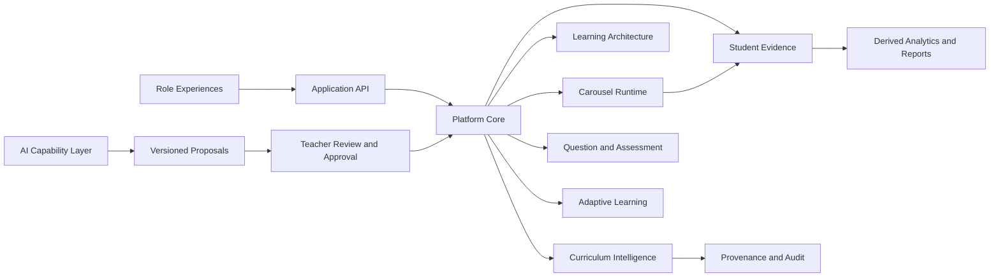
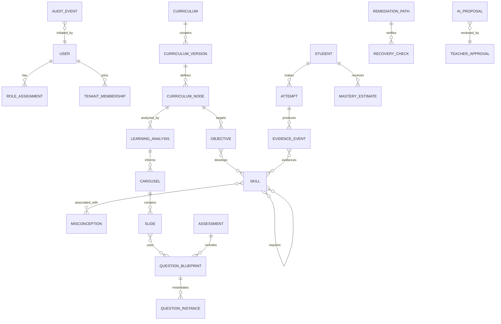
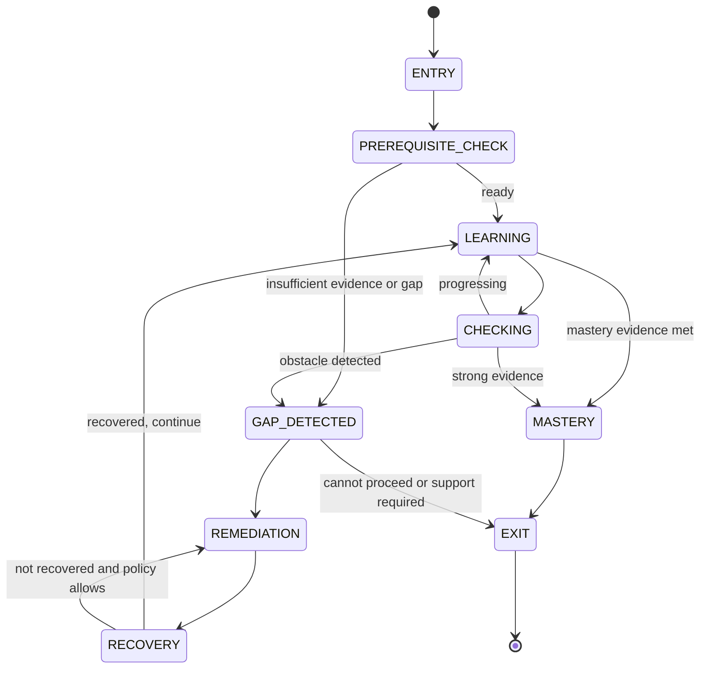
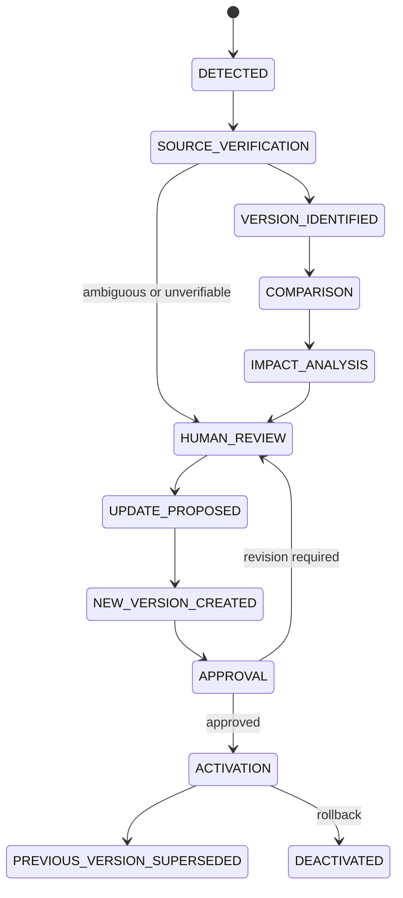
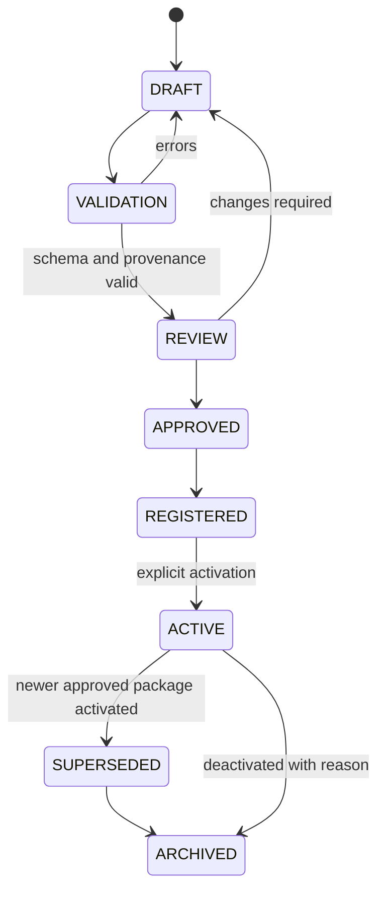

# Gate 1: Platform Constitution and Initial Architecture

Status: Proposed, awaiting human approval  
Date: 2026-08-24  
Scope: Architecture only; no application implementation

## A. Executive Architecture Summary

Universal Intelligent Learning Platform is a curriculum-agnostic learning system, not a conventional LMS. Its core executable unit is an Intelligent Carousel: a versioned learning experience that diagnoses readiness, teaches, practices, detects obstacles, remediates, verifies recovery, assesses mastery, and records evidence.

The initial architecture is a modular monolith with strict domain boundaries. It separates:

- curriculum facts and provenance
- learning architecture and pedagogical design
- content and resources
- Carousel definitions and runtime state
- raw student evidence
- derived analytics
- AI proposals
- teacher approvals and publication

The first deployable product should prove one complete Carousel against one verified curriculum node. The same runtime must later execute both Egyptian Baccalaureate Mathematics and American Mathematics through data and approved extensions, not curriculum-specific branches.



## B. Platform Constitution

### Principles

1. **Curriculum agnosticism:** the core runtime consumes generic curriculum nodes, mappings, and contracts. No curriculum name is a runtime condition.
2. **Evidence over completion:** completion is an event, not mastery. Mastery is a configurable, evidence-based decision.
3. **Human authority:** AI can propose, derive, compare, and explain; authorized humans approve and publish educational decisions.
4. **Immutable history:** published educational assets and raw student evidence are append-only. Corrections create new versions or compensating records.
5. **Provenance everywhere:** important educational statements retain source, origin, confidence, and approval state.
6. **Semantic learning objects:** educational meaning is represented in domain contracts; the UI only renders and interacts with those contracts.
7. **Explicit uncertainty:** weak evidence produces uncertainty or a request for more evidence, not an overconfident diagnosis.
8. **Privacy by authority:** access is scoped by role, tenant, relationship, and purpose.
9. **Modular monolith first:** deploy together while preserving boundaries that can later be extracted.
10. **Configurable policy:** thresholds, routing rules, and assessment policies are curriculum or institution configuration, not scattered constants.

### Non-goals for Gate 1

No dashboards, full student or teacher UI, curriculum ingestion implementation, Carousel editor, chatbot, payment system, production analytics, or deployment automation is implemented in this gate.

## C. Domain Architecture

| Domain | Owns | Does not own |
|---|---|---|
| Platform Core | IDs, clocks, tenancy context, result/error conventions, policy configuration | Educational interpretation |
| Identity and Access | users, roles, memberships, authentication sessions, authorization policies | Student learning decisions |
| Curriculum Intelligence | source discovery, extraction, normalization, analysis proposals | Publication authority |
| Curriculum Registry | curriculum packages, nodes, mappings, package lifecycle | Runtime learner state |
| Curriculum Versioning | versions, comparisons, impact reports, supersession | Raw source content |
| Knowledge Graph | concepts, skills, prerequisites, misconceptions, typed relationships | Student conclusions |
| Learning Architecture | learning analyses, objectives, instructional structure, Carousel plans | UI layout |
| Intelligent Carousel | versioned executable definitions, slides, routes, exit policies | Raw evidence interpretation |
| Question Engine | blueprints, instances, answer models, feedback and routing metadata | Final mastery policy |
| Assessment Engine | assessments, forms, scoring policies, result calculations | Curriculum source authority |
| Adaptive Learning | state transitions, routing, intervention and recovery policies | Persisting immutable evidence details |
| Student Learning Model | learner profile projections, skill state, mastery estimates | Source event history |
| AI Copilot | provider abstraction, prompts, proposals, explanations, confidence | Truth or direct publication |
| Teacher Workspace | review queues, edits, approvals, simulation review | Authorization policy definition |
| Student Experience | presentation and interaction adapters | Educational rules |
| Parent Experience | authorized progress summaries | Raw unrestricted evidence |
| School Experience | cohort and institution views | Cross-tenant data |
| Analytics and Reporting | projections, aggregates, report generation | Immutable source events |
| Resource Management | resources, licenses, metadata, availability | Curriculum claims |
| Audit and Governance | audit events, approvals, publication records, policy decisions | Hidden AI reasoning |
| Notifications | delivery preferences and notification records | Learning state ownership |
| Billing Extension | plans, entitlements, provider adapters | Educational content and evidence |

### Module interaction rule

A module may call another module through an application port or published domain event. It must not reach into another module's persistence tables or private domain objects. Cross-module references use stable IDs plus explicit version IDs.

## D. Data Architecture

The model is aggregate-oriented rather than one universal document. Core relationships:



### Ownership rules

- `Curriculum`, `CurriculumVersion`, and `CurriculumNode` belong to Curriculum Registry.
- `Objective`, `Skill`, `Prerequisite`, and `Misconception` are knowledge and learning-design objects; a skill may be reused but its curriculum mapping is separate.
- `Carousel` and `Slide` are learning-definition objects, separate from rendered UI state.
- `QuestionBlueprint` is reusable design; `QuestionInstance` is a versioned delivery instance.
- `Attempt` and `EvidenceEvent` are raw, immutable student records.
- `MasteryEstimate`, gap classifications, recommendations, and reports are derived projections and must retain the evidence snapshot and policy version used.
- `AIProposal` is never itself an approved asset. `TeacherApproval` records actor, decision, timestamp, rationale, and source proposal version.

## E. Curriculum Package Architecture

A package is a versioned, source-backed aggregate with flexible hierarchy:

```text
CurriculumPackage
  identity: packageId, name, country, programme, subject, language
  authority: responsible authority and scope
  version: curriculumVersionId, label, academicYear, effective dates
  provenance: source records and retrieval metadata
  nodes: generic nodes with type, parent, order, and extensions
  mappings: objectives, skills, prerequisites, assessments, concepts
  metadata: curriculum-specific namespaced data
  status: DRAFT | ACTIVE | SUPERSEDED | ARCHIVED
```

`CurriculumNode` supports arbitrary `type`, `parentId`, `children`, title, description, source references, objective IDs, skill IDs, assessment requirements, and namespaced extension data. The core only relies on stable capabilities and relationships, not labels such as chapter or lesson.

Every extracted statement carries a provenance record: authority, document identifier, URL or locator, version, publication/effective/retrieval dates, language, scope, extraction method, and verification status. Missing official information remains missing and is flagged for review.

## F. Intelligent Carousel Architecture

A Carousel is a first-class, versioned executable learning contract. The UI carousel is only one renderer.

```text
CarouselDefinition
  identity and version
  curriculum mappings and policy versions
  objectives, skills, prerequisites, misconceptions
  learning analysis and expected time
  slide definitions
  question and assessment references
  diagnostic, remediation, recovery, mastery, exit policies
  resource references
  teacher, student, parent, and school summaries
  provenance, AI metadata, review and publication state
```

Each `SlideDefinition` has a semantic role such as `EXPLAIN`, `DIAGNOSE`, `PRACTICE`, `REMEDIATE`, `RECOVERY_CHECK`, or `MASTERY_ASSESSMENT`, plus purpose, target mapping, content reference, interaction contract, expected evidence, entry condition, success route, failure route, and review metadata. The runtime interprets roles and policies; visual components do not decide learning routes.

Slide count is derived by learning architecture and learner state. There is no global slide-count rule.

## G. Adaptive Learning Architecture

The adaptive engine owns deterministic transitions and policy evaluation:



States are `ENTRY`, `PREREQUISITE_CHECK`, `LEARNING`, `CHECKING`, `GAP_DETECTED`, `REMEDIATION`, `RECOVERY`, `MASTERY`, and `EXIT`. Learner labels such as `MASTERED`, `MASTERED_WITH_REVIEW`, `DEVELOPING`, `GAP_DETECTED`, and `NOT_READY` are derived outcomes, not arbitrary UI flags.

## H. AI Architecture

AI is an adapter-backed capability layer. Each capability receives a bounded input snapshot and returns a typed proposal containing model/provider metadata, prompt or policy version, evidence references, confidence/uncertainty, alternatives where relevant, and validation results.

Capabilities include source discovery, curriculum analysis, learning analysis, Carousel planning, question generation, teacher interview structuring, simulation, learner analysis, remediation recommendation, version comparison, reporting, and annual review.

AI output classes:

- `AI_PROPOSED`: candidate content or decision awaiting review
- `AI_DERIVED`: computed interpretation with evidence references
- `TEACHER_APPROVED`: explicitly accepted or edited by an authorized human
- `PUBLISHED`: approved immutable asset available to learners

Provider calls are asynchronous jobs with retries, budgets, redaction, audit records, and schema validation. Hidden chain-of-thought is never stored or exposed; decision explanations contain evidence considered, applicable rule/model, recommendation, confidence, and alternatives.

## I. Student Evidence Architecture

Raw evidence is append-only and separate from analytics. Events include attempt submitted, answer, timing, hint request, retry, completion, diagnostic result, recovery result, and assessment result. Each event references learner, tenant, Carousel version, slide version, question instance/version, policy version, timestamp, and correlation ID.

Derived projections include skill evidence summaries, mastery estimates, gap classifications, progress, recommendations, intervention effectiveness, and reports. Projections can be rebuilt from raw evidence. They must state their calculation policy and evidence cutoff. A wrong answer alone may yield `INSUFFICIENT_EVIDENCE`; strong classifications require sufficient evidence.

## J. Security Architecture

Authentication is delegated behind an Identity port so a hosted identity provider or self-hosted service can be selected later. Authorization uses RBAC plus relationship and tenant scoping: a parent sees only linked learners, a teacher only assigned classes/content, and a school only its tenant data. Curriculum administration and publication require separate permissions and approval actions.

Controls:

- deny-by-default authorization at every application command/query
- tenant and learner scope checked server-side, never trusted from UI input
- encrypted transport and encrypted sensitive storage
- secrets in a managed secret store, never source control
- redaction and minimization before AI provider calls
- immutable audit events for access-sensitive and educational actions
- rate limits, abuse controls, input validation, dependency scanning, and backups
- retention/deletion policy that preserves required evidence integrity while honoring applicable privacy law
- separate service identity and least privilege for AI jobs

## K. Technology Recommendation

### Recommended initial stack

- **Web:** TypeScript with Next.js App Router and accessible responsive components.
- **API/application:** TypeScript modular monolith using NestJS. NestJS is selected over a framework-light alternative for explicit modules, dependency injection, guards, validation pipes, testing conventions, and a consistent worker/application structure. The domain layer remains framework-independent.
- **Database:** PostgreSQL for relational integrity, versioned aggregates, JSONB extensions, row-level security options, and analytical SQL. Use PostgreSQL recursive queries initially for graph traversal.
- **Data access:** Prisma for routine access plus targeted SQL for recursive queries and reporting; isolate it behind repositories.
- **Contracts:** Zod schemas as runtime source, generated TypeScript types and JSON Schema artifacts for external contracts. CI checks generated artifacts and contract fixtures.
- **Jobs/events:** PostgreSQL outbox plus a worker process initially; introduce a broker only when volume or isolation requires it.
- **AI:** provider-neutral adapter with structured-output validation, prompt/version registry, redaction, retries, and cost limits.
- **Testing:** Vitest for unit/integration tests, Playwright for later browser workflows, contract fixtures, property tests for state transitions, and database test containers.
- **Observability:** OpenTelemetry traces, structured logs, metrics, error tracking, and audit events with correlation IDs.
- **Deployment:** containerized web/API/worker against managed PostgreSQL; provider-neutral infrastructure definitions deferred until deployment requirements are approved.

Alternatives considered: Python/FastAPI is strong for AI and data science but creates a second primary type system for a TypeScript-heavy product; .NET is excellent for enterprise identity and governance but may reduce early AI-agent velocity if the team is TypeScript-first; microservices add operational cost before domain boundaries are proven. The recommendation favors one language, strong contracts, relational correctness, and a low-ops starting point.

## L. Repository Structure Proposal

```text
intelligent-learning-platform/
  apps/
    web/
    api/
    worker/
  packages/
    contracts/
    domain-core/
    curriculum/
    learning/
    carousel/
    questions/
    assessment/
    adaptive/
    evidence/
    ai/
    identity/
    reporting/
    resources/
    audit/
    test-support/
  curriculum-packages/
    egyptian-baccalaureate-mathematics/
    american-mathematics/
  docs/
    architecture/
    decisions/
    governance/
  prisma/
  tests/
    contract/
    integration/
    e2e/
  tooling/
```

The current folder contains only this architecture document. Implementation directories are proposed, not created.

## M. Testing Strategy

- Contract tests validate Curriculum Package, Carousel, Slide, Question, AI Proposal, evidence event, and approval schemas.
- Domain tests cover version state machines, provenance requirements, authorization policies, and adaptive transitions.
- Property tests assert that published assets cannot mutate and raw evidence is never overwritten.
- Integration tests exercise repositories, outbox delivery, policy evaluation, and projection rebuilds against PostgreSQL.
- Simulation tests run strong, average, struggling, prerequisite-deficient, and misconception-driven profiles and detect dead ends, excessive loops, missing evidence, and invalid exits.
- End-to-end tests cover role-scoped review, approval, publication, learner execution, recovery, and reporting once UI exists.
- Security tests cover tenant isolation, IDOR, privilege escalation, redaction, audit completeness, and dependency vulnerabilities.

## N. Versioning Strategy

All educational assets use immutable revisions with stable logical IDs and revision IDs. Draft edits create a new revision. Publication freezes the revision. Supersession links old and new revisions without deleting history. Curriculum impact analysis maps changed nodes to analyses, Carousels, questions, assessments, and reports.

Every evidence record stores exact curriculum version, Carousel revision, slide revision, question revision, assessment revision, and policy revision. Derived analytics state its source cutoff and policy revision. No silent migration changes historical interpretation.

## O. Provenance Strategy

`ProvenanceRecord` has `origin` (`OFFICIAL_SOURCE`, `TEACHER`, `AI`, `RESOURCE_PROVIDER`, `STUDENT`, `SYSTEM_DERIVED`), source/document locator, source version, retrieved date, extraction/creation method, author, confidence, verification status, and parent provenance IDs. Composite artifacts retain provenance links to all important inputs.

Approval changes governance state; it does not rewrite origin. An AI-generated explanation edited by a teacher remains traceable to both the AI proposal and teacher action.

## P. Major Risks

1. **Curriculum ambiguity:** resolve with source candidates, explicit authority approval, and provenance gates.
2. **Overconfident learner diagnosis:** require evidence thresholds, uncertainty states, and recovery checks.
3. **Contract drift:** schema fixtures, generated artifacts, and CI compatibility checks.
4. **AI provider instability or cost:** adapter boundary, budgets, caching, fallbacks, and human review.
5. **Graph complexity:** begin with typed relational edges and measured traversal needs before adopting a graph database.
6. **Privacy and school adoption:** threat modeling, tenant isolation, least privilege, retention controls, and auditability from the first implementation.
7. **Scope expansion:** validate one complete Carousel before broad feature delivery.
8. **Content quality bottleneck:** teacher workflows and simulation results are release gates, not optional review screens.

## Q. Architecture Decisions

### ADR-001: Modular monolith first

**Decision:** Use one deployable application with explicit domain modules and a worker.  
**Reason:** maximizes iteration speed and testability while preserving extraction boundaries.  
**Rejected:** immediate microservices due to operational and consistency overhead before domain behavior is proven.

### ADR-002: PostgreSQL as system of record

**Decision:** Use PostgreSQL for versioned educational data, evidence, relationships, and reporting.  
**Reason:** transactions, constraints, JSONB extensions, recursive queries, and mature security support the model.  
**Rejected:** document-only storage because immutable relational references and audit queries are central.

### ADR-003: Semantic Carousel contract

**Decision:** Store semantic slide definitions and policies independently from UI components.  
**Reason:** supports multiple renderers, adaptive execution, accessibility, simulation, and future clients.  
**Rejected:** UI-driven slide logic because it would make educational behavior difficult to test and reuse.

### ADR-004: AI proposals cannot publish directly

**Decision:** all AI output is typed, provenance-linked, reviewable, and approval-gated.  
**Reason:** protects curriculum authority, learner safety, and auditability.

### ADR-005: Append-only evidence and derived projections

**Decision:** raw student evidence is immutable; analytics are rebuildable projections.  
**Reason:** preserves historical truth and enables policy/model improvement without rewriting events.

### ADR-006: Zod-first contract validation

**Decision:** define runtime schemas in TypeScript and emit JSON Schema for external consumers.  
**Reason:** keeps implementation and validation close while supporting interoperability.

## R. Questions Requiring Human Approval

1. Which legal jurisdictions and student-data obligations apply to the first release?
2. Is the initial operating model individual learners, private teachers, or a school pilot?
3. Which identity provider and hosting region are acceptable?
4. Should the first pilot use English, Arabic, or bilingual content and interface support?
5. Which official Egyptian Baccalaureate authority and current source documents will be approved for the pilot?
6. What is the initial definition and threshold policy for mastery, recovery, and evidence sufficiency?
7. Should teachers be allowed to publish directly after approval, or must a curriculum administrator co-approve?
8. Are there existing organizational branding, accessibility, or integration requirements?
9. What retention, export, correction, and deletion policies are required for student evidence?
10. Is the proposed TypeScript/NestJS/Next.js/PostgreSQL stack acceptable, or is there a team-standard stack to honor?

## Gate 1.5 Hardening Addendum

This addendum resolves the contract and lifecycle gaps identified during Gate 1 self-review. These are architecture contracts, not production implementations.

### 1. Canonical Question Contract

`QuestionBlueprint` is the reusable educational design target. It is never replaced by an ad hoc generated question.

```text
QuestionBlueprint
  logicalAssetId, revisionId, lifecycleStatus
  curriculumMappingIds, objectiveIds, skillIds
  prerequisiteIds, misconceptionIds
  questionType, difficulty, cognitiveDemand
  promptContent, answerModel, expectedReasoning
  marks, expectedTime, evidenceSpecification
  feedbackModel, hintModel, routingPolicy
  remediationReference, recoveryReference
  provenance, createdBy, reviewedBy

QuestionInstance
  instanceId, blueprintLogicalAssetId, blueprintRevisionId
  deliveryContext, randomizedParameters, issuedAt, expiresAt

StudentAttempt
  attemptId, instanceId, studentId, runId
  submittedAnswer, startedAt, submittedAt, retryNumber
  idempotencyKey, scoringResult, feedbackShown

LearningEvidence
  evidenceEventId, attemptId, studentId, skillIds
  objectiveIds, evidenceType, observedValue, evidenceQuality
  provenance, source, policyVersion, occurredAt
```

Blueprints own educational intent and routing metadata. Instances own delivery. Attempts own learner actions. Evidence owns immutable observations. Question generation targets a blueprint first, and an instance is created only from a validated blueprint revision.

### 2. Canonical Gap Classification

`GapClassification` is a closed shared type. No module may introduce a parallel obstacle category.

| Classification | Meaning | Evidence required | Confidence and indicators | Intervention and recovery | Reporting |
|---|---|---|---|---|---|
| `KNOWLEDGE_GAP` | Required concept or fact is not demonstrated | Repeated relevant failures or explicit diagnostic absence across valid items | Medium/high; missing concept evidence, not one isolated error | Targeted explanation and concept practice, followed by a recovery check | Report as knowledge gap with evidence and confidence |
| `PREREQUISITE_GAP` | A prerequisite skill is not ready | Prerequisite-linked diagnostic evidence and dependency confirmation | High when prerequisite evidence is weak across multiple items | Route to prerequisite support, then verify prerequisite recovery | Report prerequisite and affected dependent objectives |
| `MISCONCEPTION` | A stable incorrect mental model is observed | Repeated patterned errors or diagnostic response matching a known misconception | High; pattern must match misconception evidence | Use misconception correction and contrastive examples, then recovery check | Report misconception pattern, not generic weakness |
| `PROCEDURAL_ERROR` | Concept is present but execution procedure is incorrect | Work or response trace showing a repeatable procedural fault | Medium/high from trace or repeated same-step errors | Procedural modeling and targeted practice, then recovery check | Report affected procedure and step |
| `APPLICATION_GAP` | Skill does not transfer to a context or representation | Correctness in familiar items contrasted with valid application failures | Medium/high with contextual comparison | Application/context practice, then recovery check in a new context | Report transfer limitation |
| `QUESTION_INTERPRETATION_PROBLEM` | Failure is likely caused by reading or interpreting the item | Response, clarification, language, or representation evidence | Medium; avoid conflating with subject weakness | Clarify representation/language and collect another item | Report as item interpretation evidence |
| `INSUFFICIENT_EVIDENCE` | Available evidence cannot support a stronger classification | Sparse, conflicting, invalid, or low-quality evidence | Explicitly low/uncertain | Collect additional evidence; do not claim recovery or mastery | Report uncertainty and next evidence needed |

Every classification record stores `classification`, `confidence`, `evidenceReferences`, `source` (`SYSTEM_DERIVED`, `AI`, or `TEACHER`), `policyVersion`, and timestamps. AI may propose a classification, but the shared type and evidence sufficiency rules remain system-controlled.

### 3. Provenance, Governance, Approval, and Publication

These are independent dimensions and must never be collapsed into one status field.

```text
ProvenanceRecord
  provenanceId, origin, sourceLocator, documentId, sourceVersion
  author, createdAt, retrievedAt, extractionMethod
  parentProvenanceIds, evidenceReferences

origin:
  OFFICIAL_SOURCE | TEACHER | AI | RESOURCE_PROVIDER | STUDENT | SYSTEM_DERIVED

statementType:
  OFFICIAL_FACT | AI_INTERPRETATION | AI_PROPOSAL | TEACHER_ANNOTATION | DERIVED_RESULT

verificationStatus:
  UNVERIFIED | SOURCE_VERIFIED | TEACHER_VERIFIED

approvalStatus:
  NOT_REVIEWED | UNDER_REVIEW | APPROVED | REJECTED

publicationStatus:
  DRAFT | PUBLISHED | ARCHIVED | SUPERSEDED

ApprovalRecord
  approvalId, assetLogicalId, revisionId, actorId, decision
  rationale, evidenceReferences, createdAt, supersedesApprovalId

PublicationRecord
  publicationId, assetLogicalId, revisionId, publishedBy
  publishedAt, publicationVersion, targetScope, deactivatedAt
  deactivationReason
```

The audit trail can reconstruct origin, reviewers, approver, decision time, exact revision, publication time, and later deactivation. Approval changes governance state but never changes origin or erases the AI proposal that preceded it.

### 4. Curriculum Update Engine

`CurriculumUpdate` is a versioned governance object with this state machine:



```text
CurriculumUpdate
  updateId, packageId, previousCurriculumVersionId
  candidateSource, detectedAt, sourceVerification
  candidateVersionId, comparisonId, impactReportId
  affectedNodeIds, objectiveIds, skillIds, prerequisiteIds
  misconceptionIds, carouselRevisionIds, slideRevisionIds
  questionRevisionIds, assessmentRevisionIds, remediationPathIds
  state, reviewerId, approvalId, activationRecordId
  rollbackTargetVersionId, timestamps
```

Impact analysis must identify affected nodes, objectives, skills, prerequisites, misconceptions, Carousels, slides, questions, assessments, and remediation paths. Activation is impossible without explicit approval. Deactivation marks the active version inactive, records the reason, and may reactivate a previously approved compatible version; it never deletes evidence or rewrites historical references.

### 5. Carousel Definition, Version, Run, and Checkpoints

```text
CarouselDefinition
  logicalAssetId, title, description, curriculumMappings
  objectiveIds, skillIds, prerequisiteIds, misconceptionIds
  learningAnalysisId, slideDefinitionIds, policyVersion
  questionBlueprintRevisionIds, assessmentRevisionIds
  remediationPaths, masteryPolicy, exitPolicy, provenance

CarouselVersion
  carouselLogicalAssetId, revisionId, publicationVersion
  definitionSnapshot, dependencyRevisionIds, lifecycleStatus
  approvalId, publicationId, createdAt

CarouselRun
  runId, studentId, carouselLogicalAssetId, carouselVersionId
  startedAt, currentState, currentSlideId, currentCheckpointId
  attemptSessionIds, progress, completionState
  interruptionState, resumeState, evidenceCorrelationId
  lastActivityAt, terminatedAt, terminationReason, timestamps

Checkpoint
  checkpointId, runId, slideId, state, progressSnapshot
  evidenceCursor, savedAt, resumableUntil, integrityToken
```

`CarouselDefinition` is the approved educational design. `CarouselVersion` is the immutable learner-facing revision. `CarouselRun` is one student's execution of one exact version. `Checkpoint` and slide-run records capture actual progress and evidence correlation.

Run commands are `START`, `PAUSE`, `RESUME`, `RETRY`, `COMPLETE`, `ABANDON`, and `EXPIRE`, subject to policy. A run cannot silently switch Carousel versions. Resume loads the stored version and checkpoint; a new version creates a new run or an explicit migration decision.

### 6. Idempotency and Reliable Evidence

Every mutating learner command carries a client-generated `idempotencyKey` scoped to student, operation, and authenticated session. The server records a unique command receipt and returns the original result for a repeated key.

- `eventId` uniquely identifies an immutable evidence event.
- `attemptId` identifies one logical answer attempt and is created before processing a submission.
- The database enforces uniqueness for `(studentId, operation, idempotencyKey)` and event IDs.
- Events include a client sequence where ordering matters; the server timestamp and append order are authoritative.
- Duplicate requests return the original attempt/event result, never a second attempt.
- Retries use bounded exponential backoff; timeout after commit is resolved by replaying the same idempotency key.
- Failed commands remain retryable until a durable receipt exists; partial writes use one transaction or an outbox record.
- Evidence events are appended transactionally with the accepted attempt and published through an outbox.

### 7. Structured Teacher-AI Interview

```text
TeacherInterviewSession
  sessionId, teacherId, targetCarouselLogicalAssetId
  targetLearningAnalysisId, curriculumContextSnapshot
  aiQuestions, teacherResponses, aiSuggestions
  teacherEdits, acceptedSuggestions, rejectedSuggestions
  unresolvedQuestions, finalDecisions
  generatedLearningDesignChanges
  provenance, revisionId, status, createdAt, updatedAt, completedAt
```

The conversation is input evidence. `generatedLearningDesignChanges` is a separate structured proposal and cannot become authoritative without the normal review and approval workflow. The session stores all edits and unresolved questions for auditability.

### 8. Shared Evidence Query Contract

The Student Learning Model owns the canonical evidence projections. Reporting owns aggregation and report presentation. All experiences use permission-filtered application queries over the same projections:

```text
EvidenceQuery
  getStudentSkillEvidence(studentId, skillIds?, timeRange?)
  getStudentMastery(studentId, objectiveIds?, policyVersion?)
  getCarouselProgress(studentId, runId?)
  getGapSummary(studentId, classifications?, timeRange?)
  getInterventionHistory(studentId, skillIds?)
  getClassSkillPerformance(classId, skillIds?, timeRange?)
  getCohortPerformance(tenantId, cohortId, skillIds?, timeRange?)
```

The underlying evidence and projection definitions are common. Permissions, aggregation, filtering, and presentation vary by role. No experience may recalculate mastery from raw attempts independently.

### 9. Action-Level Authorization Matrix

`AuthorizationPolicy` evaluates role, tenant, relationship, resource, action, target scope, and purpose. Generic role membership is insufficient.

Legend: `Y` allowed within scope, `C` conditional/approval-gated, `N` denied, `S` system-only.

| Resource/action | STUDENT | TEACHER | PARENT | SCHOOL_ADMIN | CURRICULUM_ADMIN | PLATFORM_ADMIN | AI_SERVICE |
|---|---:|---:|---:|---:|---:|---:|---:|
| Curriculum read | Y | Y | N | Y | Y | Y | C |
| Curriculum create/edit/archive | N | C | N | C | Y | Y | N |
| Curriculum version approve/activate | N | N | N | C | Y | Y | N |
| Carousel read | Y | Y | N | Y | Y | Y | C |
| Carousel create/edit | N | Y | N | C | Y | Y | C |
| Carousel approve/publish/archive | N | C | N | C | Y | Y | N |
| Questions create/edit | N | Y | N | C | Y | Y | C |
| Questions approve/publish | N | C | N | C | Y | Y | N |
| Assessments create/edit | N | Y | N | C | Y | Y | C |
| Assessments approve/publish | N | C | N | C | Y | Y | N |
| Student evidence read | Own | Assigned | Dependents | School | As authorized | Scoped | S |
| Student evidence create | Own events | N | N | N | N | N | S |
| Reports read/export | Own | Assigned | Dependents | School | Scoped | Scoped | N |
| AI proposals read/create/edit | Own context | Y | N | C | Y | Y | S |
| Teacher interviews read/create/edit | N | Own | N | Assigned | Scoped | Scoped | S |
| Audit records read/export | N | Own actions | N | School | Curriculum scope | All | Create only |
| Publication administer | N | N | N | C | Y | Y | N |

`AuthorizationPolicy` additionally enforces that parents see only authorized dependents, teachers see only assigned students/classes, school administrators see only their school tenant, and AI sees only an explicitly scoped redacted job context. Delete is not permitted for published assets or raw evidence; archive/deactivation is the lifecycle alternative.

### 10. Versioning Vocabulary

- `LOGICAL_ASSET_ID`: stable identity of an educational asset across revisions.
- `REVISION_ID`: immutable content revision of one logical asset.
- `PUBLICATION_VERSION`: monotonically unique learner-facing publication label for a revision within its logical asset.
- `CURRICULUM_VERSION`: exact official curriculum release used for mapping and evidence.
- `POLICY_VERSION`: exact adaptive, scoring, mastery, routing, or evidence policy used.

Student Evidence must store `studentId`, `curriculumVersionId`, Carousel logical ID and revision ID, publication version when applicable, slide revision ID, question blueprint revision ID, question instance ID, assessment revision ID, policy version ID, attempt ID, event ID, and timestamps. Logical IDs are stable; revision IDs are immutable and globally unique; publication versions cannot be reused; references must point to existing immutable revisions. Historical evidence is reconstructable even after supersession.

### 11. AI Quality Governance

`AIExecutionRecord` stores execution ID, capability, provider, model/version, prompt/policy versions, input snapshot references, redaction policy, start/end time, token/input/output limits, retries, timeout state, cost, output validation, safety checks, and resulting proposal IDs.

AI quality governance requires versioned representative educational datasets, golden cases for curriculum analysis and question generation, schema and safety validation, regression tests, quality thresholds, human review of model/provider changes, rollback to a prior approved model/prompt/policy bundle, and a fallback provider or deterministic failure path where appropriate. Calls use timeouts, bounded retries, rate limits, budgets, and token limits. A new model cannot silently change production behavior; it requires evaluation, approval, and an explicit activation record.

### 12. Data Access and Graph Boundaries

Prisma is the default repository data-access layer. Raw SQL is permitted only for verified performance-critical queries, advanced recursive graph queries, reporting queries, or database features not adequately represented by Prisma. Every raw query requires an owning module, documented reason, typed result where possible, migration compatibility review, and an automated test. No module may mix direct table access with repository access.

The Knowledge Graph exposes a `GraphTraversal` port. PostgreSQL remains the initial system of record and stores typed edges. A specialized graph system may be considered only after measured triggers such as traversal depth, graph size, query latency, workload isolation, or operational requirements exceed agreed thresholds. Changing storage must not change graph-domain contracts.

### 13. Curriculum Package Release Model



Package validation checks contract/schema, node references, mappings, provenance completeness, source verification, duplicate logical IDs, and extension namespace rules. Registration records the package and version; activation requires an authorized approval and activation record. Repository existence never activates a package. Deactivation is audited and does not alter historical evidence.

### 14. Mobile-First Acceptance Requirements

The student renderer is mobile-first and semantic. Its architecture must support touch targets and gestures without making gestures the only control, responsive layouts, readable mathematics, accessible equation rendering, keyboard input, screen readers, focus order, reduced-motion preferences, large question interactions, image/video alternatives, and Carousel navigation with visible progress.

Runs persist checkpoints transactionally and resume after interruption or reconnect. Offline or unstable-network behavior queues only idempotent commands and clearly distinguishes unsent from accepted evidence. Mobile performance budgets, resource sizing, lazy loading, cancellation, and error recovery are defined before UI implementation. Tablet and desktop render the same semantic contracts with layout adaptations, not separate learning logic.

### 15. Required Contract Inventory

The Gate 1 contract inventory is:

1. `QuestionBlueprint`
2. `GapClassification`
3. `ProvenanceRecord`
4. `ApprovalRecord`
5. `PublicationRecord`
6. `CurriculumUpdate`
7. `CarouselDefinition`
8. `CarouselVersion`
9. `CarouselRun`
10. `Checkpoint`
11. `TeacherInterviewSession`
12. `EvidenceQuery`
13. `AuthorizationPolicy`
14. `AssetVersion`
15. `AIProposal`
16. `AIExecutionRecord`

`AssetVersion` is the common envelope for logical asset ID, revision ID, publication version, lifecycle status, dependency revisions, provenance, approval, and timestamps. `AIProposal` is the common envelope for proposal ID, capability, target asset, proposed revision, evidence references, AI execution record, confidence, alternatives, and review state.

### 16. Additional Architecture Decision Records

#### ADR-007: Independent provenance and lifecycle dimensions

**Decision:** Origin, statement type, verification, approval, and publication are independent fields and records.  
**Rationale:** preserves the distinction between official facts, AI interpretations, teacher annotations, and published assets.  
**Alternatives considered:** one combined content status.  
**Consequences:** more explicit state handling and audit storage.  
**Remain approved:** Yes.

#### ADR-008: Carousel runs are separate from Carousel definitions

**Decision:** A learner run and checkpoint reference one immutable Carousel version but are never part of the definition aggregate.  
**Rationale:** supports resume, retries, exact evidence, and immutable content.  
**Alternatives considered:** storing learner progress inside the Carousel document.  
**Consequences:** requires run/session persistence and idempotent commands.  
**Remain approved:** Yes.

#### ADR-009: Shared evidence projections

**Decision:** Student, parent, teacher, and school experiences consume common evidence projections through permission-filtered queries.  
**Rationale:** prevents divergent mastery and progress calculations.  
**Alternatives considered:** experience-specific analytics logic.  
**Consequences:** evidence projection contracts and authorization filters are shared infrastructure.  
**Remain approved:** Yes.

#### ADR-010: NestJS as the application framework

**Decision:** Use NestJS for the API and worker modular monolith; keep domain contracts framework-independent.  
**Rationale:** explicit modules, dependency injection, guards, validation, testing, and consistent application/worker composition.  
**Alternatives considered:** framework-light TypeScript application.  
**Consequences:** NestJS conventions and module boundaries must be enforced; framework coupling stays in application adapters.  
**Remain approved:** Yes.

## Recommended Gate 2 Plan

After approval, Gate 2 should define AI governance in implementable detail: proposal schemas, model/provider boundaries, data redaction, prompt and policy versioning, confidence and uncertainty rules, teacher approval workflows, audit requirements, evaluation datasets, simulation safeguards, cost controls, and failure handling. It should still avoid building the full application.

## Gate 1 Outcome

Analyzed: greenfield constraints and the required universal learning-platform capabilities.  
Designed: constitution, domain boundaries, contracts, lifecycle rules, security model, technology direction, repository layout, testing strategy, and ADRs.  
Implemented: Gate 1.5 architectural hardening in this document only; no production code exists.  
Tests: contract and requirement-anchor checks only; no production tests exist.  
Status: **Gate 1.5 self-validation complete; awaiting explicit human approval before Gate 2.**
