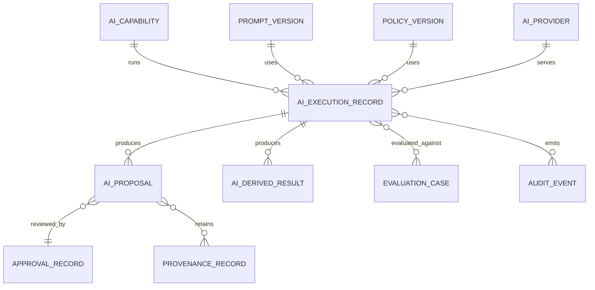
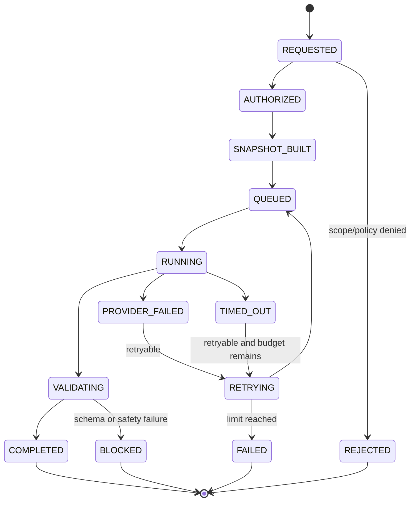

# Gate 2: AI Architecture and Governance

Status: Proposed, awaiting human approval  
Date: 2026-08-24  
Scope: AI architecture and governance only; no application implementation

## A. Gate 2 Architecture

AI is a bounded capability layer inside the approved modular monolith. It is not a curriculum registry, learning runtime, evidence store, approval authority, or hidden source of truth.

```mermaid
flowchart LR
  SOURCE[Authoritative Sources] --> SNAP[ContextSnapshot]
  SNAP --> REQUEST[AIRequest]
  REQUEST --> PERM[Policy and Capability Permission]
  PERM --> REDACT[Redaction]
  REDACT --> PROMPT[PromptVersion and PolicyVersion]
  PROMPT --> PROVIDER[AI Provider Adapter]
  PROVIDER --> VALIDATE[Output Validation]
  VALIDATE --> RECORD[AIExecutionRecord]
  RECORD --> RESULT[AIProposal or AIDerivedResult]
  RESULT --> EVIDENCE[Evidence and Confidence]
  EVIDENCE --> REVIEW[Human Review Policy]
  REVIEW --> DECISION[Approved Decision]
  DECISION --> VERSION[Existing Domain Versioning]
  VERSION --> OUTCOME[Publication or Learning Execution]
  RECORD --> AUDIT[Audit and Observability]
```



The AI Orchestrator owns capability execution, not educational authority. Domain modules own the meaning of inputs and the decision to accept a result. AI receives immutable, bounded snapshots and returns typed outputs with provenance. It cannot write directly to authoritative curriculum, published content, raw evidence, or approved decisions.

The mandatory control flow is:

```text
AUTHORITATIVE SOURCES
  ↓
ContextSnapshot
  ↓
AIRequest
  ↓
Policy + Capability Permission
  ↓
Redaction
  ↓
PromptVersion + PolicyVersion
  ↓
AI Provider
  ↓
Validation
  ↓
AIExecutionRecord
  ↓
AIProposal / AIDerivedResult
  ↓
Evidence + Confidence
  ↓
Human Review Policy
  ↓
Approved Decision
  ↓
Existing Domain Versioning
  ↓
Publication / Learning Execution
```

No stage may be bypassed for a consequential educational output. `AIDerivedResult` may inform a runtime policy only when its confidence, evidence sufficiency, and human-review policy permit that use; it never becomes raw evidence.

### Capability catalog

| Capability | Input | Output | Approval required before authority |
|---|---|---|---|
| Source discovery | User criteria and candidate sources | Candidate source report | Yes, by authorized curriculum administrator |
| Curriculum analysis | Verified curriculum snapshot | Analysis proposal | Yes |
| Learning analysis | Approved curriculum mappings and knowledge graph snapshot | Learning-analysis proposal | Yes |
| Teacher interview | Structured context and interview state | Suggested questions and design changes | Yes |
| Carousel co-authoring | Approved mappings, analysis, interview decisions | Carousel/slide proposal | Yes |
| Question generation | Blueprint request and constraints | Blueprint proposal or revision | Yes |
| Gap analysis | Versioned evidence snapshot and policy | Classified derived result/recommendation | Policy and human review as configured |
| Remediation recommendation | Gap evidence and available resources | Remediation proposal | Yes before content becomes approved |
| Learner simulation | Immutable Carousel version and test profiles | Simulation report | Teacher review before publication |
| Reporting assistance | Authorized derived projections | Draft narrative/report interpretation | Report owner approval where required |
| Curriculum update analysis | Candidate source and old/new snapshots | Comparison and impact proposal | Curriculum administrator approval |
| Annual improvement analysis | Aggregated evidence and feedback | Improvement recommendations | Teacher/administrator approval |

AI capabilities are invoked through ports. The initial implementation may run them in one worker, but each capability has an explicit input snapshot, output contract, policy, and audit record.

## B. AI Domain Model



### Ownership

- **AI Orchestrator:** validates requests, selects capability, applies policy, creates execution jobs, and coordinates adapters.
- **Prompt Registry:** owns immutable prompt templates and versions.
- **Policy Registry:** owns immutable AI safety, data, quality, and cost policies.
- **Provider Adapter:** translates a canonical request to a provider and returns provider metadata; it does not interpret educational truth.
- **AI Governance:** owns approval of prompt/model/provider bundles, evaluation results, exceptions, and rollback.
- **Target domain:** owns the proposed asset or derived interpretation after AI returns.
- **Audit:** owns immutable execution, access, approval, publication, and failure records.

## C. AI Contracts

All contracts are versioned TypeScript/Zod contracts with generated JSON Schema. The schema version is stored with every request, execution, proposal, and result.

### AIRequest

```text
AIRequest
  requestId, capability, callerIdentity, tenantScope
  targetType, targetLogicalAssetId, targetRevisionId?
  inputSnapshotReferences, allowedDataClasses
  promptVersionId, policyVersionId, outputSchemaVersion
  deadline, priority, idempotencyKey, createdAt
```

The request contains references to immutable snapshots, not uncontrolled live database reads. `allowedDataClasses` is deny-by-default.

### ContextSnapshot

`ContextSnapshot` is the immutable, content-addressed representation of the educational context supplied to one AI request.

```text
ContextSnapshot
  snapshotId, snapshotHash, createdAt, expiresAt
  tenantScope, learnerScope?, purpose
  curriculumVersionReferences, sourceReferences
  learningAnalysisRevisionReferences
  carouselVersionReferences, contentRevisionReferences
  questionAssessmentRevisionReferences
  remediationRevisionReferences
  relevantEvidenceEventReferences, derivedResultReferences
  teacherDecisionReferences, priorProposalReferences
  promptVersionId, policyVersionId, outputSchemaVersion
  authorityLabels, verificationStatuses, provenanceReferences
  redactionPolicyVersion, includedDataClasses
  retrievalQueryId, retentionPolicyVersion
```

The snapshot records the exact versions and provenance available to the model, including authority and verification labels. Its hash covers the canonical serialized, redacted payload and reference manifest. The underlying immutable records remain the system of record; the snapshot is retained according to policy so an execution can be reproduced as closely as technically possible.

### AIExecutionRecord

```text
AIExecutionRecord
  executionId, requestId, capability
  providerId, providerVersion, modelId, modelVersion
  promptVersionId, policyVersionId, outputSchemaVersion
  inputSnapshotHash, redactionPolicyVersion
  startedAt, completedAt, durationMs
  status, attemptNumber, timeoutState
  inputTokens, outputTokens, tokenLimit
  cost, currency, rateLimitBucket
  validationResult, safetyResult
  outputHash, proposalIds, derivedResultIds
  errorCode, retryable, fallbackUsed
  correlationId, createdAt
```

### AIProposal

```text
AIProposal
  proposalId, executionId, capability
  targetType, targetLogicalAssetId, targetRevisionId?
  proposedRevisionPayload, outputSchemaVersion
  evidenceReferences, provenance
  confidence, uncertainty, alternatives
  risks, assumptions, unresolvedQuestions
  status, createdAt, expiresAt
  approvalId?, publicationId?
```

An `AIProposal` is not authoritative. It must be accepted, modified, rejected, or superseded through the target domain workflow.

### AIDerivedResult

```text
AIDerivedResult
  resultId, executionId, targetType, subjectId
  resultType, value, evidenceReferences
  policyVersionId, confidence, uncertainty
  provenance, reviewStatus, computedAt, expiresAt
```

Derived results are interpretations, not raw evidence. They must never overwrite immutable student evidence.

### PromptVersion

```text
PromptVersion
  promptLogicalId, revisionId, capability
  systemInstructions, inputTemplate, outputInstructions
  allowedContextClasses, untrustedContextDelimiters
  schemaVersion, safetyPolicyVersion
  author, changeReason, tests, status
  approvedBy, approvedAt, activatedAt, retiredAt
```

Secrets, credentials, hidden chain-of-thought, and provider-specific authentication data are excluded from prompt content.

### PolicyVersion

```text
PolicyVersion
  policyLogicalId, revisionId, policyType
  dataAccessRules, redactionRules, safetyRules
  confidenceRules, approvalRules, costRules
  timeoutRules, retryRules, rateRules
  evaluationThresholds, effectiveAt, status
  approvedBy, approvedAt
```

### AIExecutionResult and AIExecutionError

Results contain only schema-valid output, validation findings, provenance, and execution references. Errors are typed as `VALIDATION_FAILED`, `SAFETY_BLOCKED`, `UNAUTHORIZED_CONTEXT`, `TIMEOUT`, `RATE_LIMITED`, `PROVIDER_UNAVAILABLE`, `BUDGET_EXCEEDED`, `PROMPT_INJECTION_SUSPECTED`, or `INTERNAL_FAILURE`, with retryability and safe next action.

## D. AI State Machines

### Execution lifecycle



### Proposal lifecycle

```text
DRAFT
  -> AI_PROPOSED
  -> TEACHER_REVIEW
  -> REVISION_REQUIRED -> AI_PROPOSED or TEACHER_REVIEW
  -> APPROVED
  -> PUBLISHED
  -> ARCHIVED or SUPERSEDED
```

An AI result can remain `AI_DERIVED` without becoming published content. Rejection, expiry, supersession, and rollback preserve the original proposal and execution records.

### Governance bundle lifecycle

```text
DRAFT -> EVALUATION -> REVIEW -> APPROVED -> ACTIVE -> RETIRED
```

A governance bundle is the compatible set of model, provider, prompt, policy, and schema versions used in production. A new bundle cannot become active without evaluation and approval.

## E. Prompt Architecture

Prompts are composed from versioned, separately reviewed layers:

1. **System policy:** role, safety rules, truth boundaries, output restrictions.
2. **Capability instructions:** task-specific behavior and required reasoning summary format.
3. **Contract instructions:** schema, allowed enums, required references, and refusal behavior.
4. **Verified context:** immutable curriculum, learning design, evidence, or resource snapshots.
5. **Untrusted context:** student/resource/user text clearly delimited and treated as data, never instructions.
6. **Request parameters:** bounded options from the calling domain.

The model receives explicit labels for source authority and uncertainty. Official curriculum text is never mixed with AI suggestions without origin metadata. Prompts require citations to input snapshot references and prohibit invented sources, silent field changes, direct publication, and unsupported certainty.

Prompt injection defenses include delimiters, instruction hierarchy, content classification, tool allowlists, output validation, URL/resource sanitization, and refusal when untrusted content attempts to alter policy or access scope. Retrieved content is quarantined until validated; no retrieved text can grant permissions or change a policy.

## F. Governance Model

### Non-negotiable rules

- AI cannot activate, publish, archive, or mutate authoritative educational assets.
- AI cannot create, edit, delete, or reinterpret raw student evidence.
- AI cannot bypass teacher, curriculum administrator, or publication approval.
- Every execution and output has a prompt, model, provider, policy, schema, input snapshot, and provenance reference.
- A low-confidence or conflicting result must remain uncertain or request human review.
- Human edits create a new revision and retain the originating proposal.
- Published content is immutable; AI suggestions target a new draft revision.

### Approval gates

| AI output | Minimum gate |
|---|---|
| Official source candidate | Curriculum administrator verifies authority and source |
| Curriculum interpretation | Curriculum administrator reviews provenance and interpretation |
| Learning analysis | Authorized teacher/curriculum reviewer approves |
| Carousel or slide design | Teacher review and normal publication approval |
| Question blueprint | Teacher/assessment reviewer validates answer, evidence, and routing |
| Gap classification | Policy validation; human review for high-impact or low-confidence cases |
| Remediation recommendation | Teacher approval before becoming an approved learning path |
| Simulation report | Teacher reviews failures and release blockers |
| Student/parent report narrative | Report owner reviews before external distribution |

Approval is an explicit command recorded by the existing `ApprovalRecord`. Publication is a separate explicit command recorded by `PublicationRecord`.

## G. Evaluation Strategy

### Evaluation assets

- Versioned golden datasets for source discovery, curriculum analysis, learning analysis, question blueprints, gap classification, remediation, simulations, and reporting.
- Representative positive, ambiguous, adversarial, multilingual, malformed, and privacy-sensitive cases.
- Expert-labeled expected fields, acceptable alternatives, prohibited claims, and escalation conditions.
- Synthetic student evidence for simulation; no production student data in development evaluation unless explicitly de-identified and approved.

### Test layers

1. Contract validation: schema, enums, references, provenance, and lifecycle rules.
2. Deterministic policy tests: access, redaction, confidence, safety, cost, and approval gates.
3. Golden-case evaluation: required fields, factual grounding, mappings, routing, and uncertainty.
4. Regression evaluation: compare active bundle with candidate bundle against prior cases.
5. Adversarial testing: prompt injection, untrusted curriculum/resource text, data exfiltration, jailbreaks, and malformed outputs.
6. Simulation evaluation: verify learner profiles, routing, remediation, recovery, mastery, dead ends, and unnecessary loops.
7. Human review sampling: expert scoring of educational quality and safety.

A candidate bundle requires all blocking safety tests to pass and must meet capability-specific quality thresholds. Thresholds are stored in `PolicyVersion`; no single universal score is sufficient for every capability.

## H. Security and Privacy Model

AI jobs use a separate service identity with least privilege. The job receives only the tenant, learner, curriculum, and asset data explicitly allowed by `AIRequest` and `PolicyVersion`. Direct provider access to the platform database is prohibited.

### Data handling

- Classify fields as public, educational-content, operational, sensitive student, or restricted identity data.
- Redact identifiers and unnecessary free text before provider calls.
- Use stable pseudonymous IDs when identity is not required.
- Prohibit raw credentials, access tokens, private keys, and unrestricted student records in prompts.
- Record redaction policy and input snapshot hash, not unnecessary sensitive payload copies.
- Apply retention limits to provider logs and execution payloads.
- Require approved regional processing and contractual controls for external providers.
- Support deletion, export, and access requests without deleting immutable audit or evidence records required for legal/educational integrity.

Authorization is checked before context construction and again before result delivery. AI cannot use a proposal to expand its own scope.

## I. Failure and Recovery Model

| Failure | Behavior | Evidence/governance result |
|---|---|---|
| Timeout | Cancel if possible, bounded retry if allowed, otherwise typed failure | No proposal; audit timeout |
| Rate limit | Respect provider retry-after and local budget | No duplicate execution; audit throttling |
| Provider outage | Use approved fallback only for compatible capability/bundle, otherwise fail safely | Record fallback or unavailable status |
| Invalid JSON/schema | Reject output; optionally retry with same policy and bounded attempt | No authoritative mutation |
| Safety violation | Block output and escalate according to policy | Record safety block; never publish |
| Prompt injection suspicion | Quarantine context, refuse unsafe operation, require review | Record source and security event |
| Partial network failure | Idempotent execution request and durable job receipt | One execution identity, no duplicate proposal |
| Low confidence | Return uncertainty and request more evidence/review | No strong learner claim |
| Budget exceeded | Stop execution and return deterministic failure | Record cost and budget event |
| Human rejection | Preserve proposal and rationale; close or revise | No publication |
| Published-content rollback | Deactivate publication through governance command; select prior approved version if permitted | Preserve all historical evidence and records |

Retries are bounded by `PolicyVersion` and use the same request idempotency key. A retry may create a new provider attempt under one execution record but cannot create duplicate authoritative proposals.

## J. Cost and Rate Model

Each capability has configurable budgets for daily/monthly spend, per-tenant spend, per-user request rate, concurrent jobs, input tokens, output tokens, maximum execution time, and retry count. Requests are rejected or downgraded to a deterministic fallback when a budget is exceeded.

Cost records use provider-reported usage when available and conservative estimates otherwise. The system records currency, pricing policy version, token counts, cache use, fallback use, and tenant attribution. Caching is permitted only for identical immutable input snapshot, prompt, policy, model, and output schema versions. Student-specific results must not leak across tenants or learners through cache keys.

## K. Architecture Decision Records

### ADR-011: AI is an adapter-backed capability layer

**Decision:** AI is invoked through an orchestrator and provider ports, returning typed proposals or derived results.  
**Rationale:** prevents provider coupling and keeps domain authority outside the model.  
**Alternatives:** direct model calls from domain modules.  
**Consequences:** requires explicit contracts and orchestration records.  
**Status:** Proposed for approval.

### ADR-012: Immutable execution and proposal lineage

**Decision:** Every AI request, execution, output, proposal, approval, and publication is linked and retained according to policy.  
**Rationale:** supports reproducibility, audit, rollback, and educational accountability.  
**Alternatives:** retain only final generated content.  
**Consequences:** storage and retention policies are required.  
**Status:** Proposed for approval.

### ADR-013: Versioned governance bundles

**Decision:** Model, provider, prompt, policy, and schema versions activate only as an evaluated bundle.  
**Rationale:** prevents silent production behavior changes.  
**Alternatives:** independently update model or prompts.  
**Consequences:** bundle evaluation and activation records are required.  
**Status:** Proposed for approval.

### ADR-014: Snapshot-based AI context

**Decision:** AI consumes immutable, hashed, redacted input snapshots.  
**Rationale:** makes executions reproducible and prevents live-data drift during a job.  
**Alternatives:** unrestricted live database reads.  
**Consequences:** snapshot creation and expiry must be managed.  
**Status:** Proposed for approval.

### ADR-015: Fail closed for unsafe or invalid output

**Decision:** Schema, authorization, provenance, and safety failures produce no authoritative mutation.  
**Rationale:** educational and privacy risks are higher than incomplete automation.  
**Alternatives:** best-effort acceptance with warnings.  
**Consequences:** human review and deterministic fallbacks are needed.  
**Status:** Proposed for approval.

### ADR-016: Provider-neutral AI integration

**Decision:** Provider adapters expose a canonical interface and capability compatibility metadata.  
**Rationale:** supports cost control, resilience, portability, and controlled fallback.  
**Alternatives:** provider-specific domain logic.  
**Consequences:** feature differences must be declared and tested.  
**Status:** Proposed for approval.

## L. Risks

| Risk | Severity | Mitigation | Residual state |
|---|---|---|---|
| Hallucinated curriculum claims | Critical | Verified snapshots, provenance, grounding checks, human approval | Requires evaluation data |
| Unsafe learner diagnosis | Critical | Closed classifications, confidence rules, human escalation | Requires policy thresholds |
| Prompt injection through resources | High | Untrusted-content boundaries, sanitization, tool restrictions | Requires adversarial testing |
| Sensitive student data exposure | Critical | Redaction, least privilege, provider controls, retention | Jurisdiction decisions remain open |
| Silent model behavior change | High | Versioned bundles, regression tests, activation approval | Requires governance operations |
| AI output schema drift | High | Generated schemas, validation, compatibility tests | Requires CI implementation |
| Provider outage or lock-in | Medium | Adapter and approved fallback strategy | Fallback compatibility must be tested |
| Cost runaway | High | Budgets, token/rate limits, caching, attribution | Pricing policies remain configurable |
| Duplicate execution or proposals | High | Idempotency keys, durable receipts, lineage | Requires integration tests |
| Overreliance on AI confidence | High | Uncertainty rules and evidence sufficiency | Requires expert calibration |
| Teacher approval fatigue | Medium | Risk-based gates and structured review queues | Workflow usability to validate later |
| Cross-tenant cache leakage | Critical | Scope-bound cache keys and authorization checks | Requires security testing |
| Untrusted generated report claims | High | Evidence references, report-owner approval | Requires narrative evaluation |
| Stale input snapshots | Medium | Snapshot expiry and version references | Policy choice remains open |
| Multilingual/math rendering errors | Medium | Representative bilingual and equation cases | Requires pilot datasets |
| Prompt/template secret leakage | High | Secret separation and registry review | Requires operational controls |
| Excessive automation scope | Medium | Explicit non-goals and approval gates | Monitor during implementation |

## M. Gate 2 Compliance Matrix

| # | Required capability | Status | Evidence in this document |
|---:|---|---|---|
| 1 | AI capability architecture | PASS | A |
| 2 | AI provider abstraction | PASS | A, B, K ADR-016 |
| 3 | AI execution model | PASS | A, C, D, I |
| 4 | AI proposal model | PASS | C, D, F |
| 5 | `AIExecutionRecord` | PASS | C |
| 6 | Prompt architecture | PASS | E |
| 7 | Prompt versioning | PASS | C, E, K ADR-013 |
| 8 | Policy versioning | PASS | C, D, K ADR-013 |
| 9 | Curriculum analysis workflows | PASS | A, F |
| 10 | Teacher-AI interview workflows | PASS | A, C, F |
| 11 | Carousel co-authoring workflows | PASS | A, F |
| 12 | Question-generation workflows | PASS | A, C, G |
| 13 | Gap-analysis workflows | PASS | A, C, G |
| 14 | Remediation recommendation workflows | PASS | A, F, G |
| 15 | Learner simulation workflows | PASS | A, F, G |
| 16 | AI confidence and uncertainty | PASS | C, E, G |
| 17 | AI output validation | PASS | A, C, G, I |
| 18 | AI provenance | PASS | A, C, E, F |
| 19 | AI safety and educational guardrails | PASS | E, F, H, I |
| 20 | Human approval gates | PASS | F |
| 21 | AI evaluation datasets | PASS | G |
| 22 | Regression testing | PASS | G |
| 23 | Model/provider change management | PASS | D, G, K ADR-013 |
| 24 | Rollback/fallback strategy | PASS | I, K ADR-016 |
| 25 | Cost and rate controls | PASS | C, J |
| 26 | Privacy and data redaction | PASS | E, H |
| 27 | AI audit architecture | PASS | A, B, C, H |
| 28 | Failure and timeout handling | PASS | D, I |
| 29 | Prompt injection and untrusted content | PASS | E, H, I |
| 30 | AI-specific security boundaries | PASS | A, F, H |

## N. Gate 3 Recommendation

Gate 3 should define Curriculum Source Architecture and verification workflows. It may specify source discovery, authority registries, document identity, retrieval and extraction boundaries, provenance capture, curriculum package validation, version comparison, ambiguity handling, and curriculum administrator approval.

Gate 3 must not silently ingest official content, choose ambiguous sources, generate learning content, publish AI proposals, build dashboards, implement the Carousel runtime, or create production student-data persistence.

## Gate 2.6 Hardening Addendum

This addendum closes the findings from the adversarial review. It introduces architecture contracts and governance rules only; it does not implement them.

### 1. Complete ContextSnapshot

`ContextSnapshot` is the immutable, content-addressed manifest and canonical redacted payload available to one AI execution. A hash alone is not sufficient.

```text
ContextSnapshot
  contextSnapshotId, createdAt, expiresAt, snapshotStatus
  tenantScope, learnerScope?, purpose, aiCapability
  curriculumVersionReferences, curriculumNodeRevisionReferences
  authoritativeSourceReferences
  sourceAuthorityLevels, sourceVerificationStatuses
  contentAssetRevisionReferences
  carouselDefinitionRevision, carouselVersionRevision
  carouselRunReference?
  relevantEvidenceReferences, evidenceVersionIdentifiers
  promptVersionId, policyVersionId, schemaVersion
  authorizationScope, redactionPolicyVersion
  canonicalPayloadHash, manifestHash
  retentionPolicyVersion, retrievalQueryId
```

The manifest records the logical ID, immutable revision, authority, verification state, tenant scope, and inclusion reason for every referenced object. The canonical payload is stored or reproducibly reconstructed from immutable source records, with its serialization rules and hash algorithm recorded. Snapshot retention is governed by policy; expiry prevents new use but does not remove required audit lineage. The underlying curriculum, asset, evidence, prompt, and policy records remain authoritative.

### 2. Mathematics AI Validation Architecture

Language-model plausibility is never mathematical truth. Mathematical capabilities must pass deterministic or expert validation appropriate to the output:

| Capability | Required validation |
|---|---|
| `QUESTION_GENERATION` | Deterministic answer generation, symbolic/equation checks, variable/unit checks, mark-scheme alignment |
| `SOLUTION_GENERATION` | Symbolic verification, equation equivalence, worked-step consistency, alternate-solution verification |
| `EXPLANATION_GENERATION` | Terminology, notation, variable consistency, worked-step and conclusion checks |
| `FEEDBACK_GENERATION` | Recompute claims, answer consistency, misconception/routing consistency, mark-scheme alignment |
| `ASSESSMENT_GENERATION` | Blueprint constraints, answer validity, difficulty, marks, units, notation, and expert review |
| `REMEDIATION_GENERATION` | Mathematical correctness, prerequisite alignment, examples/non-examples, and recovery validity |
| `CURRICULUM_ANALYSIS` | Terminology and notation validation plus source-grounding and expert review |

Validation mechanisms include deterministic arithmetic, symbolic equivalence, unit and dimensional consistency where applicable, variable and notation validation, alternate solutions, worked-step consistency, mark-scheme alignment, terminology glossaries, and expert mathematics evaluation datasets. Adversarial cases include misleading diagrams, edge cases, invalid units, sign errors, undefined variables, equivalent-but-differently-formatted answers, and plausible incorrect proofs. A failed or unavailable math validator blocks publication for affected capabilities.

### 3. Provider Training and Data Reuse Policy

The default policy is deny. Student data and restricted educational data must not be used by an external provider for training, model improvement, profiling, or unrelated secondary purposes unless explicitly authorized, legally permitted, appropriately consented where required, documented, versioned, and auditable.

```text
ProviderCompliance
  providerId, trainingUsePolicy, retentionPolicy
  geographicRegion, dataProcessingAgreementStatus
  complianceAttestation, lastVerificationAt, nextReviewAt
  reviewerId, restrictedDataApproved, evidenceReference
```

Provider settings are verified before restricted data is sent. Missing, expired, or contradictory compliance evidence causes a fail-closed result for restricted data. Provider logs and retained payloads follow the stricter platform retention policy.

### 4. Capability-Level Permission Model

`AICapabilityPermission` is evaluated per capability, not as one generic AI role.

```text
AICapabilityPermission
  capabilityId, permittedInputTypes, permittedDataClasses
  permittedToolIds, permittedOutputTypes, allowedSideEffects
  maximumContextScope, authorizationRequirements
  humanApprovalLevel, costLimit, rateLimit, retentionRule
  policyVersionId, effectiveAt, status
```

| Capability | Inputs | Tools | Outputs | Side effects | Approval |
|---|---|---|---|---|---|
| `CURRICULUM_ANALYSIS` | Verified curriculum snapshots | Source/provenance read | Analysis proposal | Create proposal only | Mandatory |
| `LEARNING_ANALYSIS` | Approved curriculum and graph snapshots | Knowledge read | Learning-analysis proposal | Create proposal only | Mandatory |
| `CAROUSEL_DESIGN` | Approved mappings, analysis, interview results | Approved content read | Carousel/slide proposal | Create draft revision only | Mandatory |
| `QUESTION_GENERATION` | Blueprint constraints and approved mappings | Math validator, glossary read | Blueprint proposal | Create draft blueprint only | Mandatory |
| `GAP_ANALYSIS` | Scoped evidence snapshot | Evidence read, deterministic analyzers | Derived result/hypothesis | No learner-state mutation | Optional review; mandatory for high impact |
| `REMEDIATION` | Gap evidence and approved resources | Resource read, math validator | Remediation proposal | Create draft path only | Mandatory for intervention |
| `SIMULATION` | Immutable Carousel version and synthetic profiles | Runtime simulator read | Simulation report | No learner or asset mutation | Mandatory before publication |
| `REPORTING` | Authorized projections and approved data | Report template read | Draft report or low-risk aggregate | Draft creation only | Mandatory before official distribution |
| `CURRICULUM_UPDATE` | Verified old/new source snapshots | Comparison and impact read | Update/impact proposal | Create candidate version only | Mandatory |

### 5. AI Tool Permission

```text
AIToolPermission
  toolId, capability, allowedActor
  inputSchema, argumentRestrictions, dataScope
  tenantScope, learnerScope, sideEffects
  readWriteClassification, approvalRequirement
  auditRequirement, policyVersionId, status
```

Tools are allowlisted per capability and job. AI has no unrestricted database, network, filesystem, publication, or messaging tool. Write-classified tools are prohibited unless the side effect is explicitly listed as draft/proposal creation and is authorized, validated, idempotent, and audited.

### 6. High-Impact Human Review Policy

Every capability has one of these governance classifications:

```text
MANDATORY_HUMAN_APPROVAL
OPTIONAL_HUMAN_REVIEW
AUTOMATIC_EXECUTION
```

| Capability/output | Classification | Rule |
|---|---|---|
| Curriculum analysis and interpretation | `MANDATORY_HUMAN_APPROVAL` | Cannot become curriculum truth |
| Learning architecture | `MANDATORY_HUMAN_APPROVAL` | Cannot become approved design |
| Carousel/question/assessment generation | `MANDATORY_HUMAN_APPROVAL` | Cannot publish directly |
| Mastery-policy or curriculum update change | `MANDATORY_HUMAN_APPROVAL` | Activation requires authorized approval |
| High-impact learner intervention or remediation | `MANDATORY_HUMAN_APPROVAL` | Must be reviewed before routing |
| Official student, parent, teacher, or school report | `MANDATORY_HUMAN_APPROVAL` | AI text remains draft until approved |
| Simulation report | `MANDATORY_HUMAN_APPROVAL` | Release blockers require review |
| Low-risk aggregate analytics with no learner-state side effect | `AUTOMATIC_EXECUTION` | Must retain policy, evidence, confidence, and audit references |
| Preliminary gap hypothesis with no routing effect | `OPTIONAL_HUMAN_REVIEW` | Must remain non-authoritative and expire by policy |

AI-derived learner hypotheses cannot become permanent learner-state facts without the applicable evidence-sufficiency and review policy. Confidence never substitutes for evidence.

### 7. Remediation Effectiveness

```text
RemediationEvaluation
  evaluationId, originalGapEvidenceReferences
  gapClassification, classificationConfidence
  remediationProposalId, approvedRemediationRevisionId
  carouselVersionId, carouselRunId, learnerExecutionReference
  recoveryEvidenceReferences, postRemediationResult
  effectivenessAssessment, evaluator, provenance
  policyVersionId, evaluatedAt
```

The evaluation answers whether the original obstacle was resolved, remains unresolved, or has insufficient evidence. It is derived evidence, not a replacement for raw attempts or recovery events.

### 8. AI Rollback Impact

```text
AIRollbackImpactReport
  reportId, targetAssetLogicalId, targetRevisionIds
  affectedCarouselVersionIds, affectedRunIds, affectedLearnerIds
  affectedSlideIds, questionRevisionIds, attemptIds
  evidenceEventIds, derivedAnalyticsIds, reportIds
  downstreamRecommendationIds, impactSummary
  reviewerId, approvalId, deactivationRecordId
  restorationTarget, notifications, createdAt
```

Rollback follows:

```text
impact analysis
→ human review
→ deactivation
→ restoration or supersession
→ historical preservation
→ required notification
→ post-rollback audit
```

Rollback never deletes or rewrites historical evidence. Affected learners and runs retain the exact version used; current recommendations and reports may be recomputed as new projections with explicit policy and rollback references.

### 9. Institutional Knowledge Retrieval

```text
KnowledgeContextQuery
  queryId, caller, tenantScope, timeScope, purpose
  approvedCurriculumVersions
  curriculumChanges, teacherDecisions
  teacherInterviewResults, approvedCarouselVersions
  carouselPerformance, evidenceProjections
  priorAIProposals, approvedRejectedProposals
  evaluationResults, remediationEffectiveness
  historicalReports, academicYearConclusions
  authorityFilters, versionFilters, approvalFilters
```

Results retain authority, version, provenance, tenant scope, time scope, and approval status. Historical AI proposals are context only and cannot be treated as authoritative without current approval. Retrieval is read-only and is included in the `ContextSnapshot` manifest.

### 10. External Resource Contract

```text
ExternalResourceSnapshot
  resourceSnapshotId, metadata, publisherOwner, resourceType
  authorityClassification, verificationStatus, sourceReference
  capturedContentHash, capturedContentVersion
  licensingInformation, retrievedAt, contentProvenance
  aiInterpretationReferences, teacherApprovalReference
  tenantScope, retentionPolicyVersion
```

Metadata, publisher, authority, verification, captured content, licensing, AI interpretation, and teacher approval remain separate. YouTube videos, PDFs, websites, uploaded documents, and articles are supplementary resources unless an authorized curriculum workflow independently verifies them. Popularity never grants curriculum authority.

### 11. Multilingual Educational Governance

Arabic, English, and bilingual outputs require language and semantic validation. The validation contract checks official curriculum terminology, mathematical terminology, notation, equations, variables, units, symbols, bilingual equivalence, instructional intent, difficulty, and assessment meaning. Versioned terminology/glossary references are included in `ContextSnapshot` and `AIExecutionRecord`.

Translation or paraphrase drift creates a new proposal requiring review. Curriculum terminology changes require curriculum-authority approval. Mathematical notation is validated independently of prose translation; a fluent translation is not accepted if its equation, variable, unit, or assessment meaning changes.

### 12. Proposal, Derived Result, and Evidence Sufficiency

`AIProposal` is a recommendation or hypothesis, such as “recommend adding prerequisite remediation.” It may affect learner routing, reports, Carousel design, or curriculum updates only through the corresponding approval policy.

`AIDerivedResult` is a computed observation, such as “31% of attempts failed the target skill under policy P.” It may support low-risk aggregate analytics automatically, but it cannot mutate raw evidence or become a permanent learner-state fact without the applicable policy.

Both retain evidence references, confidence, uncertainty, provenance, policy, and execution lineage. `EvidenceSufficiency` is a separate closed type:

```text
NO_EVIDENCE | INSUFFICIENT_EVIDENCE | SUFFICIENT_EVIDENCE | HIGH_CONFIDENCE_EVIDENCE
```

Confidence expresses uncertainty about an inference; it cannot manufacture evidence. `NO_EVIDENCE` and `INSUFFICIENT_EVIDENCE` cannot authorize a strong classification, mastery decision, or high-impact intervention.

### 13. Model and Fallback Change Governance

Every candidate model change records provider, model, model version, capability, prompt version, policy version, schema version, evaluation dataset version, regression results, approval, activation time, and rollback target. General evaluation is insufficient for mathematics activation; the candidate must pass mathematics-specific evaluation for every mathematics capability it serves.

A fallback model is evaluated per capability for schema output, mathematics correctness, multilingual correctness, safety, confidence behavior, latency, and cost. A fallback cannot activate merely because the primary provider is unavailable. Only an approved compatible governance bundle may be used.

### 14. Report Governance

```text
ReportType:
  STUDENT_REPORT | PARENT_REPORT | TEACHER_REPORT
  SCHOOL_REPORT | INTERNAL_ANALYTICS_REPORT
```

Student reports are requested/viewed by the student within own scope; parent reports by authorized dependent relationship; teacher reports by assigned class scope; school reports by school scope; internal reports by authorized staff. AI-generated text is draft for every external report type and requires the report-owner approval before it becomes official. Retention and export follow the role-specific privacy policy. Internal low-risk aggregate analytics may execute automatically but remain labeled derived and non-authoritative.

### 15. Provider Compliance Verification

Provider compliance is reviewed at onboarding and at `nextReviewAt`, after policy changes, and before restricted-data capability activation. Evidence includes provider data policy, training-use setting, retention configuration, region, agreement status, verification date, reviewer, and next review date. Missing or expired verification fails closed for restricted data and emits an auditable governance event.

### 16. Complete Consequential Lineage

For every consequential output, the required lineage is:

```text
AIRequest
→ ContextSnapshot
→ PromptVersion + PolicyVersion + SchemaVersion
→ Provider + Model + ModelVersion
→ SourceReferences + EvidenceReferences
→ ValidationResults + Confidence + EvidenceSufficiency
→ AIExecutionRecord
→ AIProposal or AIDerivedResult
→ HumanReview where required
→ ApprovalRecord where required
→ PublicationRecord where applicable
```

`AIExecutionRecord` stores the snapshot ID and hash, not merely a free-form input hash. Automatic outputs omit human approval only when their capability permission explicitly classifies them as automatic; they still retain governance state, policy reference, validation, and audit lineage.

### 17. Separated AI Governance States

These state dimensions are independent:

```text
AI_EXECUTION_STATE:
  REQUESTED | AUTHORIZED | SNAPSHOT_BUILT | QUEUED | RUNNING
  VALIDATING | COMPLETED | BLOCKED | TIMED_OUT | FAILED

AI_OUTPUT_STATE:
  NOT_CREATED | AI_PROPOSED | AI_DERIVED | VALIDATED | EXPIRED | REJECTED

GOVERNANCE_STATE:
  DRAFT | EVALUATION | REVIEW | APPROVED | ACTIVE | RETIRED

APPROVAL_STATE:
  NOT_REQUIRED | NOT_REVIEWED | UNDER_REVIEW | APPROVED | REJECTED

PUBLICATION_STATE:
  NOT_PUBLISHED | PUBLISHED | ARCHIVED | SUPERSEDED | DEACTIVATED
```

A successful execution may produce a pending proposal. A rejected proposal remains historically recorded. A published asset may be superseded or deactivated without changing the execution, evidence, or historical version references.

### 18. Gate 1 Contract Alignment

Gate 2 depends on the Gate 1 contracts `QuestionBlueprint`, `GapClassification`, `ProvenanceRecord`, `ApprovalRecord`, `PublicationRecord`, `CarouselDefinition`, `CarouselVersion`, `CarouselRun`, `Checkpoint`, `TeacherInterviewSession`, `EvidenceQuery`, `AuthorizationPolicy`, and `AssetVersion`.

Gate 2 adds and owns: `ContextSnapshot`, `AICapabilityPermission`, `AIToolPermission`, `RemediationEvaluation`, `AIRollbackImpactReport`, `KnowledgeContextQuery`, `ExternalResourceSnapshot`, `AIRequest`, `AIExecutionRecord`, `AIProposal`, `AIDerivedResult`, `PromptVersion`, and `PolicyVersion`.

Dependency direction is one-way: AI reads authorized Gate 1 snapshots and proposes results to Gate 1 domains; Gate 1 domains decide, version, approve, publish, execute, and record evidence. AI never owns or mutates Gate 1 authoritative aggregates.

## Gate 2.6 Final Self-Validation

| Adversarial scenario | Status | Result |
|---:|---|---|
| 1. Curriculum authority attack | PASS | ContextSnapshot carries source, authority, verification, version, and provenance fields. |
| 2. Prompt injection through resources | PASS | Untrusted boundaries, tool restrictions, validation, quarantine, and escalation are defined. |
| 3. AI cannot change authoritative truth | PASS | No direct write path exists; domain approval and versioning are required. |
| 4. AI gap diagnosis | PASS | Proposal/derived/evidence states and evidence sufficiency are separated. |
| 5. AI remediation | PASS | Remediation is proposed, approved, versioned, executed, and evaluated. |
| 6. Published Carousel protection | PASS | Revision, impact, approval, publication, and rollback paths are explicit. |
| 7. Complete AI lineage | PASS | Request through snapshot, model, validation, review, approval, and publication is linked. |
| 8. Context snapshot | PASS | Complete manifest, payload, hash, retention, and reconstruction rules are defined. |
| 9. Model change | PASS | Bundle evaluation, mathematics checks, activation, and rollback are required. |
| 10. Capability permissions | PASS | Inputs, tools, outputs, side effects, scope, approval, cost, and retention are defined per capability. |
| 11. Student privacy | PASS | Default-deny training reuse, minimization, redaction, retention, and provider controls are defined. |
| 12. Cross-tenant leakage | PASS | Tenant/learner scope applies to authorization, snapshots, retrieval, and caches. |
| 13. Duplicate executions | PASS | Idempotent requests and durable execution lineage prevent duplicate proposals. |
| 14. Low confidence | PASS | Low evidence/confidence cannot create strong learner state or publish. |
| 15. Mathematics correctness | PASS | Dedicated deterministic, symbolic, notation, unit, and expert validation is required. |
| 16. Multilingual content | PASS | Terminology, notation, equations, equivalence, and instructional meaning are validated. |
| 17. External resources | PASS | Resource authority, verification, content, interpretation, and approval are separate. |
| 18. Teacher knowledge | PASS | Interview evidence and approved structured learning design remain distinct. |
| 19. AI learning loop | PASS | No consequential shortcut bypasses approval, versioning, evidence, or audit. |
| 20. Always-present AI | PASS | Updates, performance, gaps, reports, comparisons, and annual learning are retrievable capabilities. |
| 21. Persistent institutional knowledge | PASS | KnowledgeContextQuery retrieves approved, versioned, scoped institutional history. |
| 22. Proposal versus derived result | PASS | Different contracts and governance effects are defined. |
| 23. Approval fatigue | PASS | Mandatory, optional, and automatic classifications are explicit. |
| 24. AI reporting | PASS | Report types, access, approval, privacy, retention, and export are defined. |
| 25. AI rollback | PASS | AIRollbackImpactReport identifies affected assets, learners, runs, evidence, and reports. |
| 26. Provider outage | PASS | Retry, queue, evaluated fallback, defer, and safe failure are defined. |
| 27. Cost control | PASS | Hierarchical budgets, token, rate, concurrency, timeout, and retry limits are enforced. |
| 28. AI security boundary | PASS | AI uses scoped, authorized tools and has no unrestricted database access. |
| 29. Architectural completeness | PASS | Gate 1 dependencies and Gate 2 additions are explicitly aligned. |
| 30. Gate 2 verdict | PASS | No Critical or High findings remain in the architecture. |

### Accepted Residual Risks

The remaining Medium risks are accepted for the architecture phase, with rationale:

| Risk | Rationale |
|---|---|
| Exact evaluation thresholds | Must be calibrated with approved mathematics and curriculum datasets; hard-coding them now would be premature. |
| Provider contract verification operations | The contract and fail-closed rule are defined; operational evidence collection belongs in implementation governance. |
| Snapshot storage and expiry mechanics | The model is defined; retention and infrastructure choices depend on legal and deployment decisions. |
| Human review workload | Risk-based approval classes are defined; workflow capacity requires pilot measurement. |
| Specialized graph or retrieval infrastructure | PostgreSQL and ports are sufficient initially; migration requires measured thresholds. |
| Multilingual expert datasets | Validation requirements are defined; representative datasets require approved language and curriculum decisions. |

No Critical or High finding remains unresolved.

## Gate 2.6 Outcome

Changes: adversarial controls, contracts, permission matrices, mathematical validation, provider governance, rollback analysis, knowledge retrieval, multilingual safeguards, state separation, and full self-validation were added.  
Implementation: documentation only; no application code, curriculum content, dashboards, Carousel runtime, production student data, or deployment was created.  
Validation: all 30 adversarial scenarios pass; no Critical or High findings remain.  
Status: **Gate 2.6 complete and awaiting explicit approval. Do not proceed to Gate 3 automatically.**

## Gate 2 Outcome

Analyzed: safe AI operation inside the approved platform architecture.  
Designed: capability boundaries, provider abstraction, execution and proposal contracts, prompt and policy versioning, governance workflows, evaluation, security, privacy, failure handling, costs, audits, and ADRs.  
Implemented: this architecture document only; no production code or curriculum content exists.  
Tests: architecture-anchor validation only; no production tests exist.  
Status: **Gate 2 design complete; awaiting explicit human approval. Do not proceed to Gate 3 automatically.**
