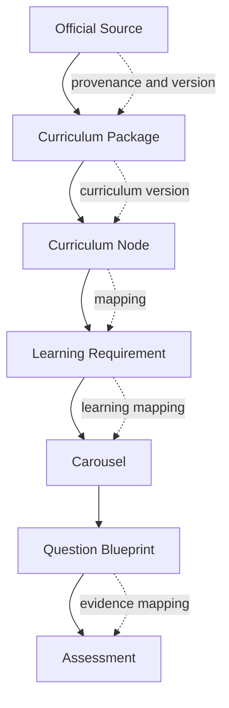
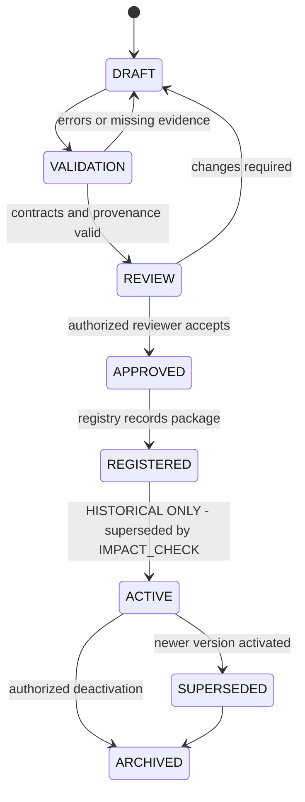
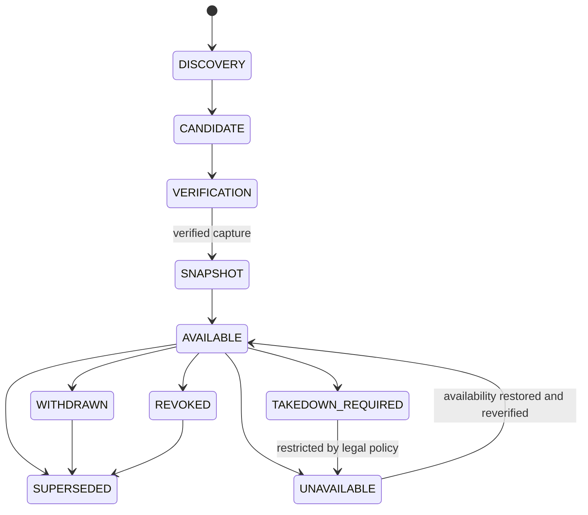
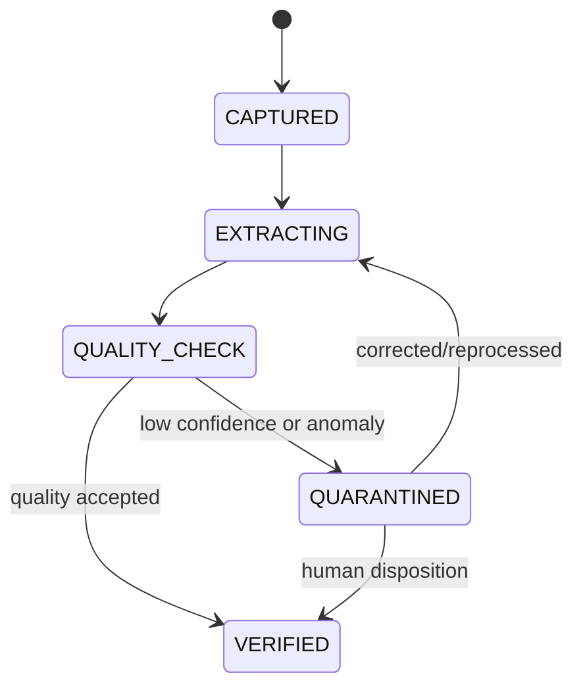
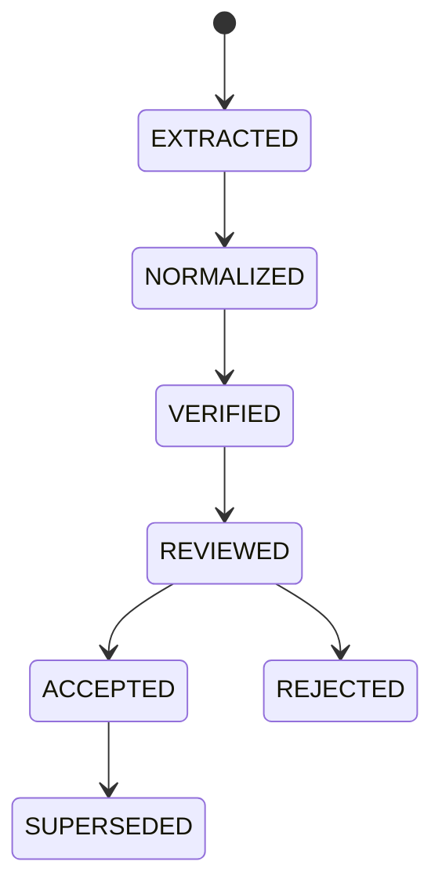
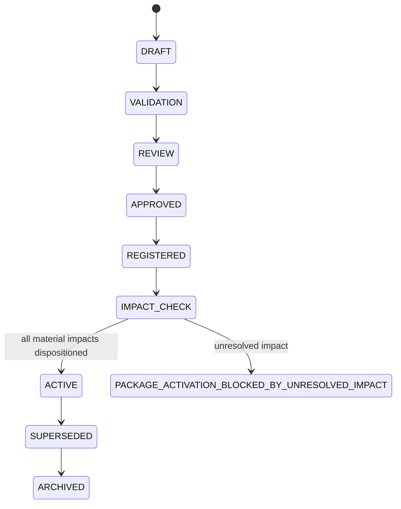

# Gate 3: Curriculum Source Architecture

Status: Proposed, awaiting human approval  
Date: 2026-08-25  
Scope: Curriculum source discovery, verification, ingestion design, provenance, and package governance only

## A. Executive Summary

Gate 3 defines how the platform identifies, verifies, extracts, normalizes, reviews, versions, and activates curriculum packages without treating AI output or an external resource as authoritative by default.

No Egyptian Baccalaureate Mathematics or American Mathematics content is ingested in this gate. The architecture defines the reusable source pipeline that future curriculum packages will use:

```text
User Criteria
→ Source Discovery
→ Candidate Sources
→ Authority Verification
→ Document Identification
→ Version and Effective-Date Verification
→ Source Snapshot
→ Extraction
→ Normalization
→ Structure Detection
→ Objective/Skill/Assessment Extraction
→ Provenance Mapping
→ Validation
→ Human Review
→ Approved Curriculum Package
→ Registration
→ Explicit Activation
```

The Curriculum Registry remains the authority for approved curriculum packages. Curriculum Intelligence may discover, extract, compare, and propose; it cannot activate or publish a curriculum package.

The canonical educational traceability chain is:

```text
Official Source
  ↓
Curriculum Package
  ↓
Curriculum Node
  ↓
Learning Requirement
  ↓
Carousel
  ↓
Question Blueprint
  ↓
Assessment
```

Each downward reference must preserve the originating version and provenance. An `Official Source` supplies verified curriculum facts; a `Curriculum Package` organizes those facts into an approved version; a `Curriculum Node` expresses the source-defined structure; a `Learning Requirement` captures an approved objective, skill, prerequisite, competency, or assessment requirement; a `Carousel` operationalizes the learning design; a `Question Blueprint` defines reusable evidence collection; and an `Assessment` composes versioned blueprints under an approved assessment policy. No later object inherits official authority merely because it references an earlier object.

When an official source changes, the platform must calculate a versioned impact chain rather than silently overwrite downstream assets:

```text
Modification in Official Source
  ↓
Curriculum Package affected
  ↓
Curriculum Nodes affected
  ↓
Learning Requirements affected
  ↓
Carousels affected
  ↓
Question Blueprints affected
  ↓
Assessments affected
```

Each impact edge records the old and candidate versions, change category, provenance references, confidence, and review status. The chain is an impact report, not an automatic update command. Affected assets remain on their existing immutable versions until authorized human review creates, approves, registers, and explicitly activates compatible new versions. Historical learner evidence continues to reference the exact previous versions used.



## B. Design Principles

1. Official facts, source metadata, extracted statements, AI interpretations, teacher annotations, and published package data remain distinguishable.
2. Ambiguous sources are surfaced for authorized human selection; the system never silently chooses among materially different authorities.
3. Source content is immutable once captured. A changed source creates a new snapshot and candidate version.
4. Missing official information remains missing and is flagged; AI must not invent requirements.
5. Every important extracted statement is traceable to a source locator and snapshot.
6. Curriculum hierarchy is represented by generic `CurriculumNode` types, not a fixed grade/unit/chapter/lesson model.
7. Package activation is explicit, authorized, auditable, and independent of repository existence.
8. Historical curriculum versions remain available for evidence reconstruction and impact analysis.
9. Source retrieval is separated from learning analysis, Carousel design, runtime execution, and student evidence.
10. AI assistance follows the approved Gate 2 pipeline and cannot bypass policy, validation, or human governance.

## C. Scope and Non-Goals

### In scope

- Source criteria and discovery
- Authority and source registries
- Candidate comparison and ambiguity handling
- Source capture and version identification
- Extraction and normalization contracts
- Flexible structure detection
- Objective, skill, prerequisite, misconception, and assessment requirement proposals
- Statement-level provenance
- Package validation and release lifecycle
- Curriculum version comparison and impact-analysis inputs
- Human review and activation boundaries
- Source-specific security, licensing, and retention rules

### Not in scope

- Actual curriculum content ingestion
- Egyptian or American curriculum packages
- Learning analysis implementation
- Carousel definitions or runtime
- Dashboards or student/teacher UI
- Production student-data persistence
- AI provider implementation
- Educational content publication
- Deployment infrastructure

## D. Domain Boundaries

| Domain | Responsibility | Boundary |
|---|---|---|
| Source Discovery | Find candidate authoritative sources from criteria | Cannot select authority without verification |
| Authority Registry | Record responsible organizations and authority scope | Does not contain learning designs |
| Source Registry | Identify documents, URLs, versions, dates, language, scope, and status | Does not approve extracted curriculum |
| Source Capture | Retrieve and hash source snapshots with legal and technical metadata | Does not interpret meaning |
| Curriculum Intelligence | Extract, normalize, detect structure, compare, and propose mappings | Cannot activate packages |
| Curriculum Registry | Own packages, versions, nodes, mappings, and lifecycle | Does not own raw retrieval mechanics |
| Provenance | Link statements and assets to source records and transformations | Does not approve content |
| Review and Governance | Manage human review, approval, rejection, and activation | Does not silently edit sources |
| Versioning | Create revisions, comparisons, supersession, and impact reports | Does not rewrite historical evidence |
| AI Governance | Apply Gate 2 execution, scope, redaction, validation, and lineage | Does not become source of truth |

The module interaction rule from Gate 1 remains: modules communicate through application ports or published events and do not access another module's private persistence directly.

## E. Source Discovery Architecture

### Discovery request

```text
CurriculumSourceDiscoveryRequest
  requestId, requesterId, tenantScope
  curriculumName, country, programme, subject
  grade?, stage?, pathway?, track?, qualification?
  syllabusCode?, academicYear?, language?
  optionalSourceReference?, purpose, createdAt
```

If a source reference is supplied, the system verifies it rather than trusting it. If no source is supplied, discovery uses the authority registry, approved search connectors, and source criteria. Search results are candidates, not facts.

### Candidate source

```text
CurriculumSourceCandidate
  candidateId, discoveryRequestId
  authorityId?, sourceReference, documentTitle?
  publisher, sourceType, language?, country?, programme?
  authorityLevel, relevance, currentStatus
  candidateVersion?, publicationDate?, effectiveDate?
  retrievalDate, ambiguityReasons, provenance
  verificationStatus, reviewerId?, createdAt
```

Candidate ranking may assist navigation, but ranking never equals authority. The system presents material conflicts such as different programmes, grades, pathways, academic years, superseded documents, unofficial publishers, or incomplete documents to an authorized reviewer.

### Authority record

```text
AuthorityRecord
  authorityId, legalName, country, programmeScope
  subjectScope, jurisdiction, officialDomains
  authorityLevel, verificationEvidence
  effectiveFrom, effectiveTo, status, reviewedAt, reviewerId
```

Authority level is an explicit value such as `RESPONSIBLE_OFFICIAL_AUTHORITY`, `DELEGATED_OFFICIAL_BODY`, `ACCREDITED_PROVIDER`, `SUPPLEMENTARY_PROVIDER`, or `UNVERIFIED`. Only approved authority levels may satisfy an official-source requirement.

## F. Source Verification and Capture

### Source verification

```text
SourceVerification
  verificationId, candidateId, authorityId
  sourceIdentity, documentIdentifier, sourceType
  authorityCheck, authenticityCheck, versionCheck
  publicationDateCheck, effectiveDateCheck, supersessionCheck
  scopeCheck, languageCheck, completenessCheck
  verificationStatus, findings, reviewerId, verifiedAt
  nextReviewAt, provenance
```

Statuses are `UNVERIFIED`, `PARTIALLY_VERIFIED`, `SOURCE_VERIFIED`, `REJECTED`, and `AMBIGUOUS_REQUIRES_REVIEW`. A package cannot proceed to approved status from `UNVERIFIED` or unresolved `AMBIGUOUS_REQUIRES_REVIEW` source data.

### Source snapshot

```text
SourceSnapshot
  sourceSnapshotId, sourceId, sourceVersion
  canonicalReference, retrievalUri, retrievedAt
  contentHash, contentVersion, mediaType, encoding
  pageOrSectionLocators, capturedBy
  licensingInformation, retentionPolicyVersion
  accessibilityMetadata, integrityStatus, provenance
```

A source snapshot is an immutable capture of the source representation used for extraction. The URI alone is not sufficient because external content can change. The content hash identifies the captured representation; locators identify relevant pages, headings, tables, or other structural positions. Retention and access must follow licensing and legal policy.

## G. Extraction and Normalization

### Pipeline stages

1. **Retrieval:** obtain an allowed source representation and create a `SourceSnapshot`.
2. **Extraction:** capture text, tables, headings, lists, equations, images, and locators without claiming meaning.
3. **Normalization:** preserve original text and produce normalized representations with language and formatting metadata.
4. **Structure detection:** identify candidate hierarchy and relationships without assuming fixed educational labels.
5. **Statement extraction:** identify candidate requirements, objectives, standards, skills, assessment rules, and constraints.
6. **Provenance mapping:** attach source snapshot and locator to every important statement.
7. **Validation:** detect missing references, conflicts, duplicates, unsupported inferences, and malformed structures.
8. **Human review:** approve, modify, reject, or mark unresolved proposals.

### Extracted statement

```text
CurriculumStatement
  statementId, sourceSnapshotId, sourceLocator
  originalText, normalizedText, language
  statementType, authorityLevel, verificationStatus
  interpretationConfidence, extractedBy
  relatedNodeCandidateId?, objectiveCandidateId?
  unresolvedIssues, provenance, createdAt
```

`originalText` is preserved. `normalizedText` is a derived representation and never replaces the source. AI-generated interpretations are separately linked and labeled; an inferred objective cannot be stored as an official fact.

## H. Universal Curriculum Package Contract

This gate preserves the Gate 1 package model and adds source-release details:

```text
CurriculumPackage
  packageLogicalAssetId, packageRevisionId
  identity, authority, programme, subject, language
  curriculumVersionId, academicYear, effectiveDates
  sourceReferences, sourceSnapshotReferences
  nodeRevisionReferences, objectiveReferences, skillReferences
  prerequisiteReferences, misconceptionReferences
  assessmentRequirementReferences, mappingReferences
  curriculumSpecificExtensions
  provenance, validationReportId
  lifecycleStatus, approvalRecordId, activationRecordId
```

`CurriculumNode` remains generic:

```text
CurriculumNode
  logicalAssetId, revisionId, type, title, description
  parentRevisionId?, childRevisionIds, order?
  curriculumVersionId, sourceReferences
  objectiveIds, skillIds, prerequisiteIds
  assessmentRequirementIds, metadata, namespacedExtensions
```

The package may use programme, stage, grade, year, track, pathway, paper, unit, topic, standard, objective, competency, or another source-defined node type. The runtime relies on relationships and capabilities, not these labels.

## I. Curriculum Package Release Lifecycle

**HISTORICAL / SUPERSEDED:** This earlier lifecycle is retained for design history. Its direct `REGISTERED → ACTIVE` path is no longer permitted. The canonical lifecycle and activation preconditions are defined in Gate 3.8 section 20 below.



### Gate requirements

- **DRAFT:** editable candidate; not available to learning or runtime modules.
- **VALIDATION:** schema, references, provenance, source, language, and structural checks run.
- **REVIEW:** authorized reviewer resolves findings and ambiguities.
- **APPROVED:** approval record identifies actor, revision, evidence, and time.
- **REGISTERED:** package receives registry identity and dependency index.
- **ACTIVE:** explicit activation record makes the package available to authorized consumers.
- **SUPERSEDED:** a newer active version exists; historical use remains valid.
- **ARCHIVED:** unavailable for new use but retained for history and evidence reconstruction.

Repository presence, successful extraction, or AI completion cannot activate a package.

## J. Validation Architecture

### Package validation

Validation must check:

- Contract and schema validity
- Unique logical and revision IDs
- Parent/child reference integrity
- No cycles where the package disallows them
- Objective, skill, prerequisite, misconception, and assessment references
- Source snapshot and locator presence
- Authority and verification status
- Statement type and provenance completeness
- Language and terminology metadata
- Duplicate or conflicting requirements
- Unresolved ambiguity flags
- Curriculum-specific extension namespace validity
- Version and effective-date consistency
- Licensing and retention metadata

Validation produces a versioned report. Errors block review or approval; warnings require explicit disposition.

### AI-assisted extraction validation

AI extraction must use the approved Gate 2 pipeline with a `ContextSnapshot`, `AIRequest`, `AIExecutionRecord`, output validation, and provenance. AI may propose structure, objectives, skills, prerequisites, misconceptions, and assessment mappings. It may not convert an inference into an official statement or bypass source verification.

## K. Human Review and Governance

### Review roles

- **Source reviewer:** verifies document identity, authority, version, scope, and dates.
- **Curriculum reviewer:** reviews extracted statements, structure, mappings, and unresolved ambiguity.
- **Subject expert:** reviews subject terminology, objectives, skills, and assessment meaning.
- **Curriculum administrator:** approves package version and activation.
- **Platform administrator:** administers registry and technical policies but cannot substitute for curriculum approval.

### Review decision

```text
CurriculumReviewDecision
  decisionId, targetType, targetRevisionId
  reviewerId, role, decision
  acceptedChanges, rejectedChanges, unresolvedIssues
  rationale, evidenceReferences, provenance
  createdAt, supersedesDecisionId
```

A teacher or expert annotation remains a teacher/expert annotation. It does not become an official curriculum fact merely because it was accepted into a draft. Approval and publication records remain separate from provenance.

## L. Curriculum Version Comparison and Updates

The Gate 1 and Gate 2 update model is applied to source architecture:

```text
Source change detected
→ verify authority and document identity
→ capture new SourceSnapshot
→ identify candidate CurriculumVersion
→ compare old/new statements and nodes
→ analyze impact
→ human review
→ create new package revision/version
→ approve
→ register
→ activate explicitly
→ supersede previous version
```

Comparison categories include added, removed, changed, moved, renamed, re-scoped, language-changed, assessment-changed, and unresolved. Impact analysis must identify affected nodes, objectives, skills, prerequisites, misconceptions, learning analyses, Carousels, slides, questions, assessments, remediation paths, and reports.

Previous versions remain immutable. Student evidence continues to reference the exact curriculum version, package revision, and downstream asset revisions used at the time.

## M. Provenance and Source-of-Truth Rules

Every package statement and mapping has independent:

- `origin`
- `statementType`
- `verificationStatus`
- `approvalStatus`
- `publicationStatus`
- source and transformation references

Examples:

```text
Official source text:
  origin = OFFICIAL_SOURCE
  statementType = OFFICIAL_FACT
  verificationStatus = SOURCE_VERIFIED

AI interpretation:
  origin = AI
  statementType = AI_INTERPRETATION
  verificationStatus = UNVERIFIED or TEACHER_VERIFIED

Teacher note:
  origin = TEACHER
  statementType = TEACHER_ANNOTATION

System mapping:
  origin = SYSTEM_DERIVED
  statementType = DERIVED_RESULT
```

An AI proposal can cite an official fact, but it does not inherit that fact's authority. A teacher approval records governance action without changing origin.

## N. Service and API Boundaries

Design-level application ports:

```text
SourceDiscoveryService
  discover(request) -> CandidateSourceSet
  verify(candidate) -> SourceVerification

SourceCaptureService
  capture(verifiedSource) -> SourceSnapshot

CurriculumExtractionService
  extract(snapshot) -> ExtractionSet
  normalize(extractionSet) -> NormalizedSet

CurriculumAnalysisService
  detectStructure(normalizedSet) -> NodeCandidates
  proposeMappings(normalizedSet) -> MappingProposalSet

CurriculumValidationService
  validate(candidatePackage) -> ValidationReport

CurriculumReviewService
  recordDecision(decision) -> ReviewResult

CurriculumRegistryService
  register(approvedPackage) -> RegistrationRecord
  activate(registeredPackage, authorization) -> ActivationRecord

CurriculumComparisonService
  compare(oldVersion, newSnapshot) -> ComparisonReport
  analyzeImpact(comparison) -> ImpactReport
```

These are conceptual ports only. They do not authorize implementation of APIs in Gate 3.

## O. Security, Privacy, and Legal Controls

- Source retrieval uses allowlisted connectors and validates redirects, certificates, media type, and size.
- External documents are treated as untrusted content and cannot issue instructions to AI or tools.
- Source connectors have no publication or curriculum-activation permission.
- Tenant scope applies to private teacher uploads, annotations, drafts, and package access.
- Licensing and permitted-use metadata are required for captured external resources.
- Restricted source content is redacted or excluded from AI context according to policy.
- Source snapshots and extraction artifacts have retention and deletion rules consistent with licenses and legal obligations.
- Audit events record retrieval, verification, extraction, review, registration, activation, supersession, and deactivation.
- No source URL or publisher popularity is treated as authority without verification.

## P. Testing and Quality Strategy

### Source and package tests

- Authority and source verification fixtures
- Document identity and version tests
- Hash and snapshot reproducibility tests
- Parser/extraction tests for text, tables, equations, and locators
- Normalization round-trip tests preserving original text
- Flexible hierarchy and node-reference tests
- Provenance completeness tests
- Ambiguity and missing-source tests
- Package schema and lifecycle tests
- Activation authorization tests
- Version comparison and impact-analysis tests

### AI-assisted extraction tests

- Golden official-source extraction cases
- Unsupported-inference detection
- Provenance citation tests
- Prompt-injection resource cases
- Multilingual terminology and equation cases
- Mathematical terminology cases
- Conflicting-source cases
- Human-review escalation cases

### Release gates

A package cannot become `ACTIVE` unless schema, provenance, source verification, review, approval, and activation checks pass. Warnings require recorded disposition. No AI quality score can replace authority verification or human approval.

## Q. Gate 3 Risks

| Risk | Severity | Control |
|---|---|---|
| Ambiguous official authority | High | Authority registry, candidate comparison, mandatory human selection |
| Source changes after retrieval | High | Immutable SourceSnapshot and content hash |
| AI invents missing requirements | Critical | Original text preservation, provenance, fail-closed validation, review |
| Extraction loses table/equation meaning | High | Locator-aware extraction, structural tests, expert review |
| Unofficial source treated as official | Critical | Authority level and verification gates |
| Licensing violation | High | Licensing metadata, retention policy, connector restrictions |
| Translation or terminology drift | High | Language metadata, glossary validation, expert review |
| Package activated accidentally | Critical | Separate registration and explicit authorized activation |
| Version impact missed | High | Typed comparison and impact report covering downstream assets |
| Private teacher content leakage | High | Tenant scope, access controls, redaction, audit |
| Parser dependency failure | Medium | Versioned extraction artifacts and fixture suite |
| Source retrieval compromise | High | Allowlisted connectors, content scanning, untrusted-content isolation |

## R. Gate 3 Deliverable Status

Analyzed: curriculum source discovery, verification, capture, extraction, normalization, provenance, package validation, release, and update architecture.  
Designed: source contracts, package contracts, lifecycle state machines, review gates, service ports, security controls, and test strategy.  
Implemented: documentation only; no curriculum source or educational content was ingested.  
Tests: architecture-anchor validation only; no production tests exist.  
Status: **Gate 3 design complete; awaiting explicit human approval. Do not proceed to Gate 4 automatically.**

# Gate 3.6 Final Adversarial Validation

Gate 3.5 findings were reviewed against Gate 1, Gate 2, and Gate 3 together. This section hardens the architecture without replacing approved Gate 1 or Gate 2 contracts.

## 1. Cross-Gate Ownership and Dependency Direction

Gate 1 owns the platform constitution and shared domain contracts. Gate 2 owns AI governance, AI execution, AI context governance, AI proposals, AI-derived results, provider governance, AI security, evaluation, and AI-specific lifecycle controls. Gate 3 owns source authority, discovery, verification, source snapshots, extraction, curriculum statements, package/version governance, provenance propagation, validation, review, registration, activation, and source-change impact analysis.

Gate 3 reuses Gate 2's approved `ContextSnapshot`, `AIRequest`, `AIExecutionRecord`, `AIProposal`, `AIDerivedResult`, `PromptVersion`, and `PolicyVersion`; it does not redefine them. Gate 3 supplies `ContextSourceReference` entries to the existing Gate 2 `ContextSnapshot` contract.

AI may assist analysis, normalization, ambiguity detection, mapping, terminology proposals, and impact analysis. AI may not create official authority, promote unverified sources, activate packages, overwrite history, bypass licensing, bypass review, or cross package boundaries.

## 2. Bound Context Source Authority

`ContextSourceReference` is a Gate 3 contract consumed by Gate 2. Every source included in an AI `ContextSnapshot` MUST be represented by one individual reference. Parallel arrays or unbound authority metadata are prohibited.

```text
ContextSourceReference
  sourceId, sourceType, sourceAuthorityLevel
  sourceVerificationStatus, curriculumVersion
  sourceSnapshotId, sourceLocator, provenanceRecordId
  packageScope, effectiveDate, capturedAt, contentHash
```

The binding is:

```text
ContextSnapshot
  → ContextSourceReference[]
  → SourceSnapshot
  → CurriculumStatement
```

Validation blocks missing `sourceSnapshotId`, authority without source identity, verification without source identity, unauthorized package scope, and a snapshot whose source ID, version, hash, or locator does not match the declared reference. The authority level, verification status, curriculum version, and provenance remain attached to that specific source reference throughout context construction.

## 3. Enforceable Educational Traceability

The canonical chain is:

```text
Official Source
↓
SourceSnapshot
↓
CurriculumStatement
↓
CurriculumPackage
↓
CurriculumNode
↓
LearningRequirement
↓
CarouselDefinition
↓
CarouselVersion
↓
QuestionBlueprint
↓
Assessment
```

```text
TraceabilityReference
  upstreamLogicalAssetId, upstreamRevisionId
  sourceSnapshotId, curriculumStatementId
  provenanceRecordId, packageId, packageRevisionId
```

`traceabilityReferences` are mandatory on `CurriculumStatement`, `CurriculumPackage`, `CurriculumNode`, `LearningRequirement`, `CarouselDefinition`, `CarouselVersion`, `QuestionBlueprint`, and `Assessment`. A downstream asset cannot claim official alignment unless its chain terminates at a verified authoritative `SourceSnapshot`. Downstream objects never inherit official authority merely by reference.

## 4. LearningRequirement Contract

```text
LearningRequirement
  requirementId, packageId, packageRevisionId
  curriculumNodeId, curriculumNodeRevisionId
  requirementType, requirementTextReference
  sourceStatementReferences, traceabilityReferences
  provenanceRecordId, terminologyReferences
  version, lifecycleStatus, createdAt
  supersedes, supersededBy
```

`requirementTextReference` points to approved source statements or separately approved derived wording. Arbitrary authoritative text cannot be copied without provenance. Every requirement references its originating `CurriculumStatement` records.

## 5. Canonical CurriculumPackage and AssetVersion Alignment

The Gate 1 `AssetVersion` envelope remains canonical for logical identity, revision identity, publication, lifecycle, provenance, approval, and timestamps. Gate 3 specializes it for curriculum packages.

| Gate 1 concept | Gate 3 concept | Rule |
|---|---|---|
| `packageId` | `packageLogicalAssetId` | Same stable logical package identity; `packageId` is the API alias. |
| `revisionId` | `packageRevisionId` | Same immutable package revision; `packageRevisionId` is the domain alias. |
| `version` | `curriculumVersionId` plus `packageRevisionId` | Official curriculum version and package revision remain distinct. |
| `lifecycleStatus` | `lifecycleStatus` | Canonical lifecycle field from `AssetVersion`. |
| `status` | `lifecycleStatus` | `status` is not a competing field; it is a compatibility alias only. |
| `publicationVersion` | Package activation record | Packages use activation, not learner publication, while preserving the shared envelope. |

The canonical contract is `CurriculumPackage` with `packageLogicalAssetId` mapped to Gate 1 `packageId` and `packageRevisionId` mapped to Gate 1 `revisionId`. No `+CurriculumPackage` marker or competing identity system exists.

## 6. Source Lifecycle and Withdrawal Rules



- `AVAILABLE`: verified source may support new selection under scope rules.
- `WITHDRAWN`: publisher withdrew it; historical snapshot is preserved, but new activation is blocked unless explicitly authorized.
- `REVOKED`: authority or validity was revoked; it cannot satisfy current official authority and cannot support new activation.
- `UNAVAILABLE`: retrieval cannot currently verify the source; historical snapshots may remain auditable, but new verification is blocked.
- `TAKEDOWN_REQUIRED`: legal/licensing handling is required; access and new use are restricted.
- `SUPERSEDED`: a newer source/version governs selection; history remains preserved.

No transition rewrites historical curriculum or evidence.

## 7. Extraction Quality Contracts

```text
ExtractionArtifact
  artifactId, sourceSnapshotId
  pageNumberOrRegionLocator, extractionMethod, OCRUsed
  extractedContentHash, extractionTimestamp, artifactStatus

ExtractionQualityReport
  reportId, sourceSnapshotId, extractionArtifactReferences
  overallConfidence, pageLevelConfidence
  missingPageDetection, missingContentDetection
  tableExtractionStatus, equationExtractionStatus
  OCRQualityStatus, structuralIntegrityStatus
  extractionAnomalies, quarantineRequired
  reviewerDisposition, reviewerId, reviewedAt
```

`extractionConfidence` means confidence that source material was captured correctly. `interpretationConfidence` means confidence that a normalized statement represents the source meaning. They are independent and independently auditable.

Quality checks cover tables, equations, mathematical notation, headings, lists, page ordering, missing pages, OCR corruption, duplicated content, broken symbols, lost units, and malformed formulas. Low extraction confidence requires quarantine or mandatory human verification before material can become a `CurriculumStatement` eligible for package validation. AI may flag or propose a repair, but it must never present repaired missing material as official source text.

## 8. Package-Boundary Enforcement

Every curriculum asset and mapping carries `packageId` and `packageRevisionId`. The default is:

```text
CROSS_PACKAGE_REFERENCE = DENIED
```

Explicit cross-package mappings, if ever approved, must declare mapping type, both package scopes, authorization, provenance, and review. Validation rejects foreign nodes, requirements, statements, terminology, assessment requirements, source snapshots, and package-less mappings. Context construction uses package identity as an authorization boundary. One mathematics package cannot silently inherit requirements from another.

## 9. Reverse Traceability Boundary

`TraceabilityIndex` is a Gate 3 architectural boundary with version-aware queries:

```text
getAssessmentsForSourceStatement
getQuestionBlueprintsForSourceStatement
getCarouselsForSourceStatement
getLearningRequirementsForCurriculumNode
getQuestionsForCurriculumNode
getAssessmentsForCurriculumNode
getSourceStatementsForAssessment
getSourceStatementsForQuestionBlueprint
getSourceStatementsForCarousel
getAffectedAssetsForSourceRevision
```

Every result preserves logical IDs, revision IDs, package IDs, source snapshot IDs, and statement IDs. The index is built from immutable traceability references and historical revisions; it must not reconstruct history from mutable current records alone. Historical references remain resolvable after supersession.

## 10. Academic-Year and Authority Conflict Resolution

Source/package selection is deterministic in this order:

1. jurisdiction match
2. qualification/pathway match
3. explicit package scope
4. effective-date validity
5. academic-year applicability
6. authority level
7. verification status
8. explicit curriculum-administrator decision where ambiguity remains

Publication date, effective date, academic year, pathway, jurisdiction, qualification, and package scope are distinct fields. Late publication, mid-year updates, overlapping effective periods, multiple pathways, future-dated sources, and supersession are handled by the same rules. Incompatible overlap creates `CURRICULUM_AUTHORITY_CONFLICT` and blocks activation until an authorized curriculum administrator resolves it. The selection decision is versioned and audited; ranking never determines authority.

## 11. Licensing Enforcement

```text
UsagePermissions
  canStore, canTransform, canSendToAI
  canDisplay, canRedistribute, canRetain
  canIndex, canUseAsCurriculumAuthority

AISharingEligibility
  status: ALLOWED | DENIED | CONDITIONAL
  reason, policyVersionId, reviewedAt, reviewerId
```

These are enforcement fields, not informational metadata. `canSendToAI = false` excludes content from every AI context; `canTransform = false` blocks normalization; `canDisplay = false` blocks user display; `canRetain = false` invokes legal/licensing retention handling; and `canUseAsCurriculumAuthority = false` blocks official curriculum use.

Takedown propagation is:

```text
Source
→ SourceSnapshot
→ CurriculumStatement
→ CurriculumPackage impact
→ Downstream assets
→ Access/publication restrictions
```

Historical evidence is not automatically deleted where retention is required. Restricted-access tombstones and legal holds preserve auditability while limiting content access.

## 12. Bilingual Terminology Governance

```text
TerminologyEntry
  terminologyId, sourceTerm, sourceLanguage
  targetTerm, targetLanguage, packageId
  curriculumStatementReferences, mathematicalNotation
  definitionReference, approvalStatus, conflictStatus
  version, provenanceRecordId, approvedBy, approvedAt

GlossaryVersion
  glossaryLogicalAssetId, revisionId, packageId
  entries, status, approvalRecordId, createdAt
```

`GlossaryVersion` is immutable. Arabic/English pairs, mathematical terms, notation, variable names, units, symbols, equations, official terminology, instructional intent, difficulty, and assessment meaning are validated independently. Conflicting terminology enters review; AI terminology is non-authoritative until approved. A translation cannot silently alter mathematical meaning, and terminology changes create a new glossary revision.

## 13. Impact Disposition and Source Change Detection

```text
SourceChangeDetectionRecord
  recordId, sourceId, previousSnapshotId, newSnapshotId
  detectionMethod, detectedAt, detectorIdentity
  previousHash, newHash, changeClassification
  verificationRequired, impactAnalysisRequired
```

Detection methods include scheduled polling, official notification, manual intake, connector notification, and hash comparison. Detection never activates or updates a package.

Package activation requires:

```text
Impact Analysis
→ Affected Assets
→ Disposition
```

Every material impact must be `ACCEPTED`, `REMEDIATED`, or `EXPLICITLY_WAIVED` by an authorized curriculum administrator. Unresolved material impact produces `PACKAGE_ACTIVATION_BLOCKED_BY_UNRESOLVED_IMPACT` and blocks `ACTIVE` transition.

## 14. Extension Governance and Candidate Transparency

Curriculum-specific extensions must declare:

```text
extensionNamespace, namespaceOwner, extensionSchema
schemaVersion, validatorIdentity, compatibilityVersion
validationResult
```

An extension cannot alter shared Gate 1 semantics without explicit cross-gate approval. Candidate review preserves the complete candidate set, ranking score and explanation, excluded candidates and reasons, reviewer decision, and authority decision. Reviewers must inspect alternatives; ranking is navigation assistance only.

## 15. Shared Contract Ownership Matrix

| Contract | Owner | Gate 3 relationship |
|---|---|---|
| `AssetVersion` | Gate 1 | Reused envelope |
| `CurriculumPackage` | Gate 3 using Gate 1 envelope | Specialization, not replacement |
| `CurriculumNode` | Gate 1/shared domain | Gate 3 supplies curriculum data |
| `LearningRequirement` | Gate 3 | New first-class source-mapped contract |
| `SourceSnapshot` | Gate 3 | Source capture contract |
| `CurriculumStatement` | Gate 3 | Statement-level source contract |
| `ContextSnapshot` | Gate 2 | Reused without redefinition |
| `ContextSourceReference` | Gate 3 extension consumed by Gate 2 | Binds source authority per item |
| `AIRequest` | Gate 2 | Reused |
| `AIExecutionRecord` | Gate 2 | Reused |
| `AIProposal` | Gate 2 | Reused |
| `AIDerivedResult` | Gate 2 | Reused |
| `ProvenanceRecord` | Gate 1/shared | Reused |
| `ApprovalRecord` | Gate 1/shared | Reused |
| `PublicationRecord` | Gate 1/shared | Reused |
| `CarouselDefinition` | Gate 1 | Referenced with traceability |
| `CarouselVersion` | Gate 1 | Referenced with traceability |
| `QuestionBlueprint` | Gate 1 | Referenced with traceability |
| `Assessment` | Gate 1/domain | Referenced with traceability |
| `ExternalResourceSnapshot` | Gate 2 | Gate 3 links licensing/source references |
| `TraceabilityIndex` | Gate 3 | Reverse lineage boundary |
| `UsagePermissions` | Gate 3 | Enforced source governance |
| `TerminologyEntry` | Gate 3 | Package-scoped terminology |
| `GlossaryVersion` | Gate 3 | Immutable terminology revision |
```

## 16. Required Lifecycle Models

### Extraction lifecycle



### Curriculum statement lifecycle



### Package lifecycle with impact gate



## 17. Gate 3.5 Attack Scenario Validation

**HISTORICAL / SUPERSEDED:** This earlier matrix records the Gate 3.6 review state. It is retained for historical audit only and is not the Gate 4 validation matrix. The canonical enforceability matrix is Gate 3.9 section 25 below.

| # | Attack | Vulnerable boundary | Expected control | Expected result | Audit evidence | Status |
|---:|---|---|---|---|---|---|
| 1 | Two official sources disagree | Source selection | Conflict state and administrator resolution | Activation blocked | Conflict record and decision | PASS |
| 2 | Official PDF disappears | Source availability | Immutable snapshot and unavailable state | History preserved; new verification blocked | Snapshot and availability event | PASS |
| 3 | Official source is revoked | Authority registry | `REVOKED` state blocks current use | No new activation | Revocation verification | PASS |
| 4 | PDF contains corrupted equations | Extraction quality | Equation check and quarantine | Cannot become verified statement | Quality report and quarantine | PASS |
| 5 | OCR changes a symbol | OCR validation | Notation check and human verification | Extraction blocked or quarantined | OCR anomaly record | PASS |
| 6 | AI invents missing text | AI extraction | Original text/provenance and fail-closed review | Inference cannot become official fact | AI execution and review | PASS |
| 7 | AI translates an official term incorrectly | Terminology governance | Glossary and bilingual validation | Conflict requires approval | Glossary conflict record | PASS |
| 8 | American package references Egyptian node | Package boundary | Foreign-reference validation | Mapping rejected | Package validation error | PASS |
| 9 | Egyptian package references American statement | Package boundary | Package-scoped provenance | Statement rejected | Scope violation audit | PASS |
| 10 | URL changes, hash identical | Source identity | Source identity and hash comparison | New URL metadata; no false content change | Change record | PASS |
| 11 | Content changes, URL unchanged | Source capture | Hash creates new snapshot/version | Impact analysis required | Snapshot and detection records | PASS |
| 12 | Two academic years overlap | Version selection | Deterministic date rules and conflict state | Administrator resolution required | Selection decision | PASS |
| 13 | Source effective mid-year | Effective-date policy | Date-valid package selection | Correct version by scope/date | Version decision | PASS |
| 14 | New package omits assessment | Impact analysis | Required downstream asset analysis | Activation blocked or disposition required | Impact report | PASS |
| 15 | Assessment lacks source statement | Traceability | Mandatory complete chain | Assessment rejected | Traceability validation | PASS |
| 16 | Source statement lacks downstream lookup | Reverse index | Versioned `TraceabilityIndex` | Query returns historical links | Index record | PASS |
| 17 | Licensed content cannot enter AI | Licensing | `canSendToAI` enforcement | Context construction excludes it | Permission decision | PASS |
| 18 | Takedown after publication | Legal propagation | Takedown chain and restricted tombstone | Access restricted; history preserved | Takedown audit | PASS |
| 19 | AI promotes unverified source | Authority boundary | Source verification and AI prohibition | Promotion rejected | Governance event | PASS |
| 20 | AI activates package | Activation boundary | AI has no activation side effect | Activation rejected | Authorization denial | PASS |
| 21 | Low-confidence extraction submitted verified | Quality gate | Quarantine/mandatory review | Package validation blocked | Quality disposition | PASS |
| 22 | Terminology changes between revisions | Glossary versioning | Immutable glossary and review | New revision required | Glossary approval | PASS |
| 23 | Historical learner record uses superseded version | Evidence references | Exact version IDs retained | Record remains reconstructable | Evidence/version links | PASS |
| 24 | Package has unresolved impact | Activation gate | Explicit blocking state | Cannot activate | Blocking error | PASS |
| 25 | Ranking influences authority | Candidate review | Alternatives and authority decision separated | Ranking cannot promote source | Ranking and decision records | PASS |
| 26 | Extension conflicts with Gate 1 | Extension governance | Namespace validator and cross-gate approval | Extension rejected | Validation result | PASS |
| 27 | Context has authority without identity | AI context | Nested `ContextSourceReference` required | Snapshot rejected | Context validation | PASS |
| 28 | Foreign package reference in AI context | Context authorization | Package scope validation | Context rejected | Authorization/audit record | PASS |
| 29 | Revoked source in new context | Source state | Revoked source blocked for new use | Context rejected | Verification state | PASS |
| 30 | Reverse traceability uses mutable records | Traceability index | Immutable references and revisions | Historical query remains correct | Index lineage | PASS |

All 30 scenarios pass at the architectural control level.

## 18. Gate 1 ↔ Gate 2 ↔ Gate 3 Consistency Matrix

| Contract | Owner | Canonical identity/revision | Package scope | Provenance | Approval/publication | Gate 3 relationship |
|---|---|---|---|---|---|---|
| `CurriculumPackage` | Gate 3 + Gate 1 envelope | `packageLogicalAssetId` / `packageRevisionId` | Required | Required | Activation record | Specializes `AssetVersion` |
| `AssetVersion` | Gate 1 | Logical ID / `revisionId` | Where applicable | Required | Shared lifecycle | Referenced |
| `CurriculumVersion` | Gate 3 registry | Official version ID | Package-bound | Source-bound | Approval/activation | Owned |
| `CurriculumNode` | Gate 1/shared | Logical ID / node revision | Required | Required | Domain approval | Extended with source mapping |
| `LearningRequirement` | Gate 3 | `requirementId` / version | Required | Statement-bound | Review/approval | New contract |
| `QuestionBlueprint` | Gate 1 | Logical ID / revision | Required when curriculum-mapped | Traceability required | Approval/publication | Referenced |
| `CarouselDefinition` | Gate 1 | Logical ID / revision | Required when mapped | Traceability required | Approval/publication | Referenced |
| `CarouselVersion` | Gate 1 | Carousel logical ID / revision | Required | Traceability required | Publication record | Referenced |
| `CarouselRun` | Gate 1 | `runId` / immutable version refs | Learner tenant | Evidence provenance | Runtime lifecycle | Historical reference only |
| `Checkpoint` | Gate 1 | `checkpointId` / run ref | Learner tenant | Evidence correlation | Runtime lifecycle | Historical reference only |
| `TeacherInterviewSession` | Gate 1 | Session ID / revision | Tenant/package context | Required | Approval through learning design | Referenced |
| `EvidenceQuery` | Gate 1 | Query contract/version | Tenant/relationship | Evidence provenance | Permission-filtered | Referenced |
| `AuthorizationPolicy` | Gate 1 | Policy ID / policy version | Package and tenant scope | Audit required | Authorization decision | Applied to source/context |
| `ProvenanceRecord` | Gate 1/shared | Provenance ID / revision | As applicable | Origin/source required | Approval separate | Reused |
| `ApprovalRecord` | Gate 1/shared | Approval ID / target revision | Target scope | Evidence references | Approval only | Reused |
| `PublicationRecord` | Gate 1/shared | Publication ID / asset revision | Target scope | Asset provenance | Publication only | Reused |
| `ContextSnapshot` | Gate 2 | Snapshot ID / hash | Tenant/learner/package | Source references | AI governance | Consumed; not redefined |
| `ContextSourceReference` | Gate 3 | Reference ID / snapshot binding | Required | Source-bound | Gate 2 context validation | Extension consumed by Gate 2 |
| `SourceSnapshot` | Gate 3 | Source ID / content version/hash | Package scope | Source provenance | Verification state | Owned |
| `CurriculumStatement` | Gate 3 | Statement ID / revision | Package scope | Source locator required | Review/acceptance | Owned |
| `ExternalResourceSnapshot` | Gate 2 | Resource snapshot ID / content version | Tenant/package where used | Resource provenance | Licensing/approval | Gate 3 links permissions |
| `AIProposal` | Gate 2 | Proposal ID / proposed revision | Target package scope | AI execution lineage | Human approval where required | Consumed, never authority |
| `AIDerivedResult` | Gate 2 | Result ID / policy version | Scoped learner/tenant | Evidence lineage | Policy-dependent | Consumed, never raw truth |
| `TraceabilityIndex` | Gate 3 | Index query/version | Package and source scope | Immutable references | Audit | Owned |
| `UsagePermissions` | Gate 3 | Permission record/version | Source/package scope | Licensing provenance | Legal review | Owned |
| `TerminologyEntry` | Gate 3 | Terminology ID / version | Required package scope | Statement-bound | Approval required | Owned |
| `GlossaryVersion` | Gate 3 | Logical ID / immutable revision | Package scope | Required | Approval record | Owned |

All identified Gate 1/Gate 2/Gate 3 mismatches are explicitly resolved by ownership, alias mapping, or a declared Gate 3 extension.

## 19. Gate 3.6 Final Result

- Gate 3.5 findings reviewed.
- Critical findings closed.
- High findings closed.
- Required Medium corrections addressed.
- Gate 1 preserved.
- Gate 2 preserved.
- Gate 3 hardened.
- No curriculum material ingested.
- No implementation created.
- No package activated.
- No Gate 4 started.

### Gate 3.6 Verdict

# READY_FOR_REVIEW

Gate 4 remains explicitly blocked pending human approval. This verdict confirms design readiness for review only; it does not authorize source discovery, source capture, curriculum ingestion, package creation, activation, or implementation.

# Gate 3.9 — Final Enforcement Correction

This section is the canonical correction layer for Gate 3.8. Earlier conflicting descriptions are retained as historical design records and are not implementable for Gate 4.

## 1. SourceUrlChangeDecision

```text
SourceUrlChangeDecision
  decisionId, sourceId, previousUrl, newUrl
  previousSnapshotId, newSnapshotId
  previousContentHash, newContentHash, hashComparisonResult
  redirectStatus, aliasStatus, reVerificationRequired
  verificationStatus, decisionStatus, failureCode
  validatorReference, approvalReference, timestamp
```

Closed outcomes are `ALIAS_CONFIRMED`, `REVERIFICATION_REQUIRED`, `SOURCE_IDENTITY_CONFLICT`, `REDIRECT_UNTRUSTED`, `CONTENT_CHANGED`, `CONTENT_IDENTICAL`, and `URL_CHANGE_REJECTED`. A URL change always enters `URL_CHANGED → SOURCE_URL_REVERIFICATION`; hash equality never silently trusts the new URL. A verified redirect or alias may reach `ALIAS_CONFIRMED`; uncertain identity reaches `SOURCE_URL_IDENTITY_CONFLICT` and `BLOCKED`; untrusted redirects reach `SOURCE_URL_REDIRECT_UNTRUSTED` and `BLOCKED`; and authority uncertainty reaches `SOURCE_REVERIFICATION_REQUIRED` and `BLOCKED`. `SourceUrlChangeValidator` requires source identity, redirect inspection, hash comparison, authority verification, and authorized decision. The decision, validator, approval, and timestamp are audit evidence.

## 2. HistoricalEvidenceReference

```text
HistoricalEvidenceReference
  evidenceId, learnerEvidenceId
  curriculumPackageId, curriculumPackageRevisionId
  curriculumNodeId, learningRequirementId
  questionBlueprintId, assessmentId, sourceSnapshotId
  evidenceTimestamp, evidenceVersion, historicalStatus
  remapStatus, provenanceReference
```

Immutable historical states are `IMMUTABLE_HISTORICAL`, `SUPERSEDED`, `ARCHIVED`, and `LEGALLY_RESTRICTED`. A remap request follows:

```text
HISTORICAL_EVIDENCE
→ REMAP_REQUEST
→ HISTORICAL_EVIDENCE_REMAP_FORBIDDEN
→ BLOCKED
```

Closed failures are `HISTORICAL_EVIDENCE_REMAP_FORBIDDEN`, `HISTORICAL_VERSION_MISMATCH`, `HISTORICAL_REFERENCE_INVALID`, and `HISTORICAL_EVIDENCE_MUTATION_ATTEMPT`. A legitimate analytical projection creates a new ID, revision, projection type, original reference, provenance, authorization record, and audit record. Original evidence is never remapped or mutated.

## 3. Closed CurriculumGovernanceFailure and Activation Mapping

```text
CurriculumGovernanceFailure
  failureId, failureType, severity
  affectedAsset, affectedRevision, detectedAt, detectedBy
  blocking, resolutionState, resolutionReference, auditReference
```

The closed failure enum is:

```text
SOURCE_RETRIEVAL_FAILURE | SOURCE_VERIFICATION_FAILED
SOURCE_AUTHORITY_UNRESOLVED | SOURCE_AUTHORITY_CONFLICT
SOURCE_REVOKED | SOURCE_WITHDRAWN | SOURCE_UNAVAILABLE
TAKEDOWN_REQUIRED | EXTRACTION_FAILURE | EXTRACTION_QUALITY_FAILED
EXTRACTION_LOW_CONFIDENCE | EXTRACTION_CONTENT_MISMATCH
HIDDEN_TEXT_DETECTED | OCR_FAILURE | CONTENT_DIVERGENCE_DETECTED
LICENSING_UNRESOLVED | LICENSING_RESTRICTED | LICENSING_REVOKED
AI_SHARING_NOT_AUTHORIZED | PACKAGE_CONFLICT | PACKAGE_SCOPE_VIOLATION
CROSS_PACKAGE_REFERENCE | TRACEABILITY_REQUIRED | TRACEABILITY_INVALID
TRACEABILITY_BROKEN | TERMINOLOGY_CONFLICT | ACADEMIC_YEAR_CONFLICT
EXTENSION_VALIDATION_FAILED | HUMAN_APPROVAL_MISSING
HUMAN_REVIEW_REJECTED | PACKAGE_VALIDATION_FAILED
IMPACT_DISPOSITION_REQUIRED | ACTIVATION_NOT_AUTHORIZED
SOURCE_LIFECYCLE_BLOCKED | SOURCE_TAKEDOWN_RESTRICTION
ASSESSMENT_INTEGRITY_FAILED | HISTORICAL_EVIDENCE_INTEGRITY_FAILED
SOURCE_URL_ALIAS_UNVERIFIED | SOURCE_URL_IDENTITY_CONFLICT
SOURCE_URL_REDIRECT_UNTRUSTED | SOURCE_REVERIFICATION_REQUIRED
HISTORICAL_EVIDENCE_REMAP_FORBIDDEN | HISTORICAL_VERSION_MISMATCH
HISTORICAL_REFERENCE_INVALID | HISTORICAL_EVIDENCE_MUTATION_ATTEMPT
UNKNOWN_GOVERNANCE_FAILURE
```

Closed resolution states are `OPEN`, `UNDER_REVIEW`, `RESOLVED`, `WAIVED`, `REJECTED`, and `SUPERSEDED`. `UNKNOWN_GOVERNANCE_FAILURE` is terminal and safe. Any unknown or unmapped failure follows `UNKNOWN / UNMAPPED FAILURE → BLOCKED → NEVER ACTIVE`. `blocking = true` always prevents activation; `WAIVED` requires an authorized administrator, rationale, scope, expiry where applicable, and audit evidence.

| Activation prerequisite | Validator | Failure code | Blocked transition | Audit evidence |
|---|---|---|---|---|
| `humanApprovalPresent` | ApprovalPolicyValidator | `HUMAN_APPROVAL_MISSING` | review/approval → registered | Approval decision or denial |
| `packageValidationPassed` | PackageValidationValidator | `PACKAGE_VALIDATION_FAILED` | validation → review | Validation report |
| `sourceAuthorityResolved` | AuthorityScopeValidator | `SOURCE_AUTHORITY_UNRESOLVED` | verification → snapshot/approved | Authority decision |
| `sourceVerificationPassed` | SourceVerificationValidator | `SOURCE_VERIFICATION_FAILED` | candidate → verified | Verification record |
| `licensingResolved` | LicensingValidator | `LICENSING_UNRESOLVED` | context/impact → active | Permission evaluation |
| `aiSharingResolved` | ContextLicensingValidator | `AI_SHARING_NOT_AUTHORIZED` | context → request | Context rejection |
| `extractionQualityPassed` | ExtractionQualityValidator | `EXTRACTION_QUALITY_FAILED` | quality → verified | Quality report |
| `hiddenTextCheckPassed` | LayerIntegrityValidator | `HIDDEN_TEXT_DETECTED` | extraction → statement | Layer inspection |
| `contentDivergenceCheckPassed` | DivergenceValidator | `CONTENT_DIVERGENCE_DETECTED` | quality → verified | Hash comparison |
| `traceabilityComplete` | TraceabilityValidator | `TRACEABILITY_REQUIRED` | validation → approved | Traceability result |
| `packageScopeValid` | PackageBoundaryValidator | `PACKAGE_SCOPE_VIOLATION` | mapping → accepted | Scope decision |
| `terminologyResolved` | TerminologyValidator | `TERMINOLOGY_CONFLICT` | review → approved | Glossary decision |
| `academicYearResolved` | ActiveForDateValidator | `ACADEMIC_YEAR_CONFLICT` | selection → activation | Selection decision |
| `extensionsValid` | ExtensionValidator | `EXTENSION_VALIDATION_FAILED` | validation → registered | Validator result |
| `impactDispositionComplete` | ImpactDispositionValidator | `IMPACT_DISPOSITION_REQUIRED` | impact check → active | Impact/disposition report |
| `authorizationGranted` | AuthorizationPolicy | `ACTIVATION_NOT_AUTHORIZED` | any → active | Authorization decision |
| `takedownClear` | TakedownValidator | `SOURCE_TAKEDOWN_RESTRICTION` | active → continued use | Takedown review |
| `sourceLifecycleAllowsUse` | SourceStateValidator | `SOURCE_LIFECYCLE_BLOCKED` | source → context/active | Lifecycle event |
| `assessmentIntegrityPassed` | AssessmentIntegrityValidator | `ASSESSMENT_INTEGRITY_FAILED` | assessment → published | Integrity report |
| `historicalEvidenceIntegrityPassed` | HistoricalEvidenceValidator | `HISTORICAL_EVIDENCE_INTEGRITY_FAILED` | evidence → remap | Evidence reference audit |

## 4. Canonical Activation Invariant

`ACTIVE` is reachable only through:

```text
IMPACT_CHECK → ACTIVE
```

and only when:

```text
canActivatePackage =
  humanApprovalPresent AND packageValidationPassed
  AND sourceAuthorityResolved AND sourceVerificationPassed
  AND licensingResolved AND aiSharingResolved
  AND extractionQualityPassed AND hiddenTextCheckPassed
  AND contentDivergenceCheckPassed AND traceabilityComplete
  AND packageScopeValid AND terminologyResolved
  AND academicYearResolved AND extensionsValid
  AND impactDispositionComplete AND authorizationGranted
  AND takedownClear AND sourceLifecycleAllowsUse
  AND assessmentIntegrityPassed AND historicalEvidenceIntegrityPassed
```

Any false or unknown predicate rejects the transition. `UNKNOWN ≠ PASS`; `UNKNOWN = BLOCK`. The activation command must evaluate every predicate transactionally against immutable validation results and emit an activation audit record containing every result and its failure references.

## 5. Mandatory Traceability Binding

The Gate 1 `AssetVersion` identity and revision fields remain authoritative. Gate 3 attaches a compatible `CurriculumTraceabilityEnvelope` through the approved extension mechanism:

```text
CurriculumTraceabilityEnvelope
  traceabilityReferences[], traceabilityStatus
  packageScope, provenanceReference
```

Every curriculum-mapped `CurriculumStatement`, `CurriculumPackage`, `CurriculumNode`, `LearningRequirement`, `CarouselDefinition`, `CarouselVersion`, `QuestionBlueprint`, and `Assessment` MUST materialize non-empty `traceabilityReferences[]` through this envelope or an equivalent approved extension.

Each `TraceabilityReference` contains:

```text
logicalAssetId, revisionId, assetType
packageId, packageRevisionId
curriculumStatementId, curriculumStatementRevisionId
sourceSnapshotId, sourceId, sourceLocator
upstreamAssetId, upstreamAssetRevisionId
relationshipType, provenanceReference
```

References are required, non-empty, immutable after publication, version-aware, package-scoped, and provenance-bound. Missing, empty, broken, invalid, superseded-invalid, or unauthorized cross-package references block approval, registration, impact completion, activation, or publication.

## 6. Canonical Assessment Contract

```text
Assessment
  assessmentId, logicalAssetId, revisionId, assetVersion
  packageId, packageRevisionId, lifecycleStatus, assessmentType
  questionBlueprintReferences, curriculumNodeReferences
  learningRequirementReferences, traceabilityReferences
  provenanceReference, authorizationReference
  approvalReference, publicationReference
  impactStatus, integrityStatus, createdAt, updatedAt
```

Its lifecycle is:

```text
DRAFT → VALIDATION → REVIEW → APPROVED → REGISTERED
→ IMPACT_CHECK → PUBLISHED → SUPERSEDED → ARCHIVED
```

Publication requires complete traceability, valid package scope and authority, valid approval, complete impact disposition, and valid assessment integrity. Gate 3 defines curriculum-governance identity and lineage only; it does not redefine Gate 2 AI behavior.

## 7. Package Scope and Source URL Rules

Reusable skills, prerequisites, misconceptions, evidence projections, retrieval results, question blueprints, Carousel definitions, assessments, and AI-derived results carry `packageScope` and `packageRevisionScope`. `SHARED_KNOWLEDGE_OBJECT` requires an explicit authorized cross-package mapping and never shares curriculum authority. Package A evidence cannot become Package B evidence automatically.

`sourceId` is stable and independent of URL. URL aliases and redirects are recorded through `SourceUrlChangeDecision`; hash comparison determines snapshot creation, but identical hashes do not bypass re-verification. Historical evidence cannot map to a newer curriculum revision except through a new authorized derived projection.

## 8. Takedown, Terminology, and Extension Gates

`TAKEDOWN_REQUIRED` places affected source/package/assets into `TAKEDOWN_REVIEW`, `FROZEN_PENDING_REVIEW`, `SUPERSEDED`, or `DEACTIVATED`. It restricts access, prevents new AI use and activation, identifies downstream impact, and requires administrator disposition. Historical access is role-controlled; AI cannot access restricted content.

`TerminologyConflictStatus` is `NONE`, `PENDING_REVIEW`, `RESOLVED`, or `REJECTED`. `PENDING_REVIEW` blocks package approval, registration, activation, and affected assessment publication. Extension states are `NOT_VALIDATED`, `VALID`, `INVALID`, and `INCOMPATIBLE`; invalid or incompatible extensions block validation completion, approval, registration, and activation.

## 9. Canonical Lifecycle Status

The only current package lifecycle is:

```text
DRAFT → VALIDATION → REVIEW → APPROVED → REGISTERED
→ IMPACT_CHECK → ACTIVE → SUPERSEDED → ARCHIVED
```

Any earlier diagram permitting `APPROVED → ACTIVE` or `REGISTERED → ACTIVE` is `HISTORICAL / SUPERSEDED`, `NOT IMPLEMENTABLE`, `NOT CANONICAL`, and `NOT VALID FOR GATE 4`.

## 10. Gate 3.9 Attack Matrix

The former Gate 3.8 matrix is historical. This matrix is canonical and requires every scenario to identify the contract, field, validator, lifecycle gate, failure, blocked transition, and audit evidence.

| # | Scenario | Contract | Required field | Validator | Lifecycle gate | Failure state | Blocked transition | Audit evidence | Result |
|---:|---|---|---|---|---|---|---|---|---|
| 1 | Two official sources conflict | `AuthorityRecord` | scoped authority fields | AuthorityScopeValidator | verification/review | `SOURCE_AUTHORITY_CONFLICT` | review→approved | conflict decision | PASS |
| 2 | Official PDF disappears | `SourceSnapshot` | snapshot/hash/state | AvailabilityValidator | verification | `SOURCE_UNAVAILABLE` | new verification→available | availability event | PASS |
| 3 | Official source revoked | source lifecycle | `sourceLifecycleState` | SourceStateValidator | context/impact | `SOURCE_REVOKED` | source→context/active | revocation record | PASS |
| 4 | Corrupted PDF | `ExtractionQualityReport` | equation/content status | ExtractionQualityValidator | quality check | `EXTRACTION_CONTENT_MISMATCH` | quality→verified | quality report | PASS |
| 5 | OCR symbol error | `ExtractionArtifact` | `OCRUsed`, equation status | MathExtractionValidator | extraction | `OCR_FAILURE` | extraction→statement | anomaly report | PASS |
| 6 | AI invents missing text | `CurriculumStatement` | original/provenance | ProvenanceValidator | statement verification | `EXTRACTION_FAILURE` | statement→verified | AI/review record | PASS |
| 7 | Incorrect translation | `TerminologyEntry` | conflict/approval | TerminologyValidator | review | `TERMINOLOGY_CONFLICT` | review→approved | glossary decision | PASS |
| 8 | Foreign node reference | package mapping | package scopes | PackageBoundaryValidator | mapping validation | `PACKAGE_SCOPE_VIOLATION` | mapping→accepted | validation error | PASS |
| 9 | Foreign source statement | `TraceabilityReference` | package/source IDs | TraceabilityValidator | package validation | `CROSS_PACKAGE_REFERENCE` | statement→package | scope audit | PASS |
| 10 | URL changes, hash identical | `SourceUrlChangeDecision` | hash/redirect/decision | SourceUrlChangeValidator | URL re-verification | `SOURCE_URL_REVERIFICATION_REQUIRED` | URL_CHANGED→verified | decision record | PASS |
| 11 | URL unchanged, content changes | `SourceChangeDetectionRecord` | previous/new hashes | HashValidator | impact check | `IMPACT_DISPOSITION_REQUIRED` | detection→active | change record | PASS |
| 12 | Academic years overlap | selection contract | date/scope fields | ActiveForDateValidator | selection | `ACADEMIC_YEAR_CONFLICT` | selection→activation | selection decision | PASS |
| 13 | Mid-year source change | `CurriculumVersion` | effective boundary | DateScopeValidator | activation | `IMPACT_DISPOSITION_REQUIRED` | old→new active | transition record | PASS |
| 14 | Assessment omitted from update | `TraceabilityIndex` | affected asset links | ImpactValidator | impact check | `IMPACT_DISPOSITION_REQUIRED` | impact→active | impact report | PASS |
| 15 | Assessment lacks source statement | `Assessment` | non-empty traceability | TraceabilityValidator | validation | `TRACEABILITY_REQUIRED` | validation→approved | validation result | PASS |
| 16 | Reverse lookup missing | `TraceabilityIndex` | immutable references | HistoricalIndexValidator | query | `TRACEABILITY_BROKEN` | query→result | index snapshot | PASS |
| 17 | Licensed content enters AI | `AISharingEligibility` | evaluated permission | Context Builder Adapter | context construction | `AI_SHARING_NOT_AUTHORIZED` | context→request | permission evaluation | PASS |
| 18 | Takedown after publication | source/package lifecycle | takedown state | TakedownValidator | active review | `SOURCE_TAKEDOWN_RESTRICTION` | active→continued use | takedown report | PASS |
| 19 | AI promotes unverified source | `AuthorizationPolicy` | source verification | AuthorizationValidator | proposal | `SOURCE_AUTHORITY_UNRESOLVED` | proposal→authority | denial audit | PASS |
| 20 | AI activates package | `AIToolPermission` | activation side effect denied | ToolPermissionValidator | activation | `ACTIVATION_NOT_AUTHORIZED` | registered→active | tool audit | PASS |
| 21 | Low-confidence extraction marked verified | `ExtractionQualityReport` | confidence/quarantine | ExtractionQualityValidator | quality | `EXTRACTION_LOW_CONFIDENCE` | quality→verified | disposition | PASS |
| 22 | Terminology changes silently | `GlossaryVersion` | immutable revision/status | TerminologyValidator | review/activation | `TERMINOLOGY_CONFLICT` | pending→active | approval record | PASS |
| 23 | Historical evidence remapped | `HistoricalEvidenceReference` | remap status/version | HistoricalEvidenceValidator | evidence update | `HISTORICAL_EVIDENCE_REMAP_FORBIDDEN` | remap→blocked | rejection audit | PASS |
| 24 | Unresolved package impact | `CurriculumPackage` | impact disposition | ImpactDispositionValidator | `IMPACT_CHECK` | `IMPACT_DISPOSITION_REQUIRED` | impact→active | blocking report | PASS |
| 25 | Ranking becomes authority | candidate set | authority decision | CandidateReviewValidator | verification | `SOURCE_VERIFICATION_FAILED` | candidate→verified | ranking/decision records | PASS |
| 26 | Extension conflicts with Gate 1 | extension contract | compatibility/status | ExtensionValidator | validation | `EXTENSION_VALIDATION_FAILED` | validation→registered | validator result | PASS |
| 27 | Context authority lacks identity | `ContextSourceReference` | `sourceId` | ContextSnapshotValidator | context | `SOURCE_AUTHORITY_UNRESOLVED` | context→request | rejection record | PASS |
| 28 | Foreign package in AI context | `ContextSourceReference` | `packageScope` | PackageBoundaryValidator | context | `PACKAGE_SCOPE_VIOLATION` | context→request | context audit | PASS |
| 29 | Revoked source in new context | `ContextSourceReference` | lifecycle state | Context Builder Adapter | context | `SOURCE_LIFECYCLE_BLOCKED` | source→context | state record | PASS |
| 30 | Reverse index uses mutable records | `TraceabilityIndex` | revision references | HistoricalIndexValidator | query | `TRACEABILITY_BROKEN` | query→result | lineage audit | PASS |

```text
ATTACK_SCENARIOS=30
STRUCTURALLY_ENFORCEABLE=30
DESCRIPTIVE_ONLY=0
FAIL=0
PARTIAL=0
```

## 11. Final Gate 3.9 Audit

- Gate 1 exists and was not modified.
- Gate 2 exists and was not modified.
- Only Gate 3 was modified in this correction pass.
- Gate 4 has not started.
- No curriculum data exists.
- No source PDFs were downloaded.
- No implementation directories were created.
- No application, database, API, test, dashboard, Carousel runtime, student-data, billing, or deployment implementation was created.

The repository remains documentation-only. No package was registered or activated.

## Gate 3.9 Verdict

# READY_FOR_GATE_4_REVIEW

This is a design-review verdict only. Gate 4 remains blocked pending explicit human approval. No source discovery, source capture, curriculum ingestion, package creation, activation, or implementation may begin automatically.

# Gate 3.10 — Final Closure / Zero-Descriptive-Only Enforcement

This section is the final canonical enforcement layer for Gate 3.9. Gate 1 and Gate 2 remain immutable approved contracts. Gate 3.10 adds compatible Gate 3 adapters, envelopes, validators, and governance records; it does not redefine Gate 1 or Gate 2 semantics.

## 1. Formal Package Mapping Contract

```text
CurriculumPackageMapping
  mappingId, logicalMappingId, mappingRevisionId
  sourcePackageId, sourcePackageRevisionId
  targetPackageId, targetPackageRevisionId
  sourceAssetId, sourceAssetRevisionId
  targetAssetId, targetAssetRevisionId, assetType
  mappingType, packageScope, authorizationStatus
  provenanceReference, approvalReference, validationStatus
  lifecycleStatus, createdAt, updatedAt
```

`mappingType` is closed:

```text
PACKAGE_LOCAL | EXPLICIT_SHARED | AUTHORIZED_CROSS_PACKAGE
DERIVED_CROSS_PACKAGE | FORBIDDEN_CROSS_PACKAGE
```

`PACKAGE_LOCAL` requires equal source and target package IDs. `EXPLICIT_SHARED` requires shared-object authorization. `AUTHORIZED_CROSS_PACKAGE` requires explicit mapping, authorization, provenance, compatibility validation, and human approval where required. `DERIVED_CROSS_PACKAGE` preserves original package lineage. `FORBIDDEN_CROSS_PACKAGE` is always rejected.

The contract applies to skills, prerequisites, misconceptions, evidence projections, retrieval results, question blueprints, Carousels, assessments, and AI-derived results. Missing or unknown mappings are invalid. Failures are `PACKAGE_MAPPING_REQUIRED`, `PACKAGE_MAPPING_INVALID`, `PACKAGE_SCOPE_VIOLATION`, `UNAUTHORIZED_CROSS_PACKAGE_MAPPING`, `CROSS_PACKAGE_PROVENANCE_MISSING`, `CROSS_PACKAGE_AUTHORIZATION_MISSING`, and `CROSS_PACKAGE_COMPATIBILITY_FAILED`. `UNVALIDATED_MAPPING → PACKAGE_MAPPING_INVALID → BLOCKED`, `UNAUTHORIZED_MAPPING → UNAUTHORIZED_CROSS_PACKAGE_MAPPING → BLOCKED`, and `MISSING_PROVENANCE → CROSS_PACKAGE_PROVENANCE_MISSING → BLOCKED` are mandatory transitions.

## 2. Formal CurriculumSelectionDecision

```text
CurriculumSelectionDecision
  selectionDecisionId, logicalDecisionId, decisionRevisionId
  jurisdiction, programme, subject, qualification, pathway
  academicYear, effectiveFrom, effectiveTo
  candidateSourceIds, candidateSnapshotIds, candidatePackageIds
  candidatePackageRevisionIds, selectedSourceId, selectedSnapshotId
  selectedPackageId, selectedPackageRevisionId
  authorityEvaluation, verificationEvaluation, licensingEvaluation
  temporalEvaluation, conflictStatus, selectionRuleVersion
  validatorReference, authorizationReference, approvalReference
  decisionStatus, provenanceReference, auditReference, createdAt
```

Decision states are `PENDING`, `VALID`, `CONFLICT`, `REJECTED`, `SUPERSEDED`, and `EXPIRED`. Conflict states are `NONE`, `AUTHORITY_CONFLICT`, `DATE_OVERLAP`, `ACADEMIC_YEAR_CONFLICT`, `PROGRAMME_CONFLICT`, `QUALIFICATION_CONFLICT`, `PATHWAY_CONFLICT`, `JURISDICTION_CONFLICT`, and `LICENSING_CONFLICT`.

Failures are `CURRICULUM_SELECTION_REQUIRED`, `CURRICULUM_SELECTION_CONFLICT`, `CURRICULUM_SELECTION_UNRESOLVED`, `CURRICULUM_SELECTION_INVALID`, `CURRICULUM_SELECTION_OUT_OF_SCOPE`, and `CURRICULUM_SELECTION_EXPIRED`. One valid candidate produces `VALID`; multiple candidates undergo deterministic evaluation; equally valid incompatible candidates produce `CONFLICT → CURRICULUM_SELECTION_CONFLICT → BLOCKED`. `LATEST_WINS`, `FIRST_FOUND`, `HIGHEST_RANKED`, and `AI_SELECTED` are forbidden. The decision is required by affected packages, curriculum versions, nodes, learning requirements, and AI context references.

## 3. Formal CurriculumTakedownImpactRecord

```text
CurriculumTakedownImpactRecord
  takedownImpactId, logicalImpactId, revisionId
  sourceId, sourceSnapshotId, takedownReason, takedownStatus
  detectedAt, effectiveAt
  affectedPackageIds, affectedPackageRevisionIds
  affectedCurriculumStatementIds, affectedCurriculumNodeIds
  affectedLearningRequirementIds, affectedCarouselIds
  affectedQuestionBlueprintIds, affectedAssessmentIds
  affectedEvidenceReferences, affectedAIContextReferences
  accessRestrictionStatus, AIUseRestrictionStatus
  publicationRestrictionStatus, packageActivationRestrictionStatus
  learnerEvidenceRestrictionStatus, administratorDisposition
  reviewDecision, replacementSourceReference
  impactAnalysisReference, authorizationReference, auditReference
  createdAt, updatedAt
```

States are `DETECTED`, `ANALYZING`, `RESTRICTED`, `FROZEN_PENDING_REVIEW`, `DISPOSITION_REQUIRED`, `REPLACEMENT_APPROVED`, `DEACTIVATION_REQUIRED`, `RESOLVED`, and `ARCHIVED`. Failures are `TAKEDOWN_IMPACT_REQUIRED`, `TAKEDOWN_IMPACT_ANALYSIS_FAILED`, `TAKEDOWN_DISPOSITION_REQUIRED`, `TAKEDOWN_ACCESS_RESTRICTION_FAILED`, `TAKEDOWN_AI_RESTRICTION_FAILED`, `TAKEDOWN_PACKAGE_RESTRICTION_FAILED`, and `TAKEDOWN_PUBLICATION_RESTRICTION_FAILED`.

The mandatory path is `TAKEDOWN_REQUIRED → TAKEDOWN_IMPACT_RECORD_CREATED → access restriction → AI restriction → new activation blocked → affected assets identified → administrator review → disposition`. An affected active package enters `FROZEN_PENDING_REVIEW`; no new publication or activation is permitted until disposition. Historical access is role-controlled and AI cannot access restricted historical source content.

## 4. Canonical Gate 3.10 Activation Failure Matrix

**THIS IS THE ONLY CURRENT ACTIVATION-FAILURE MAPPING.** Earlier generic failure tables are **HISTORICAL / SUPERSEDED**, **NOT IMPLEMENTABLE**, **NOT CANONICAL**, and **NOT VALID FOR GATE 4**. No implementation may use their generic destinations.

| Predicate | Contract | Required field | Validator | Success condition | Failure code | Blocked transition | Audit evidence | Owner |
|---|---|---|---|---|---|---|---|---|
| `humanApprovalPresent` | `ApprovalRecord` | valid approval reference | ApprovalPolicyValidator | authorized approval targets exact revision | `HUMAN_APPROVAL_MISSING` | review→registered | approval/denial record | Governance |
| `packageValidationPassed` | `CurriculumPackage` | validation status valid | PackageValidationValidator | no blocking validation findings | `PACKAGE_VALIDATION_FAILED` | validation→review | validation report | Registry |
| `sourceAuthorityResolved` | `CurriculumSelectionDecision` | valid scoped authority | AuthorityScopeValidator | one resolved in-scope authority | `SOURCE_AUTHORITY_UNRESOLVED` | verification→snapshot | selection decision | Source Registry |
| `sourceVerificationPassed` | `SourceVerification` | verified status | SourceVerificationValidator | identity, scope, authenticity, dates verified | `SOURCE_VERIFICATION_FAILED` | candidate→verified | verification record | Source Registry |
| `licensingResolved` | `UsagePermissions` | licensing decision | LicensingValidator | required permissions accepted | `LICENSING_UNRESOLVED` | impact→active | permission record | Governance |
| `aiSharingResolved` | `ContextSourceReference` | AI-sharing eligibility | ContextLicensingValidator | source is permitted for requested AI use | `AI_SHARING_NOT_AUTHORIZED` | context→request | context decision | AI/Governance |
| `extractionQualityPassed` | `ExtractionQualityReport` | quality accepted | ExtractionQualityValidator | confidence and artifacts accepted | `EXTRACTION_QUALITY_FAILED` | quality→verified | quality report | Intelligence |
| `hiddenTextCheckPassed` | `ExtractionQualityReport` | hidden/layer checks clear | LayerIntegrityValidator | no unexplained hidden content | `HIDDEN_TEXT_DETECTED` | extraction→statement | layer report | Capture |
| `contentDivergenceCheckPassed` | `ExtractionQualityReport` | divergence false | DivergenceValidator | rendered/extracted content reconciles | `CONTENT_DIVERGENCE_DETECTED` | quality→verified | hash comparison | Capture |
| `traceabilityComplete` | `CurriculumTraceabilityEnvelope` | non-empty references | TraceabilityValidator | complete verified source chain | `TRACEABILITY_REQUIRED` | validation→approved | traceability result | Registry |
| `packageScopeValid` | `CurriculumPackageMapping` | package scopes valid | PackageBoundaryValidator | all references authorized and scoped | `PACKAGE_SCOPE_VIOLATION` | mapping→accepted | scope decision | Registry |
| `terminologyResolved` | `GlossaryVersion` | no pending conflicts | TerminologyValidator | glossary conflict status resolved | `TERMINOLOGY_CONFLICT` | review→approved | glossary decision | Intelligence |
| `academicYearResolved` | `CurriculumSelectionDecision` | valid date/scope selection | ActiveForDateValidator | exactly one applicable selection | `ACADEMIC_YEAR_CONFLICT` | selection→activation | selection audit | Registry |
| `extensionsValid` | extension contract | validation state valid | ExtensionValidator | all extensions valid/compatible | `EXTENSION_VALIDATION_FAILED` | validation→registered | validator result | Registry |
| `impactDispositionComplete` | ImpactReport | all material findings dispositioned | ImpactDispositionValidator | accepted, remediated, or explicitly waived | `IMPACT_DISPOSITION_REQUIRED` | impact_check→active | impact/disposition report | Governance |
| `authorizationGranted` | `AuthorizationPolicy` | activation authorization | AuthorizationValidator | actor and scope authorized | `ACTIVATION_NOT_AUTHORIZED` | impact_check→active | authorization decision | Identity |
| `takedownClear` | `CurriculumTakedownImpactRecord` | no unresolved restriction | TakedownValidator | no active takedown block | `SOURCE_TAKEDOWN_RESTRICTION` | frozen→active | takedown record | Governance |
| `sourceLifecycleAllowsUse` | source lifecycle | state available/supersession valid | SourceStateValidator | source permits current use | `SOURCE_LIFECYCLE_BLOCKED` | source→active | lifecycle audit | Source Registry |
| `assessmentIntegrityPassed` | `Assessment` | integrity status valid | AssessmentIntegrityValidator | assessment references valid scoped blueprints | `ASSESSMENT_INTEGRITY_FAILED` | assessment→published | integrity report | Assessment |
| `historicalEvidenceIntegrityPassed` | `HistoricalEvidenceReference` | immutable version references | HistoricalEvidenceValidator | no in-place remap/mutation | `HISTORICAL_EVIDENCE_INTEGRITY_FAILED` | remap→blocked | evidence audit | Evidence |

Every predicate is evaluated; missing, unknown, unavailable, or unmapped results use `UNKNOWN_GOVERNANCE_FAILURE → BLOCKED → NEVER ACTIVE`.

## 5. Materialized CurriculumTraceabilityEnvelope

`CurriculumTraceabilityEnvelope` is not conceptual metadata. For every serialized curriculum-mapped asset it MUST materialize `traceabilityReferences[]` through the approved Gate 1 compatibility/extension mechanism. Gate 1 identity and version fields remain authoritative; Gate 3 adds lineage and does not create a competing identity system.

The envelope is mandatory on `CurriculumStatement`, `CurriculumPackage`, `CurriculumNode`, `LearningRequirement`, `CarouselDefinition`, `CarouselVersion`, `QuestionBlueprint`, and `Assessment`.

Each reference contains:

```text
sourceId, sourceSnapshotId, curriculumStatementId
curriculumStatementRevisionId, curriculumPackageId
curriculumPackageRevisionId, upstreamAssetId
upstreamAssetRevisionId, relationshipType
provenanceReference, packageScope
```

Rules are explicit: `MISSING → TRACEABILITY_REQUIRED → BLOCKED`; `EMPTY → TRACEABILITY_REQUIRED → BLOCKED`; `INVALID → TRACEABILITY_INVALID → BLOCKED`; `BROKEN → TRACEABILITY_BROKEN → BLOCKED`; unauthorized cross-package references → `PACKAGE_SCOPE_VIOLATION → BLOCKED`; incomplete source lineage → `TRACEABILITY_REQUIRED → BLOCKED`. Only `TRACEABILITY_COMPLETE` permits the next lifecycle stage.

## 6. Gate1Gate3CompatibilityBinding

```text
Gate1Gate3CompatibilityBinding
  bindingId, gate1Contract, gate3Envelope
  compatibleFields, extensionPoint, mappingRuleVersion
  validationStatus, approvalReference
```

Gate 1 fields remain authoritative. The Gate 3 traceability envelope augments them through the approved extension point. No Gate 3 field may overwrite Gate 1 identity, revision, or publication semantics. Implementations must materialize the envelope in serialized curriculum-mapped assets and must not create a second identity/version system.

## 7. Historical Failure Tables

The earlier Gate 3 and Gate 3.8 tables using `OPEN`, `governance failure`, generic validation failure, or unspecified failure destinations are retained as historical architecture evolution and are explicitly **HISTORICAL / SUPERSEDED**, **NOT IMPLEMENTABLE**, **NOT CANONICAL**, and **NOT VALID FOR GATE 4**. The only current mapping is the **CANONICAL GATE 3.10 ACTIVATION FAILURE MATRIX** above.

## 8. Final Enforcement Invariants

```text
INVARIANT-1  No unknown state can produce ACTIVE.
INVARIANT-2  No missing field can produce ACTIVE.
INVARIANT-3  No unresolved authority can produce ACTIVE.
INVARIANT-4  No unresolved licensing can produce ACTIVE.
INVARIANT-5  No incomplete traceability can produce ACTIVE.
INVARIANT-6  No unresolved terminology conflict can produce ACTIVE.
INVARIANT-7  No unresolved academic-year conflict can produce ACTIVE.
INVARIANT-8  No unresolved impact analysis can produce ACTIVE.
INVARIANT-9  No unauthorized cross-package mapping can produce ACTIVE.
INVARIANT-10 No takedown-restricted source can produce ACTIVE.
INVARIANT-11 Historical learner evidence cannot be remapped in place.
INVARIANT-12 URL mutation cannot bypass source re-verification.
INVARIANT-13 AI cannot make authoritative source-selection decisions.
INVARIANT-14 AI cannot activate packages.
INVARIANT-15 Only IMPACT_CHECK → ACTIVE is a legal incoming transition to ACTIVE.
```

Universal rule: **FAIL CLOSED.** Missing fields, unknown states, unavailable validators, incomplete evidence, ambiguous authority/licensing/traceability, or ambiguous lifecycle state produce `BLOCK`, never approval, authority, permission, inheritance, or activation.

## 9. Gate 3.10 Attack Matrix

The Gate 3.8 and Gate 3.9 attack matrices remain historical records. This is the only current attack matrix and every row contains the seven required enforcement elements plus authorization.

| # | Scenario | Contract | Required field | Validator | Lifecycle gate | Failure state | Blocked transition | Authorization | Audit evidence | Result |
|---:|---|---|---|---|---|---|---|---|---|---|
| 1 | Official sources conflict | `CurriculumSelectionDecision` | conflict/status | SelectionValidator | selection→approval | `CURRICULUM_SELECTION_CONFLICT` | conflict→blocked | curriculum admin | decision record | PASS |
| 2 | Official PDF disappears | `SourceSnapshot` | source state/hash | AvailabilityValidator | verification | `SOURCE_UNAVAILABLE` | verify→available | source reviewer | availability event | PASS |
| 3 | Authority revoked | `SourceVerification` | authority/status | AuthorityValidator | context/impact | `SOURCE_REVOKED` | source→context | source admin | revocation record | PASS |
| 4 | Corrupted PDF | `ExtractionQualityReport` | content/equation status | ExtractionValidator | quality | `EXTRACTION_CONTENT_MISMATCH` | quality→verified | reviewer | quality report | PASS |
| 5 | OCR symbol error | `ExtractionArtifact` | OCR/equation fields | MathExtractionValidator | extraction | `OCR_FAILURE` | extraction→statement | reviewer | anomaly record | PASS |
| 6 | AI invents text | `CurriculumStatement` | original/provenance | ProvenanceValidator | statement verification | `EXTRACTION_FAILURE` | statement→verified | curriculum reviewer | AI/review record | PASS |
| 7 | Incorrect translation | `TerminologyEntry` | conflict/approval | TerminologyValidator | review | `TERMINOLOGY_CONFLICT` | review→approved | subject expert | glossary decision | PASS |
| 8 | Foreign node mapping | `CurriculumPackageMapping` | package scopes/type | PackageBoundaryValidator | mapping validation | `PACKAGE_SCOPE_VIOLATION` | mapping→accepted | package owner | mapping validation | PASS |
| 9 | Foreign source statement | `CurriculumPackageMapping` | provenance/package IDs | TraceabilityValidator | package validation | `CROSS_PACKAGE_PROVENANCE_MISSING` | statement→package | curriculum admin | scope audit | PASS |
| 10 | URL changes, identical hash | `SourceUrlChangeDecision` | alias/hash/decision | SourceUrlChangeValidator | re-verification | `SOURCE_REVERIFICATION_REQUIRED` | URL_CHANGED→verified | source reviewer | decision record | PASS |
| 11 | URL unchanged, content changes | `SourceChangeDetectionRecord` | old/new hashes | HashValidator | impact check | `IMPACT_DISPOSITION_REQUIRED` | detection→active | curriculum admin | change record | PASS |
| 12 | Academic-year overlap | `CurriculumSelectionDecision` | conflict/date fields | ActiveForDateValidator | selection | `ACADEMIC_YEAR_CONFLICT` | selection→activation | curriculum admin | selection audit | PASS |
| 13 | Mid-year change | `CurriculumSelectionDecision` | effective boundary | DateScopeValidator | impact/activation | `CURRICULUM_SELECTION_UNRESOLVED` | old→new active | curriculum admin | transition record | PASS |
| 14 | Assessment omitted | `TraceabilityIndex` | affected asset links | ImpactValidator | impact check | `IMPACT_DISPOSITION_REQUIRED` | impact→active | curriculum admin | impact report | PASS |
| 15 | Assessment lacks source | `Assessment` | traceability array | TraceabilityValidator | validation | `TRACEABILITY_REQUIRED` | validation→approved | assessment reviewer | validation result | PASS |
| 16 | Reverse lookup missing | `TraceabilityIndex` | immutable revisions | HistoricalIndexValidator | query | `TRACEABILITY_BROKEN` | query→result | authorized reader | index snapshot | PASS |
| 17 | Licensed content enters AI | `UsagePermissions` | AI sharing status | ContextLicensingValidator | context | `AI_SHARING_NOT_AUTHORIZED` | context→request | Gate 2 policy | permission record | PASS |
| 18 | Takedown after publication | `CurriculumTakedownImpactRecord` | restriction/status | TakedownValidator | active review | `SOURCE_TAKEDOWN_RESTRICTION` | active→continued use | administrator | takedown record | PASS |
| 19 | AI promotes source | `AuthorizationPolicy` | authority/approval | AuthorizationValidator | proposal | `SOURCE_AUTHORITY_UNRESOLVED` | proposal→authority | curriculum admin | denial audit | PASS |
| 20 | AI activates package | `AIToolPermission` | activation denied | ToolPermissionValidator | activation | `ACTIVATION_NOT_AUTHORIZED` | registered→active | Gate 2 policy | tool audit | PASS |
| 21 | Low extraction confidence | `ExtractionQualityReport` | confidence/quarantine | ExtractionQualityValidator | quality | `EXTRACTION_LOW_CONFIDENCE` | quality→verified | reviewer | disposition | PASS |
| 22 | Silent terminology change | `GlossaryVersion` | immutable revision/status | TerminologyValidator | review/activation | `TERMINOLOGY_CONFLICT` | pending→active | subject expert | approval record | PASS |
| 23 | Historical evidence remap | `HistoricalEvidenceReference` | remap/status | HistoricalEvidenceValidator | evidence update | `HISTORICAL_EVIDENCE_REMAP_FORBIDDEN` | remap→blocked | evidence owner | rejection audit | PASS |
| 24 | Unresolved impact | `ImpactReport` | dispositions | ImpactDispositionValidator | impact check | `IMPACT_DISPOSITION_REQUIRED` | impact→active | curriculum admin | blocking report | PASS |
| 25 | Ranking becomes authority | `CurriculumSourceCandidate` | authority decision | CandidateReviewValidator | verification | `SOURCE_VERIFICATION_FAILED` | candidate→verified | source reviewer | ranking/decision | PASS |
| 26 | Extension conflicts | extension contract | compatibility/status | ExtensionValidator | validation | `EXTENSION_VALIDATION_FAILED` | validation→registered | namespace owner | validator result | PASS |
| 27 | Authority without identity | `ContextSourceReference` | source ID | ContextSnapshotValidator | context | `SOURCE_AUTHORITY_UNRESOLVED` | context→request | Gate 2 policy | rejection record | PASS |
| 28 | Foreign AI context | `ContextSourceReference` | package scope | PackageBoundaryValidator | context | `PACKAGE_SCOPE_VIOLATION` | context→request | Gate 2 policy | context audit | PASS |
| 29 | Revoked source in context | `ContextSourceReference` | lifecycle state | SourceStateValidator | context | `SOURCE_LIFECYCLE_BLOCKED` | source→context | Gate 2 policy | state record | PASS |
| 30 | Mutable reverse index | `TraceabilityIndex` | immutable references | HistoricalIndexValidator | query | `TRACEABILITY_BROKEN` | query→result | authorized reader | lineage audit | PASS |

```text
ATTACK_SCENARIOS=30
STRUCTURALLY_ENFORCEABLE=30
DESCRIPTIVE_ONLY=0
FAIL=0
PARTIAL=0
```

## 10. Final Structural Audit

Gate 1 exists and was not modified. Gate 2 exists and was not modified. Only Gate 3 was modified in this pass. Gate 4 has not started. No curriculum data, curriculum package, source PDF, implementation directory, application code, database, API, Carousel runtime, dashboard, or student-data persistence exists. No package was registered or activated.

Required contracts verified in this design: `CurriculumPackageMapping`, `CurriculumSelectionDecision`, `CurriculumTakedownImpactRecord`, `CurriculumTraceabilityEnvelope`, `Gate1Gate3CompatibilityBinding`, `Assessment`, and `CurriculumGovernanceFailure`. Required failure codes, canonical lifecycle, fail-closed behavior, and the sole `IMPACT_CHECK → ACTIVE` path are defined above.

## Gate 3.10 Verdict

# GATE 3.10 — READY_FOR_GATE_4_REVIEW

This is a design-review verdict only. Gate 4 remains blocked pending explicit human approval. Do not start Gate 4 automatically.

# Gate 3.8 — Curriculum Source Architecture Enforcement Hardening

This section is the canonical enforcement layer for Gate 3.7 findings. Earlier Gate 3 lifecycle descriptions remain historical design history; where they conflict with this section, this section controls implementation.

## 1. Cross-Gate Boundary

Gate 1 owns the platform constitution and shared domain contracts. Gate 2 owns AI governance, execution, context governance, AI proposals, derived results, provider governance, AI security, evaluation, and AI lifecycle controls. Gate 3 owns source authority, discovery, verification, snapshots, extraction, statements, packages, versioning, provenance propagation, validation, review, registration, activation, and source-change impact analysis.

Gate 3 reuses Gate 2's approved contracts and does not redefine them. Gate 3 provides typed adapters and extensions consumed through existing Gate 2 extension points. AI may analyze, normalize, compare, classify, and propose; AI may not create authority, promote sources, activate packages, overwrite history, bypass licensing, bypass review, or cross package boundaries.

## 2. ContextSourceReference Binding

Gate 2's existing `ContextSnapshot.sourceReferences` field is consumed by Gate 3 as a typed `ContextSourceReference[]`. This is a compatibility binding, not a change to Gate 2 semantics.

```text
ContextSourceReference
  sourceId, sourceType, sourceAuthorityLevel
  sourceVerificationStatus, curriculumVersion
  sourceSnapshotId, sourceLocator, provenanceReference
  usagePermissionsReference, aiSharingEligibility
  sourceLifecycleState, packageScope
```

The binding is:

```text
ContextSnapshot.sourceReferences
  → ContextSourceReference[]
  → SourceSnapshot
  → CurriculumStatement
```

No parallel arrays are permitted. Every source entering AI context requires one complete typed reference. The Gate 3 to Gate 2 Context Builder Adapter validates identity, authority, verification, curriculum version where relevant, snapshot/hash/locator consistency, package authorization, source lifecycle, usage permissions, and AI-sharing eligibility before constructing context. Missing authority, verification, required curriculum version, snapshot, licensing authorization, or provenance rejects context construction. `REVOKED`, `TAKEDOWN_REQUIRED`, `NOT_ALLOWED`, `UNKNOWN`, `EXPIRED`, or unauthorized sources are rejected. Gate 2 remains the final authority for AI execution authorization.

## 3. End-to-End Traceability Contract

```text
TraceabilityReference
  logicalAssetId, revisionId, assetType
  packageId, packageRevisionId
  curriculumStatementId, sourceSnapshotId, sourceId
  sourceLocator, provenanceReference
```

The mandatory chain is:

```text
Official Source
→ SourceSnapshot
→ CurriculumStatement
→ CurriculumPackage
→ CurriculumNode
→ LearningRequirement
→ CarouselDefinition
→ CarouselVersion
→ QuestionBlueprint
→ Assessment
```

Every curriculum-mapped object MUST contain non-empty `traceabilityReferences`. Validation returns exactly one of `TRACEABILITY_REQUIRED`, `TRACEABILITY_COMPLETE`, `TRACEABILITY_INVALID`, or `TRACEABILITY_BROKEN`. Invalid or broken traceability blocks approval, registration, impact completion, and activation. Reverse queries are provided by the version-aware `TraceabilityIndex`:

```text
getAssessmentsForSourceStatement
getQuestionsForCurriculumNode
getCarouselsForLearningRequirement
getSourceStatementsForAssessment
getSourceSnapshotsForAssessment
getPackagesForSourceStatement
```

The index uses immutable references, not mutable current records. Authority remains at the verified official source boundary; downstream objects never inherit authority automatically.

## 4. LearningRequirement and Assessment Contracts

```text
LearningRequirement
  requirementId, packageId, packageRevisionId
  curriculumNodeId, curriculumNodeRevisionId
  requirementType, requirementTextReference
  sourceStatementReferences, traceabilityReferences
  provenanceRecordId, terminologyReferences
  version, lifecycleStatus, createdAt, supersedes, supersededBy

Assessment
  assessmentLogicalAssetId, assessmentRevisionId
  packageId, packageRevisionId, assessmentType, status
  questionBlueprintReferences, traceabilityReferences
  provenanceReference, approvalReference, publicationReference
  curriculumVersionReference, authorizationScope
```

`Assessment` lifecycle is `DRAFT → VALIDATED → REVIEW → APPROVED → PUBLISHED → SUPERSEDED → ARCHIVED`. Assessment publication does not grant curriculum authority. Incomplete traceability blocks assessment approval and publication.

## 5. Canonical CurriculumPackage Lifecycle

The following is the only executable package lifecycle:

```text
DRAFT
→ VALIDATION
→ REVIEW
→ APPROVED
→ REGISTERED
→ IMPACT_CHECK
→ ACTIVE
→ SUPERSEDED
→ ARCHIVED
```

The earlier Gate 3 lifecycle containing `REGISTERED → ACTIVE` is **HISTORICAL / SUPERSEDED** and must not be implemented. `ACTIVE` has exactly one incoming transition: `IMPACT_CHECK → ACTIVE`. `APPROVED → ACTIVE` and `REGISTERED → ACTIVE` are forbidden.

```text
activationAllowed =
  sourceAuthorityResolved
  AND sourceVerificationPassed
  AND extractionAccepted
  AND licensingAccepted
  AND terminologyConflictsResolved
  AND traceabilityComplete
  AND packageValidationPassed
  AND humanApprovalPresent
  AND impactAnalysisComplete
  AND allImpactFindingsDispositioned
  AND extensionValidationPassed
  AND authorizationGranted
```

Each condition must have a versioned validation result and audit reference. Any false condition returns `ACTIVATION_DENIED` or the more specific blocking failure and prevents `ACTIVE`.

### Canonical lifecycle enforcement table

| State | Allowed incoming | Allowed outgoing | Required conditions | Forbidden conditions | Failure destination | Audit evidence |
|---|---|---|---|---|---|---|
| `DRAFT` | create/revision | `VALIDATION` | package identity and owner | active use | `OPEN` failure | creation/revision record |
| `VALIDATION` | `DRAFT` | `REVIEW` | schema, references, provenance, extension checks | blocking validation failure | `DRAFT` or failure record | validation report |
| `REVIEW` | `VALIDATION` | `APPROVED` | authority, terminology, licensing, and human review | unresolved conflict | `REVIEW` | review decision |
| `APPROVED` | `REVIEW` | `REGISTERED` | approval record and immutable revision | missing approval | `REVIEW` | approval record |
| `REGISTERED` | `APPROVED` | `IMPACT_CHECK` | registry identity and dependencies | direct activation | `IMPACT_CHECK` | registration record |
| `IMPACT_CHECK` | `REGISTERED` | `ACTIVE` | all activation predicates and dispositions | unresolved impact | `PACKAGE_ACTIVATION_BLOCKED_BY_UNRESOLVED_IMPACT` | impact/disposition report |
| `ACTIVE` | `IMPACT_CHECK` only | `SUPERSEDED`, `ARCHIVED`, `TAKEDOWN_REVIEW`, `FROZEN_PENDING_REVIEW`, `DEACTIVATED` | active record | direct edits | governance failure state | activation record |
| `SUPERSEDED` | `ACTIVE` | `ARCHIVED` | replacement recorded | new use as current | `OPEN` | supersession record |
| `ARCHIVED` | `SUPERSEDED` or deactivation | none/new revision | historical retention policy | new activation | `REJECTED` | archive record |
| `TAKEDOWN_REVIEW` | active/source event | `FROZEN_PENDING_REVIEW`, `DEACTIVATED`, `SUPERSEDED` | legal review | continued silent use | `TAKEDOWN_REQUIRED` | takedown report |
| `FROZEN_PENDING_REVIEW` | source/impact event | `DEACTIVATED`, `SUPERSEDED` | administrator disposition | new use | `IMPACT_UNRESOLVED` | freeze record |
| `DEACTIVATED` | authorized deactivation | `SUPERSEDED`, `ARCHIVED` | reason and audit | reactivation without new impact check | `ACTIVATION_DENIED` | deactivation record |

## 6. Source Identity, Lifecycle, and Authority Scope

```text
SourceIdentity
  sourceId, authorityScope, canonicalPublisher, canonicalTitle
  sourceType, jurisdiction, programme, subject, qualification, effectivePeriod

SourceUrlAlias
  aliasUrl, detectedAt, aliasType, redirectTarget, verificationStatus
```

URL is not source identity. Redirects are recorded. URL changes do not automatically create a new source; hash comparison determines whether a new snapshot is required. Changed content creates a new immutable snapshot. Identical content may create a new audit snapshot but not a new logical source unless identity changed. Uncertain URL changes require re-verification.

`AuthorityRecord` is scoped by jurisdiction, programme, subject, qualification, academic period, effective dates, source type, and issuing body. Authority level alone is insufficient. Incompatible valid authorities, expired authority, revoked authority, or scope mismatch create `CURRICULUM_AUTHORITY_CONFLICT` and block activation until authorized resolution or documented exception.

Source states are `AVAILABLE`, `WITHDRAWN`, `REVOKED`, `UNAVAILABLE`, `TAKEDOWN_REQUIRED`, and `SUPERSEDED`. Revoked, takedown, and unauthorized sources cannot enter new AI context or support new activation. Historical snapshots remain versioned and access-controlled where legally permitted.

## 7. Extraction Quality and Security

```text
ExtractionArtifact
  artifactId, sourceSnapshotId, pageNumberOrRegionLocator
  extractionMethod, OCRUsed, extractedContentHash
  extractionTimestamp, artifactStatus

ExtractionQualityReport
  reportId, sourceSnapshotId, extractionArtifactReferences
  overallConfidence, pageLevelConfidence
  missingPageDetection, missingContentDetection
  tableExtractionStatus, equationExtractionStatus
  OCRQualityStatus, structuralIntegrityStatus
  extractionAnomalies, quarantineRequired
  hiddenTextDetected, renderedContentHash, extractedContentHash
  pageCompletenessStatus, layerInspectionStatus
  ocrUsed, contentDivergenceDetected
  reviewerDisposition, reviewerId, reviewedAt
```

`extractionConfidence` and `interpretationConfidence` are independent. Quality validation covers tables, equations, notation, headings, lists, page ordering, missing pages, OCR substitutions, duplicated/reordered pages, broken symbols, lost units, malformed formulas, hidden text, invisible layers, unexpected metadata, embedded instructions, and conflicting representations.

Unexplained rendered/extracted divergence, hidden instructional text, low extraction confidence, or quality failure quarantines the extraction and blocks statement verification and package activation. AI may flag a repair but may not present repaired or invented text as official source text.

## 8. Package Isolation

Every skill, prerequisite, misconception, evidence projection, retrieval result, question blueprint, Carousel definition, assessment, and AI-derived result carries `packageScope` and `packageRevisionScope` where curriculum context applies.

```text
PACKAGE_SCOPE_VALID
PACKAGE_SCOPE_VIOLATION
CROSS_PACKAGE_REFERENCE_APPROVED
SHARED_KNOWLEDGE_OBJECT
```

`CROSS_PACKAGE_REFERENCE = DENIED` by default. Explicitly shared knowledge requires a typed approved mapping, both package scopes, provenance, authorization, and review. Shared skills do not share curriculum authority. Package A evidence cannot automatically become Package B evidence. Retrieval, cache keys, ContextSnapshot construction, question generation, Carousel mappings, and assessments all enforce package scope.

## 9. Licensing and Takedown Enforcement

```text
UsagePermissions
  canStore, canTransform, canSendToAI, canDisplay
  canRedistribute, canRetain, canIndex, canUseAsCurriculumAuthority

AISharingEligibility:
  ALLOWED | ALLOWED_WITH_RESTRICTIONS | NOT_ALLOWED | UNKNOWN | EXPIRED | REVOKED
```

`UNKNOWN`, `EXPIRED`, `REVOKED`, and `NOT_ALLOWED` block AI context. `ALLOWED_WITH_RESTRICTIONS` requires restriction evaluation. The Context Builder consumes these fields, and `AIExecutionRecord` references the evaluated permission. Unresolved legally required licensing disposition blocks package activation.

Takedown behavior is:

```text
Source
→ SourceSnapshot
→ CurriculumStatement
→ CurriculumPackage impact
→ Downstream assets
→ Access/publication restrictions
```

Affected packages/assets enter `TAKEDOWN_REVIEW` or `FROZEN_PENDING_REVIEW`, with mandatory impact analysis and administrator disposition. Historical metadata may be preserved under legal hold or restricted-access tombstone. AI cannot access restricted historical source content.

## 10. Terminology and Extension Governance

`TerminologyEntry` and immutable `GlossaryVersion` remain package-scoped and source-linked. `TerminologyConflictStatus` is closed:

```text
NONE | PENDING_REVIEW | RESOLVED | REJECTED
```

`PENDING_REVIEW` blocks package approval, registration, activation, and affected assessment publication. Arabic/English pairs, mathematical terminology, notation, variables, units, symbols, equation meaning, difficulty, and assessment meaning require validation. AI terminology is never canonical without approval.

Every extension declares `extensionNamespace`, `extensionSchemaVersion`, `extensionOwner`, `validatorReference`, and `compatibilityVersion`. Extension validation states are:

```text
NOT_VALIDATED | VALID | INVALID | INCOMPATIBLE
```

`INVALID` and `INCOMPATIBLE` block validation completion, approval, registration, and activation. Validators are package-aware, version-aware, and auditable.

## 11. Academic-Year Selection

Selection priority is deterministic:

1. jurisdiction
2. programme
3. subject
4. qualification
5. pathway
6. package scope
7. academic year
8. effective date interval
9. authority scope and level
10. verification state
11. package revision
12. explicit administrator decision if ambiguity remains

Publication date and effective date are never substituted for one another. `ACTIVE_FOR_DATE(packageScope, date)` returns one valid approved package or `CURRICULUM_AUTHORITY_CONFLICT`; it never uses implicit latest-wins behavior. Mid-year changes preserve the old package for historical records and activate the new package only at its approved effective boundary. Evidence retains the package revision actually used.

## 12. Closed CurriculumGovernanceFailure

```text
CurriculumGovernanceFailure
  failureId, failureType, severity
  affectedAsset, affectedRevision, detectedAt, detectedBy
  blocking, resolutionState, resolutionReference, auditReference
```

Closed failure types:

```text
SOURCE_RETRIEVAL_FAILURE | SOURCE_VERIFICATION_FAILURE
SOURCE_AUTHORITY_CONFLICT | SOURCE_REVOKED | SOURCE_WITHDRAWN
SOURCE_UNAVAILABLE | TAKEDOWN_REQUIRED | EXTRACTION_FAILURE
EXTRACTION_LOW_CONFIDENCE | EXTRACTION_CONTENT_MISMATCH
HIDDEN_TEXT_DETECTED | OCR_FAILURE | LICENSING_UNKNOWN
LICENSING_RESTRICTED | LICENSING_REVOKED | PACKAGE_CONFLICT
CROSS_PACKAGE_REFERENCE | TRACEABILITY_INCOMPLETE
TRACEABILITY_INVALID | TERMINOLOGY_CONFLICT | ACADEMIC_YEAR_CONFLICT
EXTENSION_VALIDATION_FAILURE | HUMAN_REVIEW_REJECTED
AUTHORIZATION_FAILURE | IMPACT_UNRESOLVED | ACTIVATION_DENIED
```

Closed resolution states are `OPEN`, `UNDER_REVIEW`, `RESOLVED`, `WAIVED`, `REJECTED`, and `SUPERSEDED`. `blocking = true` prevents activation. `WAIVED` requires an authorized administrator, rationale, scope, expiry where applicable, and audit evidence. No failure disappears; every transition has a failure destination.

## 13. Enforcement Matrix

| Control | Contract field | Validator | Lifecycle gate | Failure state | Audit evidence |
|---|---|---|---|---|---|
| authority | `sourceAuthorityLevel`, scoped `AuthorityRecord` | AuthorityScopeValidator | verification/review | `SOURCE_AUTHORITY_CONFLICT` | authority decision |
| verification | `sourceVerificationStatus` | SourceVerificationValidator | validation/review | `SOURCE_VERIFICATION_FAILURE` | verification report |
| licensing | `UsagePermissions` | LicensingValidator | context/impact check | `LICENSING_UNKNOWN` or restricted | permission evaluation |
| AI sharing | `AISharingEligibility` | Context Builder Adapter | context construction | `LICENSING_RESTRICTED` | AI execution reference |
| extraction quality | quality report/confidences | ExtractionQualityValidator | validation | `EXTRACTION_LOW_CONFIDENCE` | quality report |
| hidden text | `hiddenTextDetected`, divergence | LayerIntegrityValidator | extraction | `HIDDEN_TEXT_DETECTED` | anomaly report |
| traceability | `traceabilityReferences` | TraceabilityValidator | validation/impact | `TRACEABILITY_INVALID` | validation result |
| package scope | `packageScope`, revision scope | PackageBoundaryValidator | every mapping/context | `PACKAGE_SCOPE_VIOLATION` | scope decision |
| terminology | `conflictStatus` | TerminologyValidator | review/impact | `TERMINOLOGY_CONFLICT` | glossary decision |
| academic year | selection fields | ActiveForDateValidator | source selection | `ACADEMIC_YEAR_CONFLICT` | selection record |
| extensions | extension validation state | ExtensionValidator | validation/registration | `EXTENSION_VALIDATION_FAILURE` | validator result |
| impact | disposition and completeness | ImpactValidator | `IMPACT_CHECK` | `IMPACT_UNRESOLVED` | impact report |
| human approval | approval reference | ApprovalPolicyValidator | review/approval | `HUMAN_REVIEW_REJECTED` | approval record |
| authorization | authorization scope | AuthorizationPolicy | every transition | `AUTHORIZATION_FAILURE` | authorization decision |
| takedown | source lifecycle state | TakedownPropagationValidator | active review | `TAKEDOWN_REQUIRED` | takedown report |

## 14. Canonical Chains

### Forward

```text
Official Source
↓ Source Identity
↓ Source Verification
↓ Source Snapshot
↓ Extraction Artifact
↓ Extraction Quality
↓ Curriculum Statement
↓ Curriculum Package
↓ Curriculum Node
↓ Learning Requirement
↓ Carousel Definition
↓ Carousel Version
↓ Question Blueprint
↓ Assessment
```

### AI

```text
Authorized Source
↓ ContextSourceReference
↓ Gate 2 ContextSnapshot
↓ AI Authorization
↓ AI Execution
↓ AI Output
↓ Validation
↓ Proposal
↓ Human Governance
↓ Approved Domain Action
```

### Impact

```text
Official Source Modification
↓ SourceChangeDetectionRecord
↓ Affected Source Snapshot
↓ Curriculum Statements
↓ Curriculum Package
↓ Curriculum Nodes
↓ Learning Requirements
↓ Carousels
↓ Questions
↓ Assessments
↓ Remediation
↓ Reports
↓ Impact Disposition
↓ Activation / Supersession / Freeze
```

### Reverse

```text
Assessment
↓ Question Blueprint
↓ Carousel Version
↓ Carousel Definition
↓ Learning Requirement
↓ Curriculum Node
↓ Curriculum Package
↓ Curriculum Statement
↓ Source Snapshot
↓ Source Identity
↓ Official Source
```

All chains preserve logical identity, revision identity, package scope, provenance, and authorization context.

## 15. Contract Ownership Matrix

| Contract | Owner gate | Gate 3 role | Extension/adapter | Immutable? | Activation impact |
|---|---|---|---|---|---|
| `AssetVersion` | Gate 1 | reuse envelope | none | published revisions | required |
| `CurriculumPackage` | Gate 3 using Gate 1 | specialization | package adapter | revisions | required |
| `CurriculumNode` | Gate 1/shared | source mappings | curriculum extension | revisions | required |
| `LearningRequirement` | Gate 3 | source-mapped object | none | revisions | required |
| `SourceSnapshot` | Gate 3 | captured source | none | yes | required |
| `CurriculumStatement` | Gate 3 | statement source object | none | revisions | required |
| `ContextSnapshot` | Gate 2 | consumed unchanged | Context Builder Adapter | yes | context gate |
| `ContextSourceReference` | Gate 3 | typed source binding | Gate 2 context extension | yes per snapshot | context gate |
| `AIRequest` | Gate 2 | supplied to AI | none | request record | AI gate |
| `AIExecutionRecord` | Gate 2 | supplied to AI | none | yes | audit |
| `AIProposal` | Gate 2 | consumed as proposal | none | proposal revision | approval |
| `AIDerivedResult` | Gate 2 | consumed as derived data | none | result record | policy-dependent |
| `ProvenanceRecord` | Gate 1/shared | source links | none | yes | required |
| `ApprovalRecord` | Gate 1/shared | review/activation | none | yes | required |
| `PublicationRecord` | Gate 1/shared | not authority | none | yes | required |
| `CarouselDefinition` | Gate 1 | traceability | none | revisions | required |
| `CarouselVersion` | Gate 1 | traceability | none | yes | required |
| `QuestionBlueprint` | Gate 1 | traceability | none | revisions | required |
| `Assessment` | Gate 1/domain | canonical Gate 3 binding | none | revisions | required |
| `ExternalResourceSnapshot` | Gate 2 | licensing references | UsagePermissions binding | yes | required |
| `TraceabilityIndex` | Gate 3 | reverse lineage | none | index snapshots | required |
| `UsagePermissions` | Gate 3 | source enforcement | Context Builder Adapter | revisions | required |
| `TerminologyEntry` | Gate 3 | package terminology | none | revisions | required |
| `GlossaryVersion` | Gate 3 | immutable glossary | none | yes | required |
| `CurriculumGovernanceFailure` | Gate 3 | closed failure model | none | yes | blocks if blocking |
```

## 16. Attack Matrix

| # | Scenario | Attack | Control | Contract/field | Validator | Blocked transition | Failure state | Audit evidence | Status |
|---:|---|---|---|---|---|---|---|---|---|
| 1 | Official disagreement | two authorities conflict | scoped authority conflict | `AuthorityRecord` | AuthorityScopeValidator | review→approved | `SOURCE_AUTHORITY_CONFLICT` | conflict decision | PASS |
| 2 | PDF disappears | source URL removed | immutable snapshot | `SourceSnapshot` | AvailabilityValidator | new verification | `SOURCE_UNAVAILABLE` | availability event | PASS |
| 3 | Revocation | authority revoked | revoked state | source lifecycle | SourceStateValidator | impact→active | `SOURCE_REVOKED` | revocation record | PASS |
| 4 | Corrupted PDF | malformed source | quality quarantine | `ExtractionQualityReport` | ExtractionQualityValidator | quality→verified | `EXTRACTION_CONTENT_MISMATCH` | quality report | PASS |
| 5 | OCR symbol error | altered notation | OCR/equation checks | OCR and equation fields | MathExtractionValidator | extraction→statement | `OCR_FAILURE` | anomaly record | PASS |
| 6 | AI invents text | hallucinated requirement | original text and provenance | `CurriculumStatement` | ProvenanceValidator | statement→verified | `EXTRACTION_FAILURE` | AI execution/review | PASS |
| 7 | Wrong translation | terminology drift | immutable glossary review | `TerminologyEntry` | TerminologyValidator | review→approved | `TERMINOLOGY_CONFLICT` | glossary decision | PASS |
| 8 | Foreign node | Package A references B node | package boundary | package scopes | PackageBoundaryValidator | mapping→accepted | `PACKAGE_SCOPE_VIOLATION` | validation error | PASS |
| 9 | Foreign statement | package crosses source scope | typed provenance | `TraceabilityReference` | TraceabilityValidator | statement→package | `CROSS_PACKAGE_REFERENCE` | scope audit | PASS |
| 10 | URL alias | URL changes, same hash | stable source identity | `SourceIdentity`, alias | SourceIdentityValidator | source→new identity | none; detection record | alias record | PASS |
| 11 | Content change | same URL, new hash | new immutable snapshot | `SourceChangeDetectionRecord` | HashValidator | package→impact check | `IMPACT_UNRESOLVED` | change record | PASS |
| 12 | Year overlap | incompatible periods | deterministic selection/conflict | selection fields | ActiveForDateValidator | selection→activation | `ACADEMIC_YEAR_CONFLICT` | selection record | PASS |
| 13 | Mid-year change | immediate remap attack | effective boundary | `CurriculumVersion` | DateScopeValidator | old→new activation | `IMPACT_UNRESOLVED` | transition record | PASS |
| 14 | Omitted assessment | update hides dependency | complete impact graph | `TraceabilityIndex` | ImpactValidator | impact→active | `IMPACT_UNRESOLVED` | impact report | PASS |
| 15 | Missing forward link | assessment lacks source | mandatory references | `traceabilityReferences` | TraceabilityValidator | validation→approved | `TRACEABILITY_INCOMPLETE` | validation result | PASS |
| 16 | Missing reverse link | lookup uses current data | immutable index | `TraceabilityIndex` | HistoricalIndexValidator | query→result | `TRACEABILITY_BROKEN` | index snapshot | PASS |
| 17 | AI license denial | restricted source enters AI | permission gate | `AISharingEligibility` | Context Builder Adapter | snapshot→request | `LICENSING_RESTRICTED` | permission evaluation | PASS |
| 18 | Takedown | published source restricted | propagation/freeze | source lifecycle | TakedownValidator | active→continued use | `TAKEDOWN_REQUIRED` | takedown report | PASS |
| 19 | AI source promotion | unverified source promoted | AI has no authority side effect | source verification | AuthorizationPolicy | proposal→authority | `AUTHORIZATION_FAILURE` | denial event | PASS |
| 20 | AI activation | AI calls activation | no activation tool | `AIToolPermission` | ToolPermissionValidator | registered→active | `AUTHORIZATION_FAILURE` | tool audit | PASS |
| 21 | Low extraction confidence | forged verified status | quality quarantine | confidence fields | ExtractionQualityValidator | quality→verified | `EXTRACTION_LOW_CONFIDENCE` | disposition | PASS |
| 22 | Terminology revision | silent canonical change | immutable glossary | `GlossaryVersion` | GlossaryValidator | pending→active | `TERMINOLOGY_CONFLICT` | approval record | PASS |
| 23 | Historical evidence | superseded reference rejected | exact revision retention | evidence version IDs | EvidenceReferenceValidator | historical→remap | none; preserve record | evidence link | PASS |
| 24 | Unresolved impact | activation bypass | mandatory impact check | activation predicates | ImpactValidator | impact→active | `IMPACT_UNRESOLVED` | blocking report | PASS |
| 25 | Ranking abuse | top result treated as authority | alternatives and decision | candidate records | CandidateReviewValidator | candidate→verified | `SOURCE_VERIFICATION_FAILURE` | ranking/decision | PASS |
| 26 | Extension conflict | extension changes shared meaning | versioned validator | extension fields | ExtensionValidator | validation→approved | `EXTENSION_VALIDATION_FAILURE` | validator result | PASS |
| 27 | Unbound authority | authority without identity | nested source reference | `ContextSourceReference` | ContextSnapshotValidator | context→request | `AUTHORIZATION_FAILURE` | rejection record | PASS |
| 28 | Foreign AI context | package B context in A | scope validation | `packageScope` | PackageBoundaryValidator | context→request | `PACKAGE_SCOPE_VIOLATION` | context audit | PASS |
| 29 | Revoked context | revoked source reused | lifecycle check | `sourceLifecycleState` | Context Builder Adapter | context→request | `SOURCE_REVOKED` | state record | PASS |
| 30 | Mutable reverse lookup | current data rewrites history | immutable references | `TraceabilityIndex` | HistoricalIndexValidator | query→result | `TRACEABILITY_BROKEN` | index lineage | PASS |

All 30 scenarios pass under the strict enforceability standard.

## 17. Safe Default

```text
UNKNOWN ≠ SAFE
```

Missing authority, verification, licensing, AI sharing, traceability, package scope, terminology disposition, impact disposition, or extension validation defaults to blocked behavior. There is no implicit approval, authority inheritance, package sharing, or AI access.

## 18. Gate 3.8 Self-Validation

- Gate 3.5 findings reviewed.
- Gate 3.7 findings remediated through contracts, validators, lifecycle gates, authorization, failure states, and audit evidence.
- Exactly one canonical package lifecycle exists; older bypass diagrams are marked HISTORICAL / SUPERSEDED.
- No active path bypasses `IMPACT_CHECK`.
- Context source authority is bound through typed `ContextSourceReference[]` compatibility binding.
- Licensing is enforced before AI context construction.
- Every curriculum-mapped object requires complete traceability.
- `Assessment` has a canonical versioned contract.
- Failure states are closed and explicit.
- Reusable knowledge and evidence are package-scoped.
- Source identity is independent of URL.
- Hidden text and rendered/extracted divergence can quarantine extraction.
- Takedown behavior is explicit and audited.
- Authority is scoped by jurisdiction, programme, subject, qualification, and time.
- `CurriculumStatement` has logical/revision identity through the Gate 1 envelope and source revision binding.
- Terminology conflicts block activation.
- Invalid extensions block activation.
- Academic-year conflicts have deterministic resolution.
- All 30 attack scenarios are PASS.
- Gate 1 was not modified.
- Gate 2 was not modified.
- Gate 4 was not started.
- No curriculum content or source PDFs were downloaded.
- No implementation directories or executable code were created.

## Gate 3.8 Final Adversarial Validation

Gate 3.5 findings were reviewed. Critical findings are closed. High findings are closed. Required Medium corrections are addressed. Gate 1 is preserved. Gate 2 is preserved. Gate 3 is hardened. No curriculum material was ingested. No implementation was created. No package was activated. Gate 4 has not started.

## Gate 3.8 Verdict

# READY_FOR_GATE_4_REVIEW

Gate 4 remains blocked pending explicit human approval. This verdict does not authorize source discovery, source capture, curriculum ingestion, package creation, activation, or implementation.
